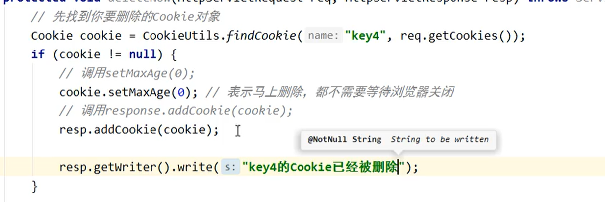

# Cookie 和 Session

##  1、Cookie

### 1、什么是Cookie

1、Cookie翻译过来是饼干的意思。

2、cookie是服务器通知客户端保存键值对的一种技术

3、客户端有了cookie后，每次请求都发送给服务器。

4、每个cookie的大小不能超过4kb

### 2、如何创建Cookie


### 3、服务器如何获取Cookie

```java
protected void getCookie(HttpServletRequest req, HttpServletResponse resp) throws ServletException, IOException {
    Cookie[] cookies = req.getCookies();
    Cookie c = CookieUtils.findCookie("key1", cookies);
    resp.getWriter().write(c.getName()+"="+c.getValue());

}
```

```java
public class CookieUtils {
    /**
     * 根据指定名称查找cookie对象
     * @param name
     * @param cookies
     * @return
     */
    public static Cookie findCookie(String name,Cookie[] cookies){
        if(cookies == null && name == null && cookies.length ==0){
            return null;
        }
        for (Cookie cookie : cookies) {
            if(name.equals(cookie.getName())){
                return cookie;
            }
        }
        return null;
    }
}
```

### 4、Cookie值的修改

方案一：

​	1、先创建一个要修改的同名的Cookie对象

​	2、在构造器，同时赋于新的Cookie值

​	3、调用response.addCookie( Cookie );

方案二：

​	1、先找到需要修改的Cookie对象

​	2、调用setValue()方法赋于Cookie新的值

​	3、调用response.addCookie()通知客户端保存修改

### 5、谷歌和火狐查看cookie


### 6、Cookie的生命控制

cookie的生命控制指的是如何管理cookie什么时候销毁删除。


setMaxAge()

​		正数，表示在指定的秒数后过期

​		负数，表示浏览器一关，cookie就会被删除(默认值是-1)。

​			0,		表示马上删除cookie


不设置的话默认是-1




删除cookie


创建一个存活一小时的cookie（格林时间）

### 7、Cookie有效路径Path的设置

Cookie的path属性可以有效的过滤哪些cookie可以发送给服务器，哪些不发。

path属性是通过请求的地址来进行有效的过滤。


CookieA  		path = /工程路径

CookieB 		 path = /工程路径/abc


请求地址如下：

​		http://ip:port/工程路径/a.html

​				CookieA发送

​				CookieB 不发送

​		http://ip:port/工程路径/abc/a.html

​				CookieA 发送

​				CookieB 发送

### 8、Cookie实现免用户名登录


## 2、Session会话

### 1、什么是Session会话

​	1、sessio是一个接口（Httpsession）

​	2、Session就是会话。它是用来维护一个客户端和服务器之间关联的一种技术。

​	3、每个客户端都有自己的一个Session会话。

​	4、Session会话中，我们经常用来保存用户登录后的信息。

### 2、如何创建Session和获取（id号，是否为新）

如何获取和创建Session。他们的API是一样的。

​	request.getSession()

​	第一次调用是：创建Session会话

​	之后调用都是：获取前面创建好的Session会话对象。


​		isNew();	 	判断到底是不是刚创建出来的（新的）

​					true	表示刚创建

​					false	表示获取之前创建

​	每个会话都有一个身份证号。也就是ID值。这个Id值是唯一的。

​		getId();	得到Session的会话的ID值。

### 3、session域中数据的存取

（前面学过的）

req.getSession.setAttribute("","");

req.getSession.getAttribute("","");

### 4、Session生命周期的控制


​	


### 5、浏览器和session之间关联的技术内幕

session技术，底层其实是基于cookie技术实现的

