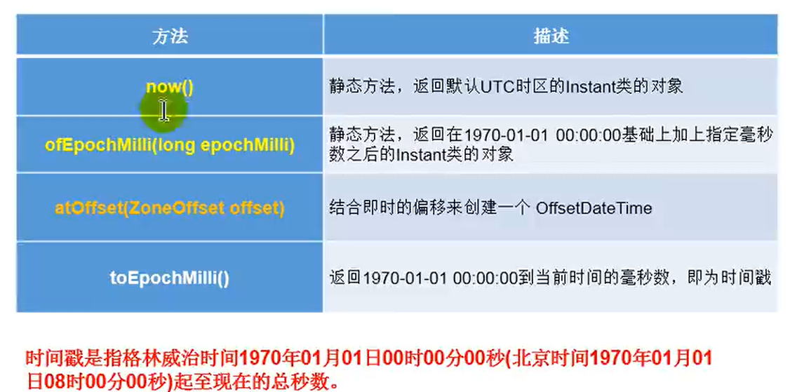
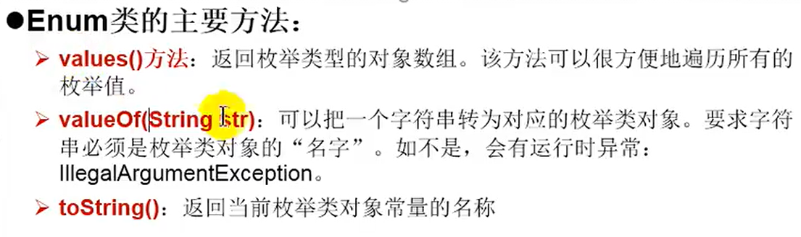

# JAVA基础

E:\ideasProjects\Projects\test\Date

## 日期和时间的Api

 


```java
//1.System类中的currentTimeMills()
//      用来返回当前时间与1970年1月1日0时0分0秒之间以毫秒为单位的时间差
@Test
public void test(){
    long time = System.currentTimeMillis();
    System.out.println(time);
}
```


```java
  /**
     * java.util.Date 类
     *          java.sql.Date类
     * 1.两个构造器的使用
     *      构造器一：Date() ：创建一个对应当前时间的Date对象
     *      构造器二：Date（时间戳）  ：创建指定时间的Date对象
     * 2.两个方法的使用
     *  》toString();    显示当前的年，月，日，时，分，秒
     *  》getTime();     获取当前Date对象对应的时间戳（毫秒数）
     * 3.java.sql.Date对应数据库中的日期类型的变量
     *      >如何实例化
     *      >
     */
    @Test
    public void test1(){
//        构造器一：Date() ：创建一个对应当前时间的Date对象
        Date date1 = new Date();
        System.out.println(date1.toString());   //Sat May 01 09:06:16 CST 2021
        System.out.println(date1.getTime());    //1619831176057
//        构造器二：Date（时间戳）  ：创建指定时间的Date对象
        Date date2 = new Date(1619831176057L);
        System.out.println(date2);
        //创建java.sql.Date对象
        java.sql.Date date3 = new java.sql.Date(1619831176057L);
        System.out.println(date3);
        //如何将Java.util.Date对象转换为java.sql.Date对象
        //情况一：
        Date date4 = new java.sql.Date(1619831176057L);
        java.sql.Date date5 = (java.sql.Date)date4;
        //情况二；
        Date date6 = new Date();
        java.sql.Date date7 = new java.sql.Date(date6.getTime());
        System.out.println(date7);
    }
```


```java
/**
 * SimpleDateFormat的使用：SimpleDateFormat对日期Date类的格式化和解析
 *
 * 1.两个操作
 * 1.1  格式化：日期------->>字符串
 * 1.2  解析；格式化的逆过程：字符串--------->>日期
 *
 * 2.SimpleDateFormat的实例化
 */
@Test
public void test3() throws ParseException {
    //实例化SimpleDateFormat   使用默认构造器
    SimpleDateFormat sdf = new SimpleDateFormat();
    //格式化：日期---->>字符串
    Date date = new Date();
    System.out.println(date);

    String format = sdf.format(date);
    System.out.println(format);

    //解析；格式化的逆过程：字符串--------->>日期
    String str = "21-5-1 上午9:45";
    Date date1 = sdf.parse(str);
    System.out.println(date1);

    //**********指定的方式进行格式化，调用带参的构造器*************
    SimpleDateFormat sdf1 = new SimpleDateFormat("yyyy-MM-dd hh:mm:ss");
    String format1 = sdf1.format(date);
    System.out.println(format1);
    String str1 = "2021-05-01 09:58:51";
     //解析：要求字符串必须是符合SimpleDateFormat识别的格式（通过构造器参数体现）否则就会抛异常
    Date date2 = sdf1.parse(str1);
    System.out.println(date2);
}
```


```java
  /**
     *Calendar日历类的使用（抽象类）
     */
    @Test
    public void test4(){
        //1.实例化
        //方式一：创建其子类（GregorianCalendar）的对象
        //方式二：调用其静态方法 getInstance
        Calendar calendar = Calendar.getInstance();
//        System.out.println(calendar.getClass());
        //常用方法
        // get()
        //输出今天是这周的第几天
        int d = calendar.get(Calendar.DAY_OF_MONTH);
        System.out.println(d);
        System.out.println(calendar.get(Calendar.DAY_OF_YEAR));
        // set()
        //把上面的值进行修改
         calendar.set(Calendar.DAY_OF_MONTH,22);
            d = calendar.get(Calendar.DAY_OF_MONTH);
        System.out.println(d);
        // add()
        calendar.add(Calendar.DAY_OF_MONTH,3);
        calendar.add(Calendar.DAY_OF_MONTH,-1);
        d = calendar.get(Calendar.DAY_OF_MONTH);
        System.out.println(d);
        // getTime()        日历类————>>Date
        Date da = calendar.getTime();
        System.out.println(da); 
        // setTime()        Date————>>日历类
        Date date = new Date();
        calendar.setTime(date);
        d = calendar.get(Calendar.DAY_OF_MONTH);
        System.out.println(d);

    }
```


```java
 /**
     * LocalDate,LocalTime,LocalDateTime的使用
     * 说明：
     *      LocalDateTime相较于LocalDate,LocalTime使用频率更高
     *      类似于Calendar
     */
    @Test
    public void test5(){
        //now()  获取当前的日期，时间，日期＋时间
        LocalTime localTime = LocalTime.now();
        LocalDate localDate = LocalDate.now();
        LocalDateTime localDateTime = LocalDateTime.now();

        System.out.println(localDateTime);
        System.out.println(localDate);
        System.out.println(localTime);
        //of():     设定指定的 年，月，日，时，分，秒。没有偏移量
        LocalDateTime localDateTime1 = LocalDateTime.of(2001, 12, 5, 5, 6, 54);
        System.out.println(localDateTime1);
        //getXxx():获取相关的属性
        System.out.println(localDateTime.getDayOfMonth());
        System.out.println(localDateTime.getDayOfWeek());
        System.out.println(localDateTime.getMonth());
        System.out.println(localDateTime.getMonthValue());
        System.out.println(localDateTime.getMinute());
        //withXxx():设置相关的属性
        //体现不可变性
        LocalDateTime localDateTime2 = localDateTime.withDayOfMonth(16);
        System.out.println(localDateTime);
        System.out.println(localDateTime2);
        //plusXxx():
        //minusXxx():
        //不可变性
        LocalDateTime localDateTime3 = localDateTime.plusDays(5);
        System.out.println(localDateTime);
        System.out.println(localDateTime3);

        LocalDateTime localDateTime4 = localDateTime3.minusDays(5);
//        System.out.println(localDateTime3);
        System.out.println(localDateTime4);
    }
```





```java
/**
 * Instant的使用
 * 类似于java.util.Date类
 */
@Test
public void test6(){
    //实例化       获取本初子午线对应的标准时间
    Instant instant = Instant.now();
    System.out.println(instant);
    //添加时间的偏移量
    OffsetDateTime offsetDateTime = instant.atOffset(ZoneOffset.ofHours(8));
    System.out.println(offsetDateTime);
    //获取时间戳
    long l = instant.toEpochMilli();
    System.out.println(l);
    //通过给定的毫秒数获取instant实例
    Instant instant1 = Instant.ofEpochMilli(1620128953946L);
    System.out.println(instant1);

}
```


```java
    /*
    DateTimeFormatter：格式化或解析日期，时间
    类似于SimpleDateFormat
     */
    @Test
    public void test7(){
        //方式一：预定义的标准格式。
        DateTimeFormatter format = DateTimeFormatter.ISO_LOCAL_DATE_TIME;
        LocalDateTime localDateTime = LocalDateTime.now();
        //格式化：日期改为字符串
        String str = format.format(localDateTime);
        System.out.println(str);
        System.out.println(localDateTime);
        //解析：
        TemporalAccessor parse = format.parse(str);
        System.out.println(parse);
        //方式二：本地化相关的格式
//        再去看视频p487
        //方式三：自定义的格式
        DateTimeFormatter formatter = DateTimeFormatter.ofPattern("yyyy-MM-dd hh:mm:ss");
        String format1 = formatter.format(LocalDateTime.now());
        System.out.println(format1);
        TemporalAccessor parse1 = formatter.parse(format1);
        System.out.println(parse1);
    }
```

## 枚举类和注解

### 枚举类的使用

E:\ideasProjects\Projects\test\Enum


**1.如何自定义枚举类**

```java
/**
 * 如何定义枚举类
 * 方式一：jdk5.0时，自定义枚举类
 * 方式二：jdk5.0之后，可以使用enum关键字定义枚举类
 */
class Session{
    //声明season对象的属性：private final修饰
    private final String seasonName;
    private final String seasonDesc;

    //私有化类的构造器，并给对象属性赋值
    private Session(String seasonName,String seasonDesc){
        this.seasonName = seasonName;
        this.seasonDesc = seasonDesc;
    }
    //提供当前枚举类的多个对象
    public static final Session SPRING  = new Session("春天","春暖花开");
    public static final Session SUMMER  = new Session("夏天","夏日炎炎");
    public static final Session AUTUMN  = new Session("秋天","秋高气爽");
    public static final Session WINTER  = new Session("冬天","冰天雪地");

    //其他诉求：获取枚举类对象的属性，toSting()方法
    public String getSeasonName() {
        return seasonName; 
    }

    public String getSeasonDesc() {
        return seasonDesc;
    }

    @Override
    public String toString() {
        return "Session{" +
                "seasonName='" + seasonName + '\'' +
                ", seasonDesc='" + seasonDesc + '\'' +
                '}';
    }
}
```

**2.如何使用关键字enum定义枚举类**

```java
/**
 * 使用enum关键字定义枚举类
 * 说明：定义的枚举类默认继承于java.lang.Enum类
 *
 * @author zrulin
 * @create 2021-05-04 21:16
 */
enum Season1 {
    //提供当前枚举类的多个对象,多个对象之间用逗号隔开，末尾分号结束
    SPRING("春天","春暖花开"),
    SUMMER("夏天","夏日炎炎"),
    AUTUMN("秋天","秋高气爽"),
    WINTER("冬天","冰天雪地");

    //声明season对象的属性：private final修饰
    private final String seasonName;
    private final String seasonDesc;

    //私有化类的构造器，并给对象属性赋值
    private Season1(String seasonName, String seasonDesc){
        this.seasonName = seasonName;
        this.seasonDesc = seasonDesc;
    }

    //其他诉求：获取枚举类对象的属性，toSting()方法
    public String getSeasonName() {
        return seasonName;
    }

    public String getSeasonDesc() {
        return seasonDesc;
    }

//    @Override
//    public String toString() {
//        return "Session{" +
//                "seasonName='" + seasonName + '\'' +
//                ", seasonDesc='" + seasonDesc + '\'' +
//                '}';
//    }
}
```

**3.Enum类的主要方法**




```java
@Test
public void test2(){
    Season1 summer = Season1.SUMMER;
    System.out.println(summer);//SUMMER

    //toString()
    System.out.println(summer.toString());
    //values()
    Season1[] values = Season1.values();
    for (int i = 0; i < values.length; i++) {
        System.out.println(values[i]);
    }
    //valueOf(String objName)   返回枚举类中对象名是objName的对象，如果没有objName的对象，则抛异常
    Season1 summer1 = Season1.valueOf("SUMMER");
    System.out.println(summer1);


}
```


**3.实现接口的枚举类**

简单的：实现接口，在enum类中实现抽象方法。

``` java
interface info{
    public void show();
}


enum Season1 implements info{
    //提供当前枚举类的多个对象,多个对象之间用逗号隔开，末尾分号结束
    SPRING("春天","春暖花开"),
    SUMMER("夏天","夏日炎炎"),
    AUTUMN("秋天","秋高气爽"),
    WINTER("冬天","冰天雪地");

    //声明season对象的属性：private final修饰
    private final String seasonName;
    private final String seasonDesc;

    //私有化类的构造器，并给对象属性赋值
    private Season1(String seasonName, String seasonDesc){
        this.seasonName = seasonName;
        this.seasonDesc = seasonDesc;
    }

    //其他诉求：获取枚举类对象的属性，toSting()方法
    public String getSeasonName() {
        return seasonName;
    }

    public String getSeasonDesc() {
        return seasonDesc;
    }

    @Override
    public void show() {
        System.out.println("这是一个季节");
    }

    //    @Override
//    public String toString() {
//        return "Session{" +
//                "seasonName='" + seasonName + '\'' +
//                ", seasonDesc='" + seasonDesc + '\'' +
//                '}';
//    }
}
```

情况二：让枚举类的对象分别实现接口中的抽象方法

```java
interface info{
    public void show();
}


enum Season1 implements info{
    //提供当前枚举类的多个对象,多个对象之间用逗号隔开，末尾分号结束
    SPRING("春天","春暖花开"){
        @Override
        public void show() {
            System.out.println("春天在哪里》、？");
        }
    },
    SUMMER("夏天","夏日炎炎"){
        @Override
        public void show() {
            System.out.println("宁静的夏天、、、");
        }
    },
    AUTUMN("秋天","秋高气爽"){
        @Override
        public void show() {
            System.out.println("秋天的蚊子真的香欸，，");
        }
    },
    WINTER("冬天","冰天雪地"){
        @Override
        public void show() {
            System.out.println("冬天是真的冷啊，，，");
        }
    };

    //声明season对象的属性：private final修饰
    private final String seasonName;
    private final String seasonDesc;

    //私有化类的构造器，并给对象属性赋值
    private Season1(String seasonName, String seasonDesc){
        this.seasonName = seasonName;
        this.seasonDesc = seasonDesc;
    }

    //其他诉求：获取枚举类对象的属性，toSting()方法
    public String getSeasonName() {
        return seasonName;
    }

    public String getSeasonDesc() {
        return seasonDesc;
    }


    //    @Override
//    public String toString() {
//        return "Session{" +
//                "seasonName='" + seasonName + '\'' +
//                ", seasonDesc='" + seasonDesc + '\'' +
//                '}';
//    }
}
```

### 注解的使用

E:\ideasProjects\Projects\test\Enum


可重复注解：


jdk8之前的

之后：


## 泛型

 自定义泛型类


继承的时候没有指定泛型的类型，默认就是object类型


泛型方法：


泛型方法可以声明为静态的：


l<E> list <E>   前面那个<E>表示，后面的E[] 不是有个类叫做E  ，而是 这个E 它就是泛型参数

通用的方法就是对象不同可以用泛型

比如说java中的dao层，进行数据库的通用的增删改查，通常只有传入的对象不同但是基本的操作都是相同的，这个时候就可以把对象写成泛型的方式，就不用写多个方法，一个方法就可以解决多个问题

**自定义泛型类，方法，接口**


list集合遍历：


 

list集合使用通配符之后，就不能用list里面的添加操作了


允许我们去读去数据

读取的数据类型是Object


​	extend 就是<= person，也就是说接收的值都得是person或者person 的子类

​	super就是>=person，也就是说接收的类型都得是person或者是person的父类。

## IO流

### File类的使用


```java
/**
 * 1.如何创建File类的实例
 *
 * 2.
 * 相对路径；相较于某个路径下，指明的路径
 * 绝对路径：包含盘符在内的文件或文件目录的路径
 */
@Test
public void test(){
    //构造器1：
    File file1 = new File("hello.txt"); //相对于当前的module
    File file2 = new File("F:\\日志\\hello.txt");     //双斜杠是因为在java中有转义字符

    System.out.println(file2);
    System.out.println(file1);
    //构造器2：
    File file = new File("F:\\日志", "hello");//在指定文件下的文件或文件目录
    System.out.println(file);

    //构造器3
    File file3 = new File(file, "hello.txt");
    System.out.println(file3);

}
```


### IO流原理及流的分类

### 节点流（文件流）

### 缓冲流

### 转换流

### 标准输入输出流

### 打印流

### 数据流

### 对象流

### 随机存取文件流

### NIO.2中的Path、Paths、Files的使用