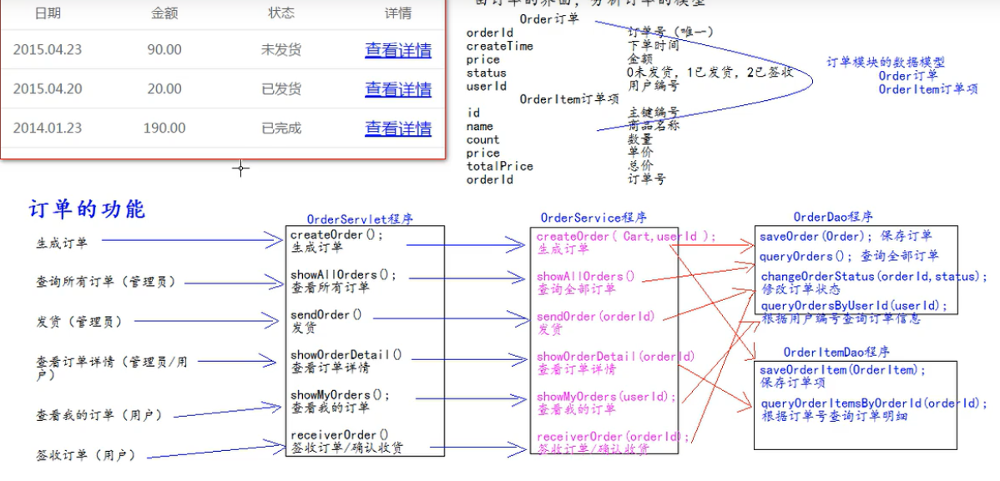

 		

# JavaEE 项目的三层架构


​	分层的目的是为了解耦，解耦就是为了降低代码的耦合度。方便项目后期的维护和升级。


web层					com.zrulin.web/servlet/controller

service层				com.zrulin.service														Service接口包

​								com.zrulin.service.impl												Service接口实现类

dao持久层			com.zrulin.dao															Dao接口包

​								com.zrulin.dao.impl													Dao接口实现类

实体bean对象		com.zrulin.pojo/entity/domain/bean						JavaBean类

测试包					com.zrulin.test/junit

工具类					 com.zrulin.utils

## 编写代码的流程

### 	1、创建书城需要的数据库和表

### 	2、编写数据库表对应的JavaBean对象

```java
public class User {
    private String username;
    private String password;
    private String email;
    private Integer id;
```

### 3、编写 工具类	JdbcUtils

```java
/**
 * @author zrulin
 * @create 2020-11-16 21:32
 */
public abstract class JdbcUtils {

    private static DruidDataSource dataSource;
    static{
        try {
            InputStream is = JdbcUtils.class.getClassLoader().getResourceAsStream("jdbc.properties");
            Properties pros = new Properties();
            pros.load(is);
            dataSource =(DruidDataSource) DruidDataSourceFactory.createDataSource(pros);

            System.out.println(dataSource.getConnection());
        } catch (Exception e) {
            e.printStackTrace();
        }
    }

    public static void main(String[] args) {

    }

    public static Connection getConnection(){
        Connection conn = null;
        try {
            conn = dataSource.getConnection();
        } catch (SQLException e) {
            e.printStackTrace();
        }
        return conn;
    }
    public static void close(Connection conn){
            if(conn != null){
                try {
                    conn.close();
                } catch (SQLException e) {
                    e.printStackTrace();
                }
            }
    }
}
```


### 4、编写BaseDao

```java
/**
 * @author zrulin
 * @create 2020-11-17 10:22
 */
public class BaseDao {
    private QueryRunner queryRunner = new QueryRunner();

    /**
     * update()方法用来执行：Insert/Update/Delete 语句
     * @param sql   执行的sql华语剧
     * @param args  sql对应的参数值
     * @return 如果返回-1，说明执行失败<br/>返回其他表示影响的行数。
     */
    public int update(String sql,Object... args){
        Connection connection = JdbcUtils.getConnection();

        try {
            return queryRunner.update(connection,sql,args);
        } catch (SQLException e) {
            e.printStackTrace();
        }finally {
            JdbcUtils.close(connection);
        }
        return -1;
    }

    /**
     * 查询返回一个JavaBean的sql语句
     * @param type  返回的对象类型
     * @param sql   执行的sql语句
     * @param args  sql对应的参数值
     * @param <T>   返回的类型的泛型
     * @return
     */
    public <T>T queryForOne(Class<T> type,String sql,Object... args){
        Connection conn = JdbcUtils.getConnection();
        try {
           return  queryRunner.query(conn,sql,new BeanHandler<T>(type),args);
        } catch (Exception e) {
            e.printStackTrace();
        }finally {
            JdbcUtils.close(conn);
        }
        return null;
    }
    /**
     * 查询返回多个JavaBean的sql语句
     * @param type  返回的对象类型
     * @param sql   执行的sql语句
     * @param args  sql对应的参数值
     * @param <T>   返回的类型的泛型
     * @return
     */
    public <T> List<T> queryForList(Class<T> type, String sql, Object... args){
        Connection con = JdbcUtils.getConnection();
        try {
            queryRunner.query(con,sql, new BeanListHandler<T>(type),args);
        } catch (SQLException e) {
            e.printStackTrace();
        }finally {
            JdbcUtils.close(con);
        }
        return null;
    }

    /**
     *执行返回一行一列的sql语句
     * @param sql   执行的sql语句
     * @param args  sql对应的参数
     * @return
     */
    public Object queryforSingleValue(String sql,Object... args){
        Connection conn = JdbcUtils.getConnection();

        try {
            return queryRunner.query(conn,sql,new ScalarHandler(),args);
        } catch (SQLException e) {
            e.printStackTrace();
        }finally {
            JdbcUtils.close(conn);
        }
        return null;
    }
}
```

### 5、编写UserService和测试


UserService接口

```java
public interface UserService {
    /**
     *注册用户
     * @param user
     */
    public void registUser(User user);

    /**
     * 登录
     * @param user
     * @return
     */
    public User loginUser(User user);

    /**
     * 检查用户名是否可用
     * @param username 用户名
     * @return  返回true表示用户名已存在，返回false表示用户名可用。
     */
    public boolean exitsUsername(String username);
 
}
```


userService实现类：

```java
public class UserServiceImpl implements UserService {

    UserDao userDao = new UserDaoImpl();

    @Override
    public void registUser(User user) {
       userDao.saveUser(user);
    }

    @Override
    public User loginUser(User user) {
        return userDao.queryUserForUsernameAndPassword(user.getUsername(),user.getPassword());
    }

    @Override
    public boolean exitsUsername(String username) {
       if(userDao.queryUserForUsername(username) == null){
           return false;
       }
       return true;
    }
}
```

### 6、实现用户的注册功能


1、获取请求的参数

2、检查	验证码是否正确

正确：

​		3、检查	用户名是否可用

​					可用

​								调用Service保存到数据库

​								跳回到注册成功页面 	regist_success.html

​					不可用

​								跳回到注册页面	

不正确：

​			跳回注册页面


### 7、IDEA中Debug调试的使用


调试工具栏


### 8、页面的jsp动态化

### 9、抽取页面中相同的内容

#### 1、head中的css,jquery,base标签

#### 2、每个页面的页脚

#### 3、manaer的模块

### 10、登录注册错误提示，及表单回显

### 11、BaseServlet的抽取

#### 1、代码优化一：合并loginServlet 和registServlet

#### 2、代码优化二：使用反射优化大量 else if 代码

#### 3、抽取BaseServlet程序

### 12、数据的封装和BeanUtils的使用	

其中一个作用：BeanUtils工具类，它可以一次性把所有请求的参数注入到JavaBean中。

BeanUtils它不是jdk的类 ，而是第三方的工具类，所以需要导包。


### 13、使用EL表达式修改表单回显。

## mvc概念

mvc 全称 ：Model模型、view视图、Controller控制器。

mvc最早出现在JavaEE 三层中的web层，它可以有效的指导web层代码如何有效分离，单独工作。

view视图：只负责数据和界面的展示，不接受任何与显示数据无关的代码， 便于程序员和美工的分工合作，--------jsp/html

Controller控制器：	只负责接收请求，调用业务层代码处理请求，然后派发页面，然后派发页面，是一个调度者的角色，---servlet转到某个页面，或重定向到某个页面

model模型：将与业务逻辑相关的数据封装为具体的JavaBean类，其中不参杂任何与数据处理相关的代码------JavaBean/domain/entity、pojo

==mvc是一种思想==

mvc的理念是将软件代码拆分成组件，单独开发，组合使用（目的还是为了解耦合）

## 图书模块

### 1、编写图书模块的数据库表

MySQL `DECIMAL`数据类型用于在数据库中存储精确的数值。我们经常将`DECIMAL`数据类型用于保留准确精确度的列，例如会计系统中的货币数据。

要定义数据类型为`DECIMAL`的列，请使用以下语法：

```
column_name ``DECIMAL``(P,D);
```

在上面的语法中：

- `P`是表示有效数字数的精度。 `P`范围为`1〜65`。
- `D`是表示小数点后的位数。 `D`的范围是`0`~`30`。MySQL要求`D`小于或等于(`<=`)`P`。

`DECIMAL(P，D)`表示列可以存储`D`位小数的`P`位数。十进制列的实际范围取决于精度和刻度。

与INT数据类型一样，`DECIMAL`类型也具有`UNSIGNED`和`ZEROFILL`属性。 如果使用`UNSIGNED`属性，则`DECIMAL UNSIGNED`的列将不接受负值。

如果使用`ZEROFILL`，MySQL将把显示值填充到`0`以显示由列定义指定的宽度。 另外，如果我们对`DECIMAL`列使用`ZERO FILL`，MySQL将自动将`UNSIGNED`属性添加到列。

### 2、编写图书模块的JavaBean

### 3、编写图书模块的Dao和测试Dao

### 4、编写图书模块的Service和测试Service

### 5、编写图书模块的web层，和页面联调测试

### 6、图书列表功能的实现


### 7、前后台简单介绍


### 8、添加图书功能实现


跳到图书列表页面这个地方用请求的重定向，而不用请求的转发。

因为：请求的转发是一次请求，请求的重定向是两次请求。

又因为：

表单重复提交：

​		当用户提交完请求，浏览器会记录下最后一次请求的全部信息。当用户按下功能键F5，就会发起浏览器记录的最后一次请求。

### 9、删除图书功能的实现


### 10、修改图书

第一步：


第二步：


解决方案一：


11、图书分页的分析


## 用户模块

### 1、登录----显示用户名

```java
  System.out.println("登录成功");
            req.getSession().setAttribute("user",loginUser);
            req.getRequestDispatcher("/pages/user/login_success.jsp").forward(req,resp);
```

```jsp
<span>欢迎<span class="um_span">${sessionScope.user.username}</span>光临zrulin书城</span>
```

```jsp
<c:if test="${empty sessionScope.user}">
    <a href="pages/user/login.jsp">登录</a>
    <a href="pages/user/regist.jsp">注册</a>
</c:if>
<c:if test="${!empty sessionScope.user}">
    <span>欢迎<span class="um_span">${sessionScope.user.username}</span>光临zrulin书城</span>
    <a href="pages/order/order.jsp">我的订单</a>
    <a href="index.jsp">注销</a>
</c:if>
```


### 2、登出----注销用户

1.销毁Session中用户的登录信息，（或者销毁Session）

2、重定向到首页或登录页面。

### 3、表单重复提交之----验证码

表单重复提交有三种常见情况：

​		一：提交完表单。服务器使用请求转发来进行页面的跳转。这个时候 ，用户按下功能键F5,就会发起最后一次请求。造成表单重复提交问题，解决方法：使用重定向来进行跳转。

​		二：用户正常提交服务器，但是因为网络延迟等原因，迟迟未收到服务器响应，这个时候，用户以为提交失败，就会着急，然后多点了几次提交操作，也会造成表单重复提交。

​		三：用户正常提交服务器，服务器也没有延迟，但是提交完成之后用户回退浏览器。重新提交，也会造成表单重复提交。


### 4、谷歌kaptcha图片验证码的使用	

​	谷歌验证码kaptcha使用步骤：

​			1、导入谷歌验证码的jar包：

​		

​			2、在web.xml中去配置用于生成验证码的Servlet程序。


4、在服务器获取谷歌生成的验证码和客户端发送过来的验证码比较使用。

### 5、验证码的切换


```jsp
//给验证码绑定单击事件
$("#code_img").click(function () {
    //在事件响应的function函数中有一个this对象，这个this对象，是当前正在响应时间的Dom对象。
    //src属性表示验证码img标签的 图片路径，他可读，可写。
    this.src = "${basePath}Kaptcha.jpg?d="+new Date();
});
```

## 购物车模块

### 1、购物车模块分析


### 2、功能实现


**修改购物车商品数量**


## 订单模块

### 1、订单模块的分析



