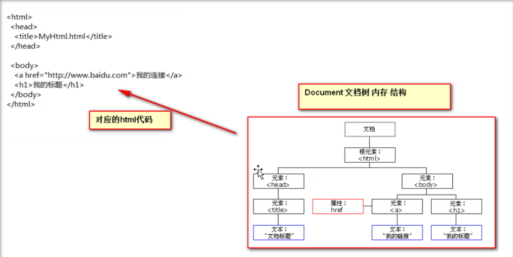

# javaWeb

## javaScript

### 1、javaScript介绍

javascript语言诞生主要是完成页面的数据验证，因此它运行在客户端，需要运行浏览器来解析执行javaScript代码。

**js是弱类型，Java是强类型。**

弱类型就是类型可变。

强类型，就是定义变量的时候类型已确定。而且不可变。

### 2、特点

交互性：（它可以做的就是信息的动态交互）

安全性：（不允许直接访问本地硬盘）

跨平台性：（只要是可以解释js的浏览器都可以执行，和平台无关）

### 3、JavaScript和HTML代码的结合方式

#### 3.1、第一种方式

只需要在head标签中，或者在body标签中，使用script标签来书写JavaScript代码。

```html
<!DOCTYPE html>
<html>
	<head>
		<meta charset="utf-8">
		<title>javascript-hello</title>
		<script type="text/javascript">
			 // alert()是Javascript语言提供的一个警告框函数
			 // 它可以接收任意类型的参数，这个参数就是警告框的提示信息。
			alert("JavaScript hello");
		</script>
	</head>
	<body>
	</body>
</html>
```


#### 3.2、第二种方式

使用script标签引入单独的JavaScript代码文件

```html
<script type="text/javascript" src ="xxx.js"></script>
```


### 4、变量


JavaScript的变量类型：

数值类型：number

字符串类型：string

对象类型：object

布尔类型：boolean

函数类型：function


JavaScript里特殊的值：

undefined		未定义，所有js变量为赋于初始值的时候，默认值都是underfined。

null					空值

NAN					全称是：Not a Number 。非数字，非数值。


JS中的定义变量格式：

var	变量名；

var	变量名 = 值。

```html
<!DOCTYPE html>
<html>
	<head>
		<meta charset="utf-8">
		<title>title</<title></title>>
	</head>
	<body>
		<script type="text/javascript">
			var i;
			// alert(i);	//undefined
			i = 12;	
			// alert(i);		//12
			// alert(typeof(i));	//number
			
			i = "abc";
			// alert(i);		//abc
			// alert(typeof(i));	//string
			
			var a = 21;
			var c = "abc";
			alert(a * c);	//NaN
		</script>
	</body>
</html>
```


### 5、关系比较运算

等于：	==	--等于是简单的做字面值的比较

全等于：	===		--除了做字面值的比较之外，还会比较两个变量的数据类型。

```html
<!DOCTYPE html>
<html>
	<head>
		<meta charset="utf-8">
		<title>title</title>
		
		<script type="text/javascript">
			var i = "12";
			var a = 12;
			 alert( i == a );		//true
			 alert( i === a);		//false
		</script>
	</head>
	<body>
	</body>
</html>

```


### 6、逻辑运算

且运算：	&&

或运算：	||

取反运算:	!

​	在JavaScript语言中，所有的变量，都可以作为一个Boolean类型的变量去使用。

==0，null,	underfined ,""（空串）都认为是false;==

```java
/*
&&且运算。
有两种情况
第一种情况：当表达式全为真的时候，返回最后一个表达式的值。
第二种情况：当表达式中，有一个为假的时候，返回第一个为假的表达式的值。

||或运算
第一种情况：当表达式全为假时，返回最后一个表达式的值。
第二种情况：只要有一个表达式为真，就会返回第一个为真的表达式的值。

并且&&与运算 和 ||或运算 有短路
短路就是说，当这个&&或||有结果了之后，后面的表达式不在执行。
*/
```

### 7、==数组（****重点）==

#### 7.1、数组定义方式

js中数组的定义：

格式：

```java
var 数组名 = [];	//空数组

var 数组名 = [1,'abc',true]; 	//定义数组同时赋值元素。
```

```html
<!DOCTYPE html>
<html>
	<head>
		<meta charset="utf-8">
		<title>tille</title>
		<script type="text/javascript">
			var a = [];	//定义一个空数组
			// alert(a.length);	//0
			a[0] = 12;
			// alert(a[0]);	//12
			// alert(a.length);	//1
			a[2] = "abc";
			// alert(a.length);	//3
			// alert(a[1]);	//undefined
			
			//JavaScript语言中的数组，只要我们通过数组下标赋值，那么最大的下标值，就会自动的给数组做扩容操作。
			
			for(var i =0 ;i<a.length ; i++){
				alert(a[i]);
			}
		</script>	
	</head>
	<body>
	</body>
</html>
```


### 8、==函数（****重点）==

#### 8.1、函数两种定义方式

**第一种，可以使用function关键字来定义函数。**

​	使用的格式如下：

```html
	function 函数名 (形参列表）{
​			函数体			
​	}
```

```html
<!DOCTYPE html>
<html>
	<head>
		<meta charset="utf-8">
		<title>title</title>
		<script type="text/javascript">
			//定义一个无参函数
			function fun () {
				alert("无参函数fun()被调用了");
			}
			
			//函数调用才会执行
			fun();
				function fun2(z,b){
					alert("有参函数fun(z,b)被调用了  a = "+z+"，b  = "+b);
				}
			fun2(1,4);
			
			// 定义带有返回值的函数
			function sum (num1,num2){
				var result = num1 * num2;
				return result;
			}
			alert(sum(22,88));
		</script>
	</head>
	<body>
	</body>
</html>

```


**函数的第二种定义方式**

使用格式如下：

```html
var 函数名 = function(形参列表){函数体}
```

==注：在Java中函数允许重载，但是在js中函数的重载会直接覆盖掉上一次的定义==

#### 8.2、函数的arguments 隐形参数（只在function 函数内）

就是在function函数中不需要定义，但却可以直接用来获取所有参数的变量。我们管他叫隐型参数。

隐形参数特别想Java基础中的可变长参数一样。

public void fun (object ...args);

可变长参数其实就是一个数组。

那么js中的隐形参数也跟Java的可变长参数一样操作类似数组。

```html
<!DOCTYPE html>
<html>
	<head>
		<meta charset="utf-8">
		<title>title</title>
		<script type="text/javascript">
			var fun = function (){
				alert(arguments.length);
				alert(arguments[0]);
				alert(arguments[1]);
				alert(arguments[2]);
				alert("无参函数fun()被调用了");
			}
			fun(1,"abc",true);
		</script>
	</head>
	<body>
	</body>
</html>
```

### 9、js中的自定义对象（扩展）

#### 9.1、object形式的自定义对象

对象的定义：

​	var  变量名  =  new  Object ();		//对象实例（空对象）

​	变量名.属性名 = 值 ；					//定义一个属性

​	变量名.函数名 = function（）{}	//定义一个函数

对象的访问：

​	变量名.属性 / 函数名（）；

```html
<!DOCTYPE html>
<html>
	<head>
		<meta charset="utf-8">
		<title>title</title>
		<script type="text/javascript">
			var obj = new Object ();
			obj.name = "zrulin";
			obj.age = 18;
			obj.email = "linzru@qq.com";
			obj.fun = function(){
				alert("name = "+obj.name+",age = "+obj.age+",email = "+obj.email);
			}
			obj.fun();
		</script>
	</head>
	<body>
	</body>
</html>
```

#### 9.2 、{}花括号形式的自定义对象

```htm
var 变量名 = {
	属性名：值，	//定义一个属性
	属性名：值，	//定义一个属性
	函数名：function(){}//定义一个函数
};

对象的访问：
	变量名.属性 / 函数名();
```

### 10、js中的事件

什么是事件？事件是电脑输入设备与页面进行交互的响应。我们称之为事件。

**常用的事件：**

onload 加载完成事件：	页面加载完成之后，常用于做js代码初始化操作。

onclick 单击事件：			常用于按钮点击响应操作

onblur 失去焦点事件：	常用于输入框失去焦点后验证其输入内容是否合法。

onchange 内容发生改变事件：	常用于下拉列表和输入框内容发生改变后操作。

onsubmit 表单提交事件：		常用于表单提交前，验证所有表单项是否合法。

**事件的注册又分静态注册和动态注册两种**

​	什么是事件的注册（绑定）？

​		其实就是告诉浏览器，当事件响应后要执行哪些操作代码，叫事件注册	或绑定。

静态注册事件：通过HTML标签的事件属性直接赋于事件响应后的代码，这种方式我们叫做静态注册。                                                                                                                                                                                                                                                                                                                                                                                                                                                                                                                                                                                                                                                                                                                                                                                                                                                                                                                                                                                                                                                                                                                                                                                                                                                                                                                                                                                                                                                                                                                                                                                                                                                                                                                                                                                                                                                                                                                                                                                                                                                                                                                                                                                                                                                                                                                                                                                                                                                                                                                                                                                                                                                                                                                                                                                                                                                                                                                                                                                                                                                                                                                                                                                                                                                                                                                                                                                                                                                                                                                                                                                                                                                                                                                                                                                                                                                                                                                                                                                                                                                                                                                                                                                                                                                                                                                                                                                                                                                                                                                                                                                                                                                                                                                                                                                                                                                                                                                                                                                                                                                                                                                                                                                                                                                                                                                                                                                                                                                                                                                                                                                                                                                                                                                                                                                                                                                                                              

动态注册事件：是指先通过js代码得到标签的dom对象，然后通过

```html
dom对象.事件名 = function(){}
```

​							这种形式赋于事件响应后的代码，叫动态注册。

​			动态注册的基本步骤：

​					1.获取标签对象

​					2.标签对象.事件名 = function(){}


#### 10.1、onload 加载完成事件

```html
<!DOCTYPE html>
<html>
	<head>
		<meta charset="utf-8">
		<title>title</title>
		<script type="text/javascript">
			function onloadFun(){
				alert('静态注册onload事件');
			}
			
			// onload 的动态注册，是固定写法
			window.onload = function(){
				alert("onload事件的动态注册");	
			}
		</script>
	</head>
	
	<!-- 静态注册onload事件
			onload事件是浏览器解析完页面之后就会自动触发的事件。
			<body onload="alert('静态注册onload事件');">
			<body onload="onloadFun();">
	 -->
	 
	<body>	
	</body>
</html>

```

#### 10.2、onclick 单击事件

```html
<!DOCTYPE html>
<html>
	<head>
		<meta charset="utf-8">
		<title>title</title>
		<script type="text/javascript">
			
			function onclickFun(){
				alert('静态注册onclick事件');
			}
			
			// 动态注册onclick事件
			window.onload = function(){
				// 1.获取标签对象
				/* 
					document	是JavaScript语言提供的一个对象（文档）（表示整个html文档）
					get			获取
					Element		元素（就是标签）
					By			通过。。  
					Id			id属性
				 */
				var btnobj = document.getElementById("btn01");
				
				//2.通过 标签对象.事件名 = function(){}
				btnobj.onclick = function(){
					alert('动态注册onclick事件');
				}
			}
			
		</script>
	</head>
	<body>
		<button onclick="onclickFun();">按钮1</button>
		<button id="btn01">按钮2</button>
	</body>
</html>

```


#### 10.3、onblur 失去焦点事件

```html
<!DOCTYPE html>
<html>
	<head>
		<meta charset="utf-8">
		<title>title</title>
		<script type="text/javascript">
			function onblurFun(){
				// console是控制台对象，是由JavaScript语言提供，专门用来向浏览器的控制台打印输出，用于测试使用
				// log（）是打印的方法
				console.log("静态注册失去焦点事件");
			}
			// 动态注册onblur事件
			window.onload = function(){
				// 1.获取标签对象
				var onblurobj = document.getElementById("password01");
				// 通过标签对象 .事件名 = function(){};
				onblurobj.onblur = function(){
					console.log("动态注册onblur事件");
				}
			}
			
		</script>
	</head>
	<body>
		姓名：<input type="text" onblur="onblurFun();"><br/>
		密码：<input id="password01" type="password">
	</body>
</html>

```


#### 10.4、onchange 内容发生改变事件

```html
<!DOCTYPE html>
<html>
	<head>
		<meta charset="utf-8">
		<title>title</title>
		<script type="text/javascript">
			function onchangeFun (){
				alert('女神已经发生改变');
			}
			window.onload = function(){
				var seobj = document.getElementById("select01");
				seobj.onchange = function(){
					alert("男神已经改变了");
				}
			}
		</script>
	</head>
	<body>
		请选择你心中的女神：
		<select onchange="onchangeFun();">
			<option value="">--女神--</option>
			<option value="">小芳</option>
			<option value="">娘娘</option>
			<option value="">飘飘</option>
		</select>
		
		请选择你心中的男神：
		<select id="select01">
			<option value="">--男神--</option>
			<option value="">小</option>
			<option value="">娘</option>
			<option value="">飘</option>
		</select>
	</body>
</html>

```

#### 10.5、onsubmit 表单提交事件

```html
<!DOCTYPE html>
<html>
	<head>
		<meta charset="utf-8">
		<title>title</title>
		<script type="text/javascript">
			function submitFun(){
				alert('静态注册表单提交事件----发现内容不合法');
				return false;
			}
			window.onload = function(){
				var subobj = document.getElementById("submit01");
				subobj.onsubmit = function(){
					alert('动态注册表单提交事件----发现内容不合法');
						return false;
				}
			}
		</script>
	</head>
	<body>
		<form action="http://localhost:8080" method="get" onsubmit="return submitFun();">
			<input type="submit"  value="静态注册" />
		</form>
		
		<form action="http://localhost:8080" method="get" id="submit01">
			<input type="submit"  value="动态注册" />
		</form>
	</body>
</html>

```

### 11、DOM模型

DOM的全称是 Document Object Model 文档对象模型

大白话，就是把文档中的标签，属性，文本，转换成为对象来管理。



#### 	11.1、Document 对象的理解

第一点：Document他管理了所有的HTML文档内容。

第二点：document它是一种树结构的文档。有层级关系。

第三点：它让我们把所有的标签 都 对象化

第四点：我们可以通过document访问所有的标签对象。

```html
<!DOCTYPE html>
<html>
	<head>
		<meta charset="utf-8">
		<title>title</title>
		<script type="text/javascript">
			/* 需求：当用户点击了校验按钮，要获取输出框中内容，然后验证其是否合法。<br/>
				验证的规则是：必须由字母，数字，下划线组成。并且长度是5到12位。
			 */
			function onclickFun(){
				// 当我们要操作一个标签时，一定要先获取这个标签对象。
				var clickobj = document.getElementById("name");
					
				var usernametext = clickobj.value;
				// 如何验证是否符合某个规则，需要使用正则表达式技术。
				var path = /^\w{5,12}$/;
				/* 
				 test()方法用于测试某个字符串，是不是匹配我的规则。
				 匹配就返回true。不匹配就返回false。
				 */
				if(path.test(usernametext)){
					alert("该输入合法");
				}else{
					alert("该输入不合法");
				}
			}
		</script>
	</head>
	<body>
		姓名: <input type="text" id="name" value="lisa" />
		<button onclick="onclickFun();">校验</button>
	</body>
</html>

```

#### 11.2、正则表达式


#### 11.3、两种常见的验证提示效果

```html
<!DOCTYPE html>
<html>
	<head>
		<meta charset="utf-8">
		<title>title</title>
		<script type="text/javascript">
			/* 需求：当用户点击了校验按钮，要获取输出框中内容，然后验证其是否合法。<br/>
				验证的规则是：必须由字母，数字，下划线组成。并且长度是5到12位。
			 */
			function onclickFun(){
				// 当我们要操作一个标签时，一定要先获取这个标签对象。
				var clickobj = document.getElementById("name");
					
				var usernametext = clickobj.value;
				var spanobj = document.getElementById("span01");
				
				// 如何验证是否符合某个规则，需要使用正则表达式技术。
				var path = /^\w{5,12}$/;
				/* 
				 test()方法用于测试某个字符串，是不是匹配我的规则。
				 匹配就返回true。不匹配就返回false。
				 */
				if(path.test(usernametext)){
					// alert("该输入合法");
					spanobj.innerHTML= "该输入合法";
				}else{
					// alert("该输入不合法");
					spanobj.innerHTML = "该输入不合法";
				}
			}
		</script>
	</head>
	<body>
		姓名: <input type="text" id="name" value="lisa" />
		<span id="span01" style="color: red;"></span>
		<button onclick="onclickFun();">校验</button>
	</body>
</html>

```

还有一种就是把 spanobj.innerHTML等于两张图片一张勾一张×


#### 11.4、getElementsByName方法

getElementsById	返回拥有指定id的第一个对象的引用。

getElementsByName	返回带有指定名称的对象集合。

```html
<!DOCTYPE html>
<html>
	<head>
		<meta charset="utf-8">
		<title>title</title>
		<script type="text/javascript">
			function checkAll(){
					// 让所有复选框都选中
					// document.getElementsByName()；是根据 指定的name属性查询返回多个标签对象集合
					// 这个集合的操作和数组一样 
					// 集合中每个元素都是dom对象
					// 这个集合中的元素顺序是他们在HTML页面中从上到下的顺序
					var hobbys = document.getElementsByName("hobby")
					// checked表示复选框的选中状态，人如果选中时true，补选中时false。
					// checked这个属性可读，可写。
					for(var i = 0; i< hobbys.length ; i++){
						hobbys[i].checked = true;
					}
			}
			
			function checkNO(){
				var hobbys = document.getElementsByName("hobby");
				for(var i = 0 ; i < hobbys.length ; i++){
					hobbys[i].checked = false;
				}
			}
			
			function checkReverse(){
				var hobbys = document.getElementsByName("hobby");
				for(var i = 0 ; i < hobbys.length ; i++){
					// if(hobbys[i].checked){
					// 	hobbys[i].checked = false;
					// }else{
					// 	hobbys[i].checked = true;
					// }
					hobbys[i].checked = ! hobbys[i].checked;
				}
			}
		</script>
	</head>
	<body>
		兴趣爱好：
		<input type="checkbox" name="hobby" value="cpp"	/>C++
		<input type="checkbox" name="hobby" value="java" />Java
		<input type="checkbox" name="hobby" value="js" />js
		<br/>
		<button onclick="checkAll();">全选</button>
		<button onclick="checkNO();">全不选</button>
		<button onclick="checkReverse();">反选</button>
		
	</body>
</html>

```


getElementsByTagName();	返回带有指定标签名的对象集合	（我觉得没有做笔记的必要）


​	（还是附上一张图）

==注：document对象的三个查询方法，如果有id属性，优先使用getElementsById	方法来查询，如果没有id属性，则优先使用getElementsByName	来进行查询。如果id属性和name属性都没有最后再按标签名查getElementsByTagName==

==以上三种方法一定要在页面加载完成之后执行，才能查询到对象。==

### 10、节点的常用属性和方法

​		节点就是标签对象

​		**方法：**

通过具体元素节点调用

getElementsByTagName()

方法，获取当前节点的指定标签名孩子节点。


appendChild（oChildNode）

方法，可以添加一个子节点，oChildNode是要添加的孩子节点。


​		**属性：**

childNodes

属性，获取当前节点的所有子节点。

fristChild

属性：获取当前节点的第一个子节点。

lastChild

属性，获取当前节点的最后一个子节点。

parentNode

属性，获取当前节点的父节点。

nextSibling

属性，获取当前节点的下一个节点。

previousSibling

属性，获取当前节点的上一个节点。

className

用于获取或设置标签的class属性值。

innerHTML

属性，表示获取/设置起始标签和结束标签中的内容。

innerText

属性，表示获取/设置起始标签和结束标签中的文本。


### 12、课外笔记

#### 函数：

##### 数组元素的增减

第一种：按照下标直接**添加元素**；

push()函数：往数组的末尾添加一个或多个元素，参数是要添加的元素，返回数组长度。

```javascript
//利用push()方法在数组尾部添加元素
var numverArray = [12,23,34,45];
var newlengh = numvarArray.push(56);
console.log(newLenth);//输出5
console.log(numverArray);//输出[12,23,34,45,56]
```


unshift()方法：在数组的头部添加元素，并返回数组新的长度，其余元素自动向索引大的方向移动。

```javascript
var sArray = ["ja","va","script"];
var newLength = sArray.unshift("he","llo");
console.log(newLength);//输出5
console.log(sArray);//输出["he","llo","ja","va","script"];
```


第一种: 将 数组.length 减小来**删除元素**

delete运算符：delete运算符后接要删除的元素，但是删除后，会有一个占位符，所以数据的长度保持不变。

```javascript
var dArray = [11,22,33,44,55];
delete dArray[4];//删除索引最大的元素
console.log(dArray);//输出[11,22,33,44]
console.log(dArray.length);//长度为5
```


pop():一次删除一个，并返回被删除的元素。

```javascript
//利用pop方法在数组的尾部删除元素
var numberArray = [3,4,5,6,7];
var deletedNumber = numberArray.pop();
console.log(deletedNumber);//输出被删除的元素7
console.log(numberArray);//删除后的数组为[3,4, 5,6]
```


在头部删除元素：shift()，shift()的作用是删除数组头部的一个元素并返回该元素，然后所有元素往索引值小的方向移动一位。

```javascript
var dArray = [11,22,33,44,55];
console.log(dArray.shift());//输出11，11从数组中被删除
console.log(dArray);//输出[22,33,44,55]
```


##### 数组的常用方法


split()方法：用于**把一个字符串分割成一个字符串数组**。


**查找元素的位置**：indexOf() lastIndexOf()

两者都有两个参数，第一参数为要查找的元素，第二个参数可选，为搜索的起点索引。

```javascript
var search = ["a","b","a","b","c","d","a","a","b","a"];
console.log(search.indexOf("a"));//输出0
console.log(search.lastIndexOf("a"));//输出9
console.log(search.indexOf("a",2));//输出2，从索引为2处开始搜索
//第二个参数可以是负数，-1表示倒数第一个元素，-2表示倒数第二个元素，以此类推。
console(search.indexOf("a",-2));//输出9
console(search.lastIndexOf("a",-2))//输出7
```

**数组的合并**：concat()，其形式是：数组a.concat(数组b),合并之后返回新数组，新数组为数组a后面接数组b，但是数组a和b不变。

```javascript
var a = [1,2,3];
var b = [4,5,6];
var c = a.concat(b);//合并后返回新数组
console.log(c);//输出[1,2,3,4,5,6];
```


reverse（）实现**数组倒置**，无参数，返回倒置后的数组，同时调用该方法的数组也会被倒置。称为就地逆置

```javascript
var a = [1,2,3,4];
var b = a.reverse();
console.log(a); //输出[4,3,2,1]
console.log(b);//输出[4,3,2,1]
```


**元素合并**：join()：将数组的所有元素连接起来组成字符串，参数为元素之间的分隔符，默认逗号。

```javascript
var sArray = ["june","july","August"];
console.log(sArray.join());//输出june,julu,August
console.log(sArray.join("+"));//输出june+july+August
```

**元素排序**：sort()：实现数据元素排序，不带该参数表示元素按照ASCII表从小到大排序；

```javascript
var arr = [1,2,10,5,12];
arr.sort();
console.log(arr);//输出[1,10,12,2,5];
```

带参数的格式如下：

```
arr.sort(function(a,b){
	return a -b;//升序排列
})
arr.sort(function(a,b){
	return b- a;//降序排列
})

```


