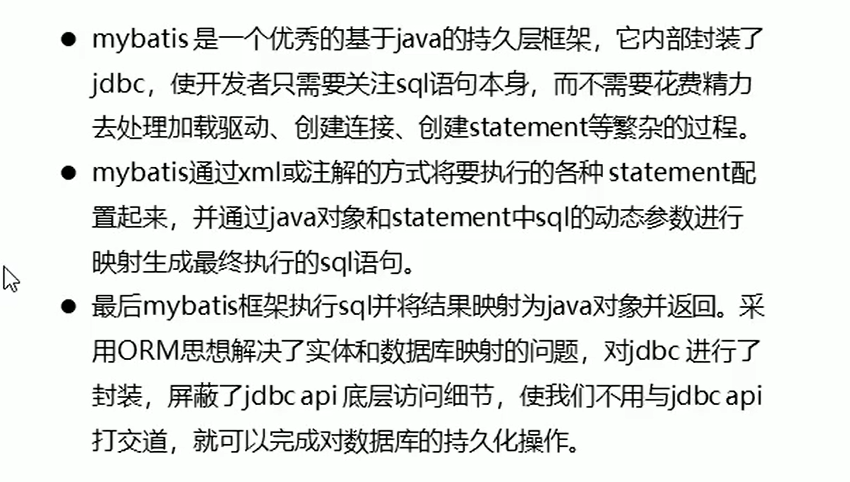

# MyBatis

**原始jdbc操作：**

插入操作：


查询操作：


**原始jdbc操作的分析**


**什么时MyBatis**



## MyBatis开发步骤


1.添加mybatis坐标

```xml
<dependency>
    <groupId>mysql</groupId>
    <artifactId>mysql-connector-java</artifactId>
    <version>5.1.37</version>
</dependency>
<dependency>
    <groupId>org.mybatis</groupId>
    <artifactId>mybatis</artifactId>
    <version>3.4.6</version>
</dependency>
<dependency>
    <groupId>junit</groupId>
    <artifactId>junit</artifactId>
    <version>4.12</version>
    <scope>test</scope>
</dependency>
<dependency>
    <groupId>log4j</groupId>
    <artifactId>log4j</artifactId>
    <version>1.2.17</version>
</dependency>
```

2.创建user数据表

3.编写User实体类

4.编写映射文件userMapper.xml

约束头：

```xml
<?xml version="1.0" encoding="UTF-8" ?>
<!DOCTYPE mapper PUBLIC "-//mybatis.org//DTD Mapper 3.0//EN" "http://mybatis.org/dtd/mybatis-3-mapper.dtd">
```

```xml
<mapper namespace="userMapper">
    <select id="findAll" resultType="com.zrulin.bean.User">
        select * from user
    </select>
</mapper>
```

5.编写核心文件sqlMapConfig.xml

约束头：

```xml
<?xml version="1.0" encoding="UTF-8" ?>
<!DOCTYPE configuration PUBLIC "-//mybatis.org//DTD Config 3.0//EN" "http://mybatis.org/dtd/mybatis-3-config.dtd">
```

```xml
<configuration>
    <!--数据源环境-->
    <environments default="development">
        <environment id="development">
            <transactionManager type="JDBC"/>
            <dataSource type="POOLED">
                <property name="driver" value="com.mysql.jdbc.Driver"/>
                <property name="url" value="jdbc:mysql://localhost:3306/jdbctest?characterEncoding=UTF-8"/>
                <property name="username" value="root"/>
                <property name="password" value="123456"/>
            </dataSource>
        </environment>
    </environments>
<!--    加载映射文件-->
    <mappers>
        <mapper resource="com.zrulin.mapper/UserMapper.xml"/>
    </mappers>
</configuration>
```


6.编写测试类

```xml
@Test
public void test() throws IOException {
    //加载核心配置文件
    InputStream resourceAsStream = Resources.getResourceAsStream("sqlMappingConfig.xml");
    //获得sqlSession工厂对象
    SqlSessionFactory build = new SqlSessionFactoryBuilder().build(resourceAsStream);
    //获得sqlSession对象
    SqlSession sqlSession = build.openSession();
    //执行sql语句
    List<Object> userList = sqlSession.selectList("userMapper.findAll");
    //打印结果
    System.out.println(userList);
    //释放资源
    sqlSession.close();
}
```


## MyBatis的映射文件概述


## MyBatis增删改查

**插入操作：**


mybatis事务是默认不提交的 

mybatis执行更新操作  要自己提交事务

```java
@Test
public void test3() throws IOException {
    User user = new User();
    user.setName("tom");
    user.setPassword("osngiowegw");

    //加载核心配置文件
    InputStream resourceAsStream = Resources.getResourceAsStream("sqlMappingConfig.xml");
    //获得sqlSession工厂对象
    SqlSessionFactory build = new SqlSessionFactoryBuilder().build(resourceAsStream);
    //获得sqlSession对象
    SqlSession sqlSession = build.openSession();
    //执行sql语句
    sqlSession.insert("userMapper.insert",user);
    //事务提交
    sqlSession.commit();
    //释放资源
    sqlSession.close();
}
```

==注意事项==


查询不需要事务提交

**修改操作：**


==注意事项==


**删除操作：**


==注意事项==


传递单个参数，中间可以用

传实体属性，中间

==知识小结==


## MyBatis核心文件的概述

**Mybatis核心文件配置层级关系**


## Mybatis常用配置解析

**1.environments标签**


**2.mapper标签**


**3.Properties标签**


**typeAliases标签**


==知识小结==


## MyBatis相应API

**1.SqlSession工厂构建器SqlSessionFactoryBuilder**


**2.SqlSession会话对象**


## Dao层实现

**传统方式**


**代理开发方式**


	

**测试代理方式**

	

## MyBatis映射文件的深入

**动态sql语句**

概述：


**动态sql  之< if>**


**动态sql  之< foreach>**


查询语句


相当于：


在mybatis中：


**SQL片段抽取**


==知识小结==


## MyBatis核心配置文件深入

**1.typeHandlers标签**


主要是进行类型处理器定义。

jdbc数据类型和java数据类型不一样


1.

2.


3.在核心文件中注册


## plugins标签


1.导坐标


2.在核心文件中配置插件


==知识小结==


## Mybatis的多表操作


面向对象的思想，不是直接用int类型的Uid，而是引用user中的id

表示出数据库中主键和外键的关系


**一对多：**


**多对多查询：**


java层面的代码的话，user实体中有role实体组成的list集合。


==知识小结==


## MyBatis注解开发

**1.MyBatis的常用注解** 


**MyBatis的注解实现复杂映射开发**


**一对一：**


或者：


**一对多：**


**多对多：**


# Mybatis-Plus

ge：>=
gt：>
le：<=
lt：<


```java
	//创建一个QueryWrapper的对象
    QueryWrapper<User> wrapper = new QueryWrapper<>();
    //通过QueryWrapper设置条件
    //ge gt le lt
    //查询age>=30的记录
    //第一个参数是字段的名称 ， 第二个参数是设置的值
    wrapper.ge("age" , 30);
    List<User> users = userMapper.selectList(wrapper);
    System.out.println(users);
```


eq：=
ne：！=


		wrapper.eq("name" , "Marray");
	    List<User> users = userMapper.selectList(wrapper);
	    System.out.println(users);
between：范围之间 ， 需要三个参数 ， 第一个是表字段名 ， 第二个是起始 ， 第三个是结束

		wrapper.between("age" , 20 , 30);
	    List<User> users = userMapper.selectList(wrapper);
	    System.out.println(users);
like：模糊查询

orderByDesc：降序排列
orderByAsc：升序

		wrapper.orderByDesc("id");
	    List<User> users = userMapper.selectList(wrapper);
	    System.out.println(users);
last：拼接语句

		wrapper.last("limit 1");
	    List<User> users = userMapper.selectList(wrapper);
	    System.out.println(users);

等同于：
        
SELECT
 *
FROM
user 
WHERE
deleted=0 limit 1


select：查询指定列

		wrapper.select("id" , "name");
	    List<User> users = userMapper.selectList(wrapper);
	    System.out.println(users);