# Python爬虫

 步骤：

写一个主函数

一些步骤全部以函数的方式进行拆分

1.获取网页

2.逐一解析数据

3.保存数据

获取一个get请求

```python
# 获取一个Get请求
import urllib.request

response = urllib.request.urlopen("https://www.baidu.com/")
print(response.read().decode("utf-8"))    #对获取到的网页源码进行utf-8解码
```


获取一个post请求

```python
# 获取一个 post 请求
import urllib.parse
import urllib.request

data = bytes(urllib.parse.urlencode({'username': 'tom'}), encoding='utf-8')
response = urllib.request.urlopen("http://httpbin.org/post", data=data)
print(response.read().decode("utf-8"))
```

超时处理

```python
# 超时处理
import urllib.request
response = urllib.request.urlopen("http://httpbin.org/get",timeout=1)
print(response.read().decode("utf-8"))
```

```python
import urllib.request
import socket
import urllib.error

try:
    response = urllib.request.urlopen("http://httpbin.org/get", timeout=0.1)
    print(response.read().decode("utf-8"))
except urllib.error.URLError as e:
    if isinstance(e.reason, socket.timeout):    # 判断错误的原因
        print("time out")
```

打印出响应类型，状态码，响应头

```python
# 打印出响应类型，状态码，响应头
import urllib.request

response = urllib.request.urlopen("http://www.baidu.com")
print(type(response))
```


```python
import urllib.request
response = urllib.request.urlopen("http://www.baidu.com")
print(response.status)      # 状态码  判断请求是否成功
print(response.getheaders())        # 响应头，得到的一个元组组成的列表
print(response.getheader('Server'))     # 得到特定的 响应头
print(response.read().decode('utf-8'))  # 获取响应体的内容，字节流的数据，需要转成utf-8格式
```


由于使用urlopen无法传入参数，我们需要解决这个问题

我们需要声明一个request对象，通过这个对象来添加参数


```python
import urllib.request

request = urllib.request.Request('http://python.org')  # 由于urlopen无法传参数，声明一个request对象
response = urllib.request.urlopen(request)
print(response.read().decode('utf-8'))
```


提供请求头信息伪装不是爬虫

```python
# 我们还可以分别创建字符串，字典等等来带入到request对象里面
from urllib import request, parse

url = 'http://httpbin.org/post'
headers = {
    'User-Agent': 'Mozilla/5.0 (Windows NT 10.0; Win64; x64) AppleWebKit/537.36 (KHTML, like Gecko) Chrome/90.0.4430.212 Safari/537.36',
    'Host': 'httpbin.org'
}
dict = {
    'username': 'jay'
}
data = bytes(parse.urlencode(dict), encoding='utf-8')
req = request.Request(url=url, headers=headers, method='POST')
response = request.urlopen(req)
print(response.read().decode('utf-8'))
```


```python
# 我们还可以通过addheaders方法不断的向原始的requests对象里不断添加
from urllib import request, parse

url = 'http://httpbin.org/post'
dict = {
    'name': 'tom',
    'password': '123465'
}
data = bytes(parse.urlencode(dict), encoding='utf-8')
req = request.Request(data=data, url=url, method='POST')
req.add_header('User-Agent',
               'Mozilla/5.0 (Windows NT 10.0; Win64; x64) AppleWebKit/537.36 (KHTML, like Gecko) Chrome/90.0.4430.212 Safari/537.36')
response = request.urlopen(req)
print(response.read().decode('utf-8'))
```


打印出cookies

下面这段程序获取response后声明的cookie对象会被自动赋值

## web请求过程剖析

```python
# coding=utf-8
# @Time : 2021/5/27 15:37
# @Author : zrulin
# @File : web请求过程剖析.py
# @Software : PyCharm
# 服务器渲染：在服务器那边直接把数据和html页面结合起来，统一返回给浏览器。
# 在页面源代码中能看到数据
# 客户端渲染：
#   第一次请求只要一个html骨架，第二次请求拿到数据，进行数据展示。
#   在页面源代码中，看不到数据

# 熟悉使用浏览器抓包工具

# 请求头中最常见的一些重要内容（爬虫需要）：
#     1.User-Agent:请求载体的身份标识（用啥发的请求）
#     2.Referer:防盗链（这次请求是从哪个页面发出的？反爬会用到）
#     3.Cookie：本地字符串数据信息（用户登录信息，反爬的token）

# 响应头中一些重要的内容：
# 1.cookie：本地字符串数据信息（用户登录信息，反爬的token）
# 2.各种神奇的莫名其妙的字符串（这个需要经验了，一般都是token字样，防止各种反爬虫和攻击）

# 请求方式  ：
# 1.get ：显示提交
# 2.post：隐式提交
```

国内源

用清华大学镜像下载

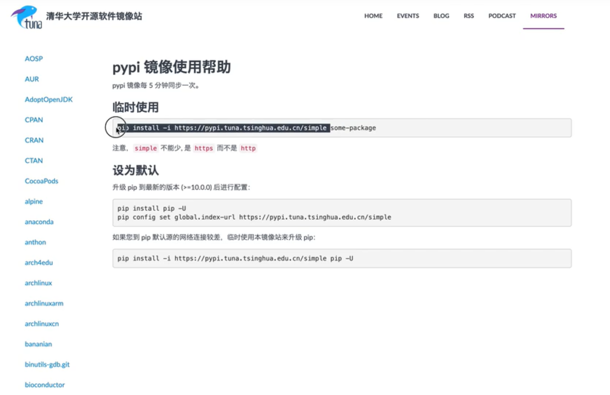

前面的一样，把后面的some-package换成想要下载的。

## request

```python
# coding=utf-8
# @Time : 2021/5/28 14:12
# @Author : zrulin
# @File : request入门.py
# @Software : PyCharm

import requests

query = input('请输入一个你喜欢的明星')

url = f'https://www.sogou.com/web?query={query}'

headers = {
    'User-Agent': 'Mozilla/5.0 (Windows NT 10.0; Win64; x64) AppleWebKit/537.36 (KHTML, like Gecko) Chrome/90.0.4430.212 Safari/537.36'
}

resp = requests.get(url, headers=headers)   # 解决了一个小的反爬

print(resp.text)
resp.close()
```


```python
# coding=utf-8
# @Time : 2021/5/28 14:24
# @Author : zrulin
# @File : requests入门02.py
# @Software : PyCharm

import requests

url = 'https://fanyi.baidu.com/sug'
i = input('请输入你要翻译的单词')
data = {
    'kw': i
}
# 发送post请求，发送的数据必须放在字典中，通过data参数进行传递
resp = requests.post(url,data=data)
print(resp.json())  # 将服务器返回的内容直接处理成json()  ->>>dict
resp.close()
```


```python
# coding=utf-8
# @Time : 2021/5/28 14:32
# @Author : zrulin
# @File : requests入门03.py
# @Software : PyCharm
import requests

url = 'https://movie.douban.com/j/chart/top_list'
param = {
    'type': '24',
    'interval_id': '100:90',
    'action': '',
    'start': '0',
    'limit': '20'
}
header = {
    'User-Agent': 'Mozilla/5.0 (Windows NT 10.0; Win64; x64) AppleWebKit/537.36 (KHTML, like Gecko) Chrome/90.0.4430.212 Safari/537.36'
}
resp = requests.get(url, params=param,headers=header)
print(resp.request.url)
print(resp.request.headers)
print(resp.json())
resp.close()
```


## 数据解析

三种解析方式

- re解析
- bs4解析
- xpath解析

xpath语法规则用起来舒服，写起来简单，最简单的是bs4,运行最快的是re

这三种方式可以混合进行使用，完全以结果作为导向，只要能拿到你想要的数据，用什么方案并不重要，当你掌握了这些之后，在考虑性能的问题。

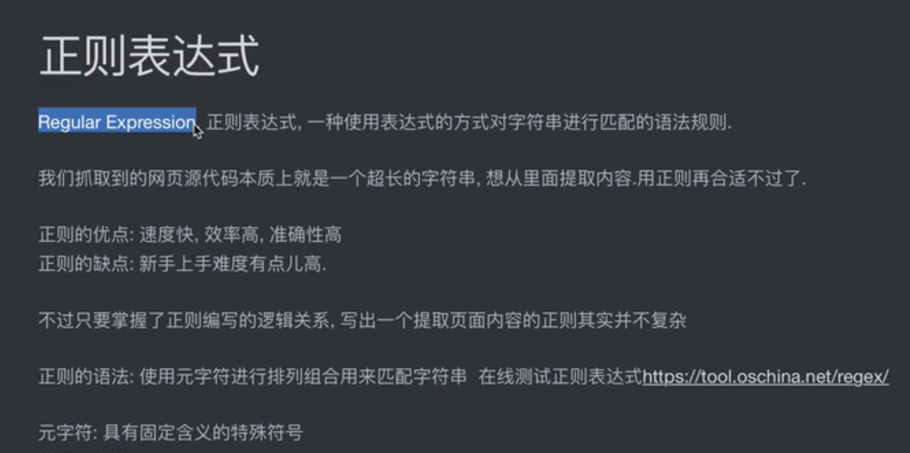

用一句话从我们的大字符串提取到我们想要的内容

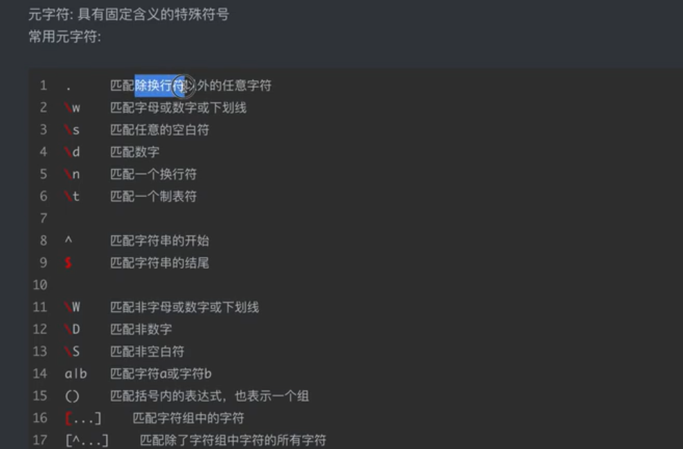

每一个元字符默认只匹配一位字符串。

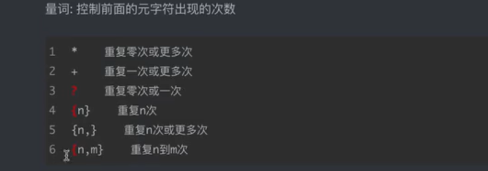

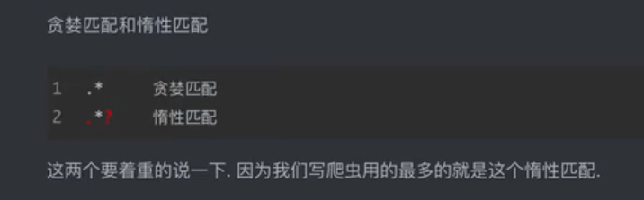

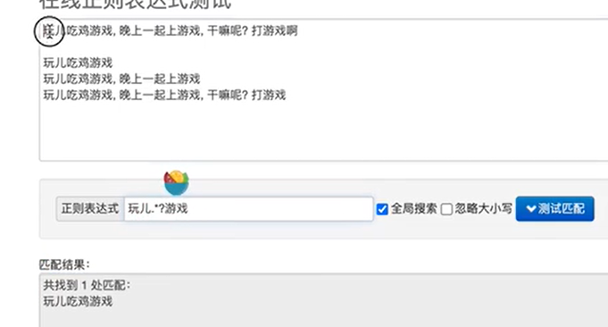

.*?   找最短的，

原理：.*默认往多里找，找到最后的时候，？问好就逼迫他往回找，用到计算机里面经典的回溯算法。

### re模块

​	

```python
# coding=utf-8
# @Time : 2021/5/28 15:43
# @Author : zrulin
# @File : re模块.py
# @Software : PyCharm

import re
# findall 匹配字符串中所有符合正则的内容
lit = re.findall(r'\d+','我的电话号码是：2616161，它的电话号码是：84658748')
print(lit)

# finditer匹配字符串中所有内容【返回的是迭代器】 从迭代器中拿到内容需要.group()
it = re.finditer(r'\d+','我的电话号码是：2616161，它的电话号码是：84658748')
print(it)
for i in it:
    print(i.group())

# search 找到一个结果就返回，返回的对象是match对象，拿数据需要.group()
s = re.search(r'\d+','我的电话号码是：2616161，它的电话号码是：84658748')
print(s)
print(s.group())

# match是从头开始匹配
m = re.match(r'\d+','2616161，它的电话号码是：84658748')
print(m)
print(m.group())

# 预加载正则表达式
obj = re.compile(r'\d+')
sm = obj.finditer(r'我的电话号码是：2616161，它的电话号码是：84658748')
print(sm)
for i in sm :
    print(i.group())
```


```python
# coding=utf-8
# @Time : 2021/5/28 15:59
# @Author : zrulin
# @File : re模块02.py
# @Software : PyCharm
import re

s = """
<div class='jay'><span id='1'>郭麒麟</span></div>
<div class='jj'><span id='2'>宋铁</span></div>
<div class='jolin'><span id='3'>大聪明</span></div>
<div class='sylar'><span id='4'>范思哲</span></div>
<div class='tory'><span id='5'>胡说八道</span></div>
"""
# (?P<分组名字>正则) 可以单独从正则匹配到的内容中进一步提取内容
obj = re.compile(r"<div class='.*?'><span id='(?P<id>\d+)'>(?P<hh>.*?)</span></div>", re.S)  # re.S 让.能匹配换行符
result = obj.finditer(s)
for i in result:
    print(i.group())
    print(i.group('id'))
    print(i.group('hh'))
    print(i.group("id")+":"+i.group("hh"))
```

手刃电影天堂

```python
# coding=utf-8
# @Time : 2021/5/28 17:11
# @Author : zrulin
# @File : 手刃豆瓣250.py
# @Software : PyCharm
import copyreg

import re
import requests
import csv

url = 'https://movie.douban.com/top250'
headers = {
    'User-Agent': 'Mozilla/5.0 (Windows NT 10.0; Win64; x64) AppleWebKit/537.36 (KHTML, like Gecko) Chrome/90.0.4430.212 Safari/537.36'
}
resp = requests.get(url, headers=headers)
page_content = resp.text
resp.close()
# 解析数据
obj = re.compile(r'<li>.*?<div class="item">.*? <span class="title">(?P<作品名>.*?)</span>.*?'
                 r' <p class="">.*?(?P<时间>\d+).*?</p>.*?'
                 r'<span class="rating_num" property="v:average">(?P<评分>.*?)</span>.*?'
                 r'<span>(?P<人数>.*?)</span>', re.S)
result = obj.finditer(page_content)

# 开始匹配
f = open('data.csv', mode='w', encoding='utf-8')
csvwriter = csv.writer(f)
for i in result:
    # print(i.group('作品名'))
    # print(i.group('时间'))
    # print(i.group('评分'))
    # print(i.group('人数'))
    dic = i.groupdict()
    csvwriter.writerow(dic.values())
f.close()
print('over!')
```

屠戮电影天堂

```python
# coding=utf-8
# @Time : 2021/5/28 19:16
# @Author : zrulin
# @File : 屠戮电影天堂.py
# @Software : PyCharm

# 1.定位到2020必看片
# 2.从2020必看片中提取到子页面的链接地址
# 3.请求子页面的链接地址,拿到我们想要的下载地址

import requests
import re
import csv

url = 'https://www.dytt89.com/'
resp = requests.get(url, verify=False)  # verify=Flase 去除安全验证
resp.encoding = 'gb2312'
content01 = resp.text
resp.close()

obj = re.compile(r'2021必看热片.*?<ul>(?P<content>.*?)</ul>', re.S)
obj1 = re.compile(r".*?<li><a href='(?P<href>.*?)' title.*?", re.S)
obj2 = re.compile(r'.*?<div class="title_all"><h1>(?P<title>.*?)</h1>.*?'
                  r'<td style="WORD-WRAP: break-word" bgcolor="#fdfddf"><a href="(?P<href>.*?)</a></td>', re.S)
result = obj.search(content01)
content02 = result.group('content')
result2 = obj1.finditer(content02)
child_href_list = []
for i in result2:
    # 拼接子页面url地址: 域名+子页面地址
    child_href = url + i.group('href').strip('/')
    child_href_list.append(child_href)
f = open('data1.csv',mode='w',encoding='utf-8')
csvwriten = csv.writer(f)
for i in child_href_list:
    resp1 = requests.get(i, verify=False)
    resp1.encoding = 'gbk'
    content03 = resp1.text
    resp1.close()
    result3 = obj2.finditer(content03)
    for j in result3:
        # print(j.group('title'))
        # print(j.group('href'))
        dic = j.groupdict()
        csvwriten.writerow(dic.values())
f.close()
```

### bs4

```python
# coding=utf-8
# @Time : 2021/5/28 20:26
# @Author : zrulin
# @File : bs4的基本使用.py
# @Software : PyCharm

# 拿到页面源代码
# 使用bs4进行解析,拿到数据
from bs4 import BeautifulSoup
import requests
import csv

url = 'http://www.xinfadi.com.cn/marketanalysis/0/list/1.shtml'
resp = requests.get(url)
content = resp.text
resp.close()
f = open('data2.csv',mode='w',encoding='utf-8')
csvwriten = csv.writer(f)
# 解析数据
# 1.把页面源代码交给BeautifulSoup进行处理,生成bs对象
page = BeautifulSoup(content, 'html.parser')
# 2.从bs中查找数据
# find(标签,属性=值) 找遇到的第一个
# findall(标签,属性=值) 找多个
# table = page.find('table', class_='hq_table')  # class是python的关键字
table = page.find('table', attrs={'class': 'hq_table'})  # 和上一行是一个意思,此时可以避免class
# 拿到所有数据的行
trs = table.find_all('tr')[1:]
for i in trs:
    tds = i.find_all('td')  # 拿到每行中的td
    for j in tds:
        csvwriten.writerow(j)
f.close()
print('over!')
```

抓图片：

```python
# coding=utf-8
# @Time : 2021/5/28 20:59
# @Author : zrulin
# @File : 抓取优美图库图片.py
# @Software : PyCharm

# 1.拿到主页面的源代码，然后提取到子页面的链接地址，href
# 2.通过href拿到子页面的内容，从子页面中找到图片的下载地址
# 3.下载地址
import requests
from bs4 import BeautifulSoup
import time

url = 'https://www.umei.net/bizhitupian/weimeibizhi/'
resp = requests.get(url)
resp.encoding = 'utf-8'
content = resp.text
resp.close()

# 把源代码交给beautifulSoup
page = BeautifulSoup(content, 'html.parser')
alist = page.find('div', class_='TypeList').find_all('a')
# print(alist)
for i in alist:
    href = 'https://www.umei.net' + i.get('href')   # 通过get拿到属性的值
    # 拿到子页面的源代码
    resp1 = requests.get(href)
    resp1.encoding = 'utf-8'
    # 从子页面中拿到图片的下载路径
    page = BeautifulSoup(resp1.text, 'html.parser')
    p = page.find('p', align='center')
    img = p.find('img')
    src = img.get('src')
    # 下载图片
    resp_img = requests.get(src)
    # resp_img.content 拿到的是字节
    img_name = src.split('/')[-1]  # 拿到url最后一个 / 以后的内容
    with open('img/'+img_name, mode='wb') as f:
        f.write(resp_img.content)
        f.close()
    print('over!1', img_name)
    time.sleep(1)
```


### xpath

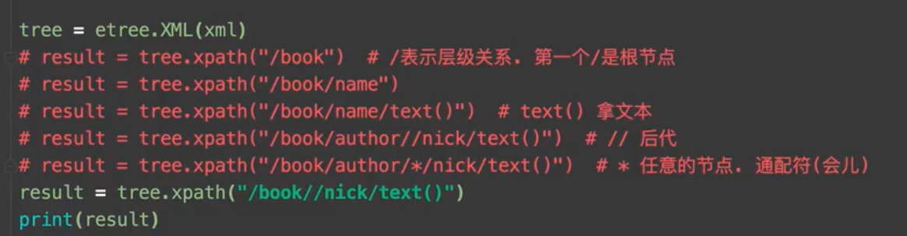

xpath是从1开始数的

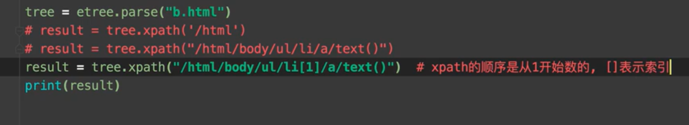

属性的筛选

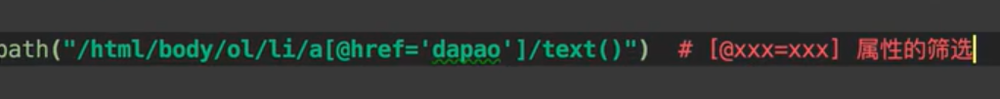

找到多个数据进行循环

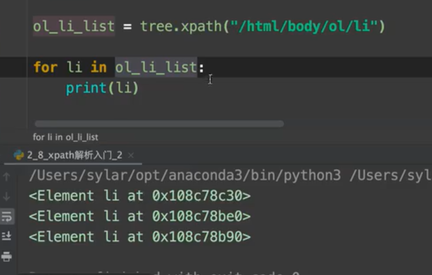

再查找到的时候，相对查找，用./开头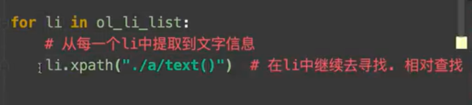

拿标签里面属性的值

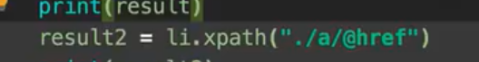

拿标签里面属性的值，拿一堆

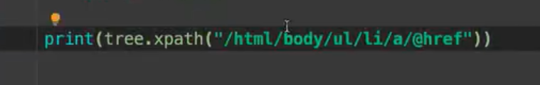

小技巧：

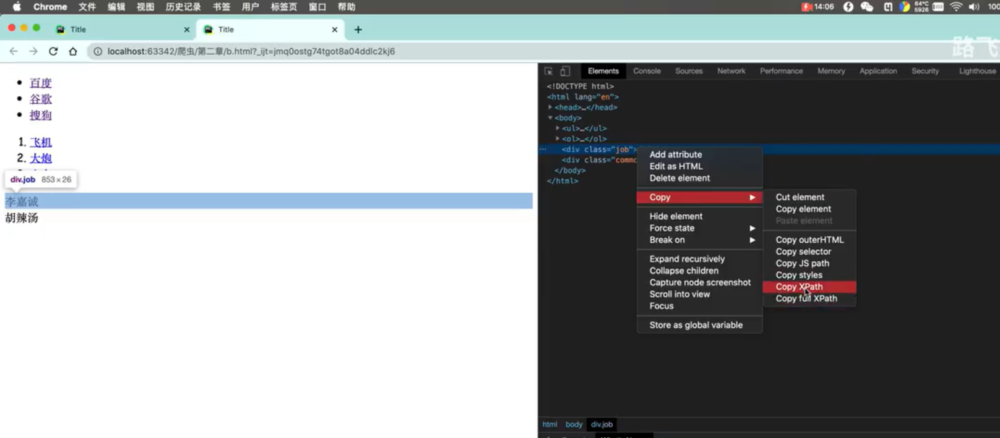

