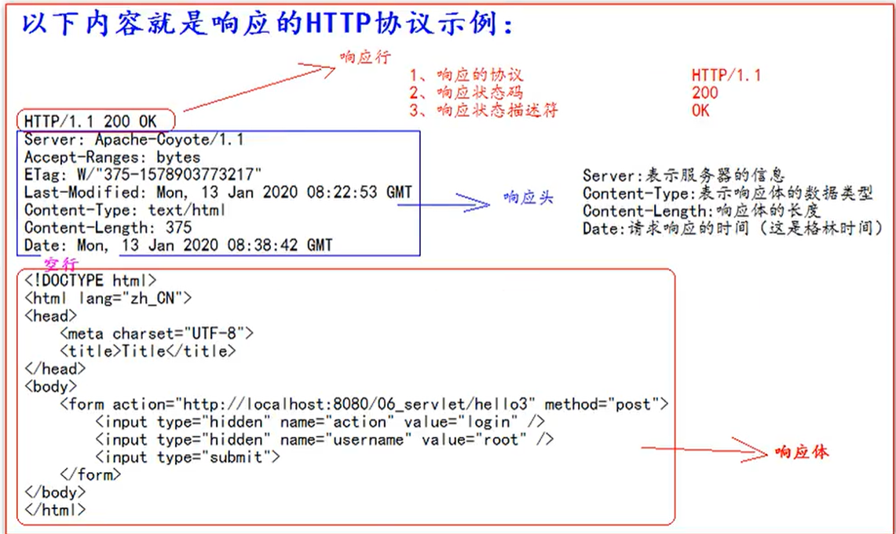

# Servlet

## 1、servlet技术

### 1、什么是servlet

​	1、servlet是JavaEE的规范之一。规范就是接口

​	2、servlet是javaweb的三大组件之一。三大组件分别是，servlet程序，Filter过滤器、Listener监听器。

​	3、Servlet是运行在服务器上的一个Java小程序，它可以接收客户端发送过来的请求，并响应数据给客户端。


### 2、手动实现servlet程序

1.编写一个类去实现Servlet接口

2.实现Servlet方法，处理请求，并响应数据。

3.到web.xml中区配置Servlet程序的访问地址

```xml
<!--    servlet 标签给Tomcat配置Servlet程序-->
    <servlet>
        <!--servlet-name标签  Servlet起一个别名（一般是类名）-->
        <servlet-name>HelloServlet</servlet-name>
<!--        servlet-class标签 是Servlet的全类名-->
        <servlet-class>com.zrulin.HelloServlet</servlet-class>
    </servlet>
<!--    servlet-mapping标签给Servlet程序配置访问地址-->
    <servlet-mapping>
<!--        servlet-name的作用是告诉服务器，我当前配置的地址是给哪个servlet程序使用-->
        <servlet-name>HelloServlet</servlet-name>
<!--         url-pattern标签配置访问地址
              /  斜杠在服务器解析的时候，表示地址为: http://ip:port/工程路径     <br/>
              /hello    表示地址为：http://ip:port/工程路径/hello                <br/>
              -->
        <url-pattern>/hello</url-pattern>
    </servlet-mapping>
```

常见的错误

1、url-pattern中配置的路径没有以斜杠打头


2、servlet-name配置的值不存在


3、servlet-class标签的全类名配置错误


### 3、url地址到Servlet程序的访问


### 4、servlet的生命周期

1、执行 servlet 构造器方法

2、执行init 初始化方法

第一、二步，是在第一次访问的时候，创建servlet程序会调用、


3、执行service方法

第三步，每次访问都会调用

4、执行destroy方法

第四步，在web工程停止的时候调用。


### 5、GET和POST请求的分发处理

```java
   @Override
    public void service(ServletRequest servletRequest, ServletResponse servletResponse) throws ServletException, IOException {
            System.out.println("3、执行service方法");
        HttpServletRequest httpServletRequest  = (HttpServletRequest) servletRequest;
        String method = httpServletRequest.getMethod();
//        System.out.println(method);
        if("GET".equals(method)){
            doGet();
        }else {
            doPost();
        }
    }
    public void doGet(){
        System.out.println("get请求");
        System.out.println("get请求");
    }
    public void doPost(){
        System.out.println("post请求");
        System.out.println("post请求");
    }
```


### 5、通过继承HttpServlet实现Servlet程序

1、编写一个类去继承HttpServlet类

2、根据业务需要重写doGet或doPost方法

3、到web.xml中配置servlet程序的访问地址


servlet类的代码：

```java
public class HelloServlet1 extends HttpServlet {
    @Override
    protected void doGet(HttpServletRequest req, HttpServletResponse resp) throws ServletException, IOException {
      System.out.println("Helloservlet1的 doget方法");
    }

    @Override
    protected void doPost(HttpServletRequest req, HttpServletResponse resp) throws ServletException, IOException {
        System.out.println("Helloservlet1的 dopost方法");

    }
}
```

web.xml中的配置

```xml
<servlet>
    <servlet-name>HelloServlet1</servlet-name>
    <servlet-class>com.zrulin.HelloServlet1</servlet-class>
</servlet>
<servlet-mapping>
    <servlet-name>HelloServlet1</servlet-name>
    <url-pattern>/hello1</url-pattern>
</servlet-mapping>
```


### 6、使用IDEA创建Servlet程序


配置servlet信息


### 7、servlet类的继承体系


## 2、ServletConfig类

ServletConfig 从名字上来看，就知道是servlet的配置信息类。

### 1、servletconfig类的三大作用

1、可以获取servlet程序的别名servlet-name的值

2、获取初始化参数init-param

```xml
<!--        init-param是初始化参数-->
        <init-param>
<!--            是参数名-->
            <param-name>username</param-name>
<!--            是参数值-->
            <param-value>root</param-value>
        </init-param>
        <init-param>
            <param-name>url</param-name>
            <param-value>jdbc:mysql://localhost:3306/test</param-value>
        </init-param>
```

(放在<servlet></servlet>里面)

3、获取servletContext对象 

```java
 public void init(ServletConfig servletConfig) throws ServletException {
        System.out.println("2、执行init 初始化方法");
//        1、可以获取servlet程序的别名servlet-name的值
            System.out.println("servlet程序的别名是："+servletConfig.getServletName());
//        2、获取初始化参数init-param
            System.out.println("初始化参数username的值是："+servletConfig.getInitParameter("username"));
            System.out.println("初始化参数url的值是："+servletConfig.getInitParameter("url"));
//        3、获取servletContext对象
        System.out.println(servletConfig.getServletContext());
    }
```

对初始化信息进行操作

==注：==

 重写init方法一定要写上super.init(config)


因为他继承的是父类（GenericServlet）的方法，而在父类方法中有this.config = config;但是重写后就没有了这个语句（重写覆盖）。使得config没有了被赋值的机会。所以报空指针异常。

## 3、ServletContext类

### 1、什么是ServletContext

1、ServletContext是一个接口，他表示servlet上下文对象。

2、一个web工程只有一个ServletContext对象实例。

3、ServletContext对象是一个域对象。

4、ServletContext是在web工程启动的时候创建，在web工程停止的时候销毁。


什么是域对象？

域对象是可以像Map一样存储数据的对象，叫做域对象。

这里的域指的是存储数据的操作范围，整个web工程。

|        | 存数据         | 取数据         | 删除数据          |
| ------ | -------------- | -------------- | ----------------- |
| Map    | put()          | get()          | remove()          |
| 域对象 | setAttribute() | getAttribute() | removeAttribute() |

### 2、ServletContext类的四个作用

1、获取web.xml 配置的上下文参数 context-param

2、获取当前的工程路径，格式：/工程路径

3、获取工程部署后在服务器硬盘上的绝对路径

```java
public class ServletContext extends HttpServlet {
    protected void doPost(HttpServletRequest request, HttpServletResponse response) throws ServletException, IOException {
//        1、获取web.xml 配置的上下文参数 context-param
        javax.servlet.ServletContext context = getServletConfig().getServletContext();	
        String name = context.getInitParameter("name");
        System.out.println("context-param参数name的值是："+name);
        System.out.println("context-param参数password的值是："+context.getInitParameter("password"));
//        2、获取当前的工程路径，格式：/工程路径
        System.out.println("当前的工程路径："+context.getContextPath());
//        3、获取工程部署后在服务器硬盘上的绝对路径
        /*
        	/ 斜杠呗服务器解析地址为：http://ip:port/工程名/ <br/>
        */
        System.out.println("工程部署的路径是："+context.getRealPath("/"));
    }
```

4、像Map一样存储数据

```java
public class ServletContext1 extends HttpServlet {
    protected void doGet(HttpServletRequest request, HttpServletResponse response) throws ServletException, IOException {
        ServletContext context = getServletContext();
        System.out.println(context);
        System.out.println("context  key1 的值："+context.getAttribute("key1"));
        context.setAttribute("key1","value1");
        System.out.println("context  key1 的值："+context.getAttribute("key1"));
        System.out.println("context  key1 的值："+context.getAttribute("key1"));
    }
}
```


## 4、http协议

### 1、什么是HTTP协议

​	什么是协议？

​		协议是指双方，或多方，相互约定好，大家都需要遵守的规则，叫协议。

所谓HTTP协议，就是指，客户端和服务器之间通信时，发送的数据，需要遵守的规则，叫HTTP协议。

HTTP协议中的数据又叫报文。

### 2、请求的HTTP协议格式

客户端给服务器发送数据叫请求。

服务器给客户端回传数据叫响应。


请求又分为GET请求，和POST请求两种。

#### 1、GET请求

1、请求行

- 请求的方式										GET
- 请求的资源路径[+?+请求参数]         
- 请求的协议的版本号                          HTTP/1.1

2、请求头

​	key:value  组成  	不同的键值对，表示不同的含义


#### 2、POST请求

1、请求行

- 请求的方式										POST
- 请求的资源路径[+?+请求参数]         
- 请求的协议的版本号                          HTTP/1.1

2、请求头

​	key:value  组成  	不同的键值对，表示不同的含义

​	==空行==

3、请求体		====>>>		就是发送给服务器的数据


#### 3、常用的请求头的说明

Accept：表示客户端可以接收的数据类型

Accept-Languege：表示客户端可以接收的语言类型

User-Agent：表示客户浏览器的信息。

Host：表示请求时的服务器ip和端口号

#### 4、哪些时GET请求，哪些是POST请求

GET请求：

1. form标签 method = get
2. a标签
3. link标签引入css
4. Script标签引入js文件
5. img标签引入图片
6. iframe引入html页面
7. 在浏览器地址栏中输入地址后敲回车

POST请求

1. form标签 method = post


### 3、响应的HTTP协议格式

1. 相应行

   1. 响应的协议和版本号
   2. 响应的状态码
   3. 响应的状态描述符

2. 响应头

   1. key:value		不同的响应头，有其不同的含义。

   ==空行==

3. 响应体

   ----->>  就是回传给客户端的数据





### 4、常用的响应码说明

​	200			表示请求成功

​	302			表示请求重定向

​	404			表示请求服务器已经收到了，但你要的数据不存在（请求地址错误）

​	500			表示服务器已收到请求，但服务器内部错误（代码错误）

### 5、MIME类型说明


谷歌浏览器如何查看HTTP协议


## 5、HttpServletRequest类

### 1、HttpServletRequest类有什么用

每次只要有请求进入Tomcat服务器，Tomcat服务器就会把请求过来的HTTP协议信息解析封装好到Request对象中。然后传递到service方法（doGet和doPost）中给我们使用，我们可以通过HttpServletRequest对象，获取到所有请求的信息。

### 2、HttpServletRequest类的常用方法

1、getRequestURI（）					获取请求的资源路径

2、getRequestURL（）					获取请求的统一资源定位符（绝对路径）

3、getRemoveHost（）					获取客户端的IP地址

4、getHeader（）								获取请求头

5、getParameter（）						获取请求的参数

6、getParametervalues（）			获取请求的参数（多个值的时候使用）

7、getMethod（）							获取请求的方式GET或POST

8、setAttribute（key,value）		设置域数据

9、getAttribute(key)							获取域数据

10、getRequestDispatcher（）			获取请求转发对象

```java
//        1、getRequestURI（）             获取请求的资源路径
            System.out.println("URI ====>>>>" +req.getRequestURI());
//        2、getRequestURL（）                获取请求的统一资源定位符（绝对路径）
            System.out.println("URL ====>>>>" +req.getRequestURL());
//        3、getRemoteHost（）                获取客户端的IP地址
            System.out.println("k客户的ip地址 ==>>  " +req.getRemoteHost());
//        4、getHeader（）
        System.out.println("请求头User-Agent："+ req.getHeader("User-Agent"));
        System.out.println("请求的方法 ：==>>  " +req.getMethod());
```

获取表单数据

doget请求


表单


### 解决dopost时的乱码

```java
System.out.println("-----------doPost-----------");
req.setCharacterEncoding("UTF-8");
```

在dopost中添加这个


### 3、请求的转发

什么是请求的转发？

请求的转发是指，服务器收到请求后，从一次资源转到另一个资源的操作叫做请求的转发。


Servlet1中的代码

```java
    protected void doGet(HttpServletRequest req, HttpServletResponse resp) throws ServletException, IOException {
//            获得请求的参数（办事的材料）查看
        String username = req.getParameter("username");
        System.out.println("在柜台一（servlet1）中查看的材料为：" + username);

        //给材料盖一个章，并传递到servlet2（柜台2）去查看
        req.setAttribute("key1","柜台一的章");

        //问路，servlet2（柜台2）怎么走，
        /*
        * 请求转发必须要以斜杠打头， /  表示地址为：http://ip:port/工程名/，映射到IDEA代码的web目录。<br/>
        * */
        RequestDispatcher requestDispatcher = req.getRequestDispatcher("/servlet2");
        //走向servlet2（柜台2）
        requestDispatcher.forward(req,resp);
    }
}
```

Servlet2中的代码：

```java
public class Servlet2 extends HttpServlet {
    @Override
    protected void doGet(HttpServletRequest req, HttpServletResponse resp) throws ServletException, IOException {
    //获取请求的参数
    System.out.println("在Servlet2 中查看 参数：" + req.getParameter("username"));
    Object key1 = req.getAttribute("key1");
    System.out.println("柜台一是否有章 ：" +key1);

    //处理自己的业务
    System.out.println(" servlet2    处理自己的业务");
}
}
```

请求转发的特点：

1、浏览器地址栏没有变化

2、他们是一次请求

3、他们共享Request域中的数据

4、可以转发到WEB-INF目录下

5、不可以访问工程以外的资源

### 4、base标签的作用

​	==所有相对路径在工作时都会参照当前浏览器地址栏中的地址来进行跳转==

地址栏中地址http://localhost:8888/Servlet3/a/b/c.html

点击../../index.html

http://localhost:8888/Servlet3/a/b/c.html../../index.html  -->

http://localhost:8888/Servlet3/a/b/../../index.html 			-->

http://localhost:8888/Servlet3/a/../index.html 					-->

http://localhost:8888/Servlet3/index.html 


base标签可以设置当前页面中所有相对路径工作时，参照哪个路径来进行跳转。

​	

### 5、Web中的相对路径和绝对路径

在javaweb中路径分为相对路径和绝对路径

相对路径是：

.					表示当前目录

..					表示上一级目录

资源名			表示当前目录/资源名


绝对路径：

​		http://ip:port/工程路径/资源路径

### 6、web 中 / 斜杠的不同意义

在web中 / 斜杠 是一种绝对路径

/ 斜杠 如果呗浏览器解析，得到的地址是：http://ip:port/

```html
				<a href="/">/</a>
```

/ 斜杠 如果被服务器解析，得到的地址是；http://ip:port/工程路径

```java
1、<url-pattern>/servlet1</url-pattern>
2、servletContext.getRealPath("/");
3、request.getRequestDispatcher("/");
```

特殊情况：response.sendRediect("/") ;  把斜杠发送给浏览器解析。得到：http://ip:port/

## 2、HttpServletResponse类

### 1、HttpServletResponse类的作用

​	HttpServletResponse类和HttpServletRequest类一样，每次请求过来，Tomcat服务器都会创建一个Response对象传递给servlet程序去使用。HttpServletRequest表示请求过来的信息，HttpServletResponse表示所有响应的信息，

​	我们如果需要设置返回给客户端的信息，都可以通过HttpServletResponse对象来进行设置。

### 2、两个相应流的说明

​	字节流			getOutputStream();			常用于下载（传递二进制数据）

​	字符流			getWriter()							常用于回传字符串（常用）

两个流同时只能使用一个。

使用了字节流，就不能再使用字符流，反之亦然，否则就会报错。


### 3、如何往客户端回传数据

要求：往客户端回传 字符串 数据；


### 4、解决响应中的中文乱码

```java
public class responseIoServlet extends HttpServlet {
    @Override
    protected void doGet(HttpServletRequest req, HttpServletResponse resp) throws ServletException, IOException {
        //设置服务器的字符集为UTF-8
        resp.setCharacterEncoding("UTF-8");
        //通过响应头，设置浏览器也使用UTF-8字符集
        resp.setHeader("Content-Type","text/html; charset=UTF-8");
        PrintWriter writer = resp.getWriter();
        writer.write("468486484684");
        writer.println("h哈哈哈哈哈哈");
        System.out.println(resp.getCharacterEncoding());
    }
}
```

**方案二：**

```java
//他会同时设置服务器和客户端都使用UTF-8字符集，还设置了响应头
//注意：此方法一定要获取流对象之前调用才有效
resp.setContentType("text/html; charset=UTF-8");
```

### 5、请求重定向

​	请求重定向，是指客户端给服务器发请求，然后服务器告诉客户端说。我给你一些地址。你去新地址访问。叫请求重定向（因为之前的地址可能已经被废弃）


response代码：

```java
public class Respons1 extends HttpServlet {
    @Override
    protected void doGet(HttpServletRequest req, HttpServletResponse resp) throws ServletException, IOException {
        System.out.println("sponse1 曾到此一游");
        //设置响应码302，表示重定向，（已搬迁）
        resp.setStatus(302);
        //设置响应头，说明新的地址在哪里
        resp.setHeader("Location","http://localhost:8888/Servlet3/response2");
    }
}
```

response2代码：

```java
public class Response2 extends HttpServlet {
    @Override
    protected void doGet(HttpServletRequest req, HttpServletResponse resp) throws ServletException, IOException {
        resp.getWriter().println("response2's result! ");
    }
}
```

==请求重定向的特点：==

1、浏览器地址栏会发生变化

2、两次请求

3、不共享Resquest域中的数据

4、不能访问WEB-INF下的资源

5、可以访问工程外的资源

**请求重定向的方案二（推荐使用）**

```java
public class Respons1 extends HttpServlet {
    @Override
    protected void doGet(HttpServletRequest req, HttpServletResponse resp) throws ServletException, IOException {
        System.out.println("sponse1 曾到此一游");
//        //设置响应码302，表示重定向，（已搬迁）
//        resp.setStatus(302);
//        //设置响应头，说明新的地址在哪里
//        resp.setHeader("Location","http://localhost:8888/Servlet3/response2");
        resp.sendRedirect("http://localhost:8888");

    }
}
```

   resp.sendRedirect("http://localhost:8888");