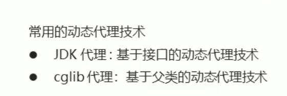
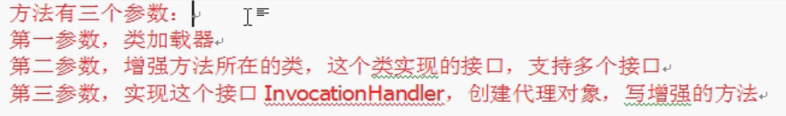

# Spring

## Spring-Ioc

### Spring程序开发步骤：

1.导入Spring开发的基本包坐标。

2.编写Dao接口和实现类。

3.编写Spring核心配置文件。

4.在Spring配置文件中配置UserDaoImpl

5.使用Spring的ApI获得Bean实例


### Bean标签基本配置


### Bean标签的范围配置

	singleton让spring容器只生成一个bean对象，prototype 创建多个bean对象

singleton在加载配置文件，创建spring容器的时候就创建对象 ，之后的getbean就获取这个创建的对象。

prototype则是在每次getbean的时候创建一个bean对象。


### bean的生命周期配置


### Bean实例化三种方式:

**无参构造方法实例化**

```xml
<bean id="userDao" class="com.zrulin.dao.impl.UserDaoImpl" scope="prototype"></bean>
```

**工厂静态方法实例化**

xml配置：

```xml
<bean id="userDao" class="com.zrulin.factory.StaticFactory" factory-method="getUserDao"></bean>
```

创建工厂对象，静态方法：

```java
public class StaticFactory {
    public static UserDao getUserDao(){
        return new UserDaoImpl();
    }
}
```

**工厂实例方法实例化**

xml配置：

```xml
<bean id="factory" class="com.zrulin.factory.DynamicFactory"></bean>
<bean id="userDao" factory-bean="factory" factory-method="getUserDao"></bean>
```

创建工厂对象，方法：

```java
public class DynamicFactory {
    public UserDao getUserDao(){
        return new UserDaoImpl();
    }
}
```

### Bean的依赖注入分析


### Bean依赖注入分析


### Bean的依赖的注入方式

构造方法：

java代码：

```java
public class UserServiceImpl implements UserService {
    private UserDao userDao;
//    public void setUserDao(UserDao userDao){
//        this.userDao = userDao;
//    }
    public UserServiceImpl(){

    }
    public UserServiceImpl(UserDao userDao){
        this.userDao = userDao;
    }
    @Override
    public void save() {
        userDao.save();
        System.out.println("UserService..............save.........");
    }
}
```

xml配置文件代码：

```xml
<bean id="userService" class="com.zrulin.service.Impl.UserServiceImpl">
        <constructor-arg name="userDao" ref="userDao"></constructor-arg>
</bean>
```


**set方法注入：**

java代码：

```java
public class UserServiceImpl implements UserService {
    private UserDao userDao;
    public void setUserDao(UserDao userDao){
        this.userDao = userDao;
    }
    @Override
    public void save() {
        userDao.save();
        System.out.println("UserService..............save.........");
    }
}
```

xml代码：

```xml
<bean id="userDao" class="com.zrulin.dao.impl.UserDaoImpl"></bean>
<bean id="userService" class="com.zrulin.service.Impl.UserServiceImpl">
        <property name="userDao" ref="userDao"></property>
</bean>
```

在类里面创造属性，然后创造set方法。在spring容器配置里面配置依赖关系。

**p命名空间注入本质也是set方法注入**


### Bean的依赖注入的数据类型


**普通数据类型：**


property 标签，然后name填属性名，value填值

==是普通数据类型就用value  是引用对象就用ref==

**集合数据类型**


### 引入其他配置文件（分模块开发）


==知识要点==


 	

### ApplicationContext的继承体系：

==applicationContext :==	接口类型，代表应用上下文，可以通过其实例获得Spring容器中的Bean对象。


### ApplicationContext实现类


### getBean（）方法的使用


第一种方法通过id去获取bean对象，允许容器当中可以出现多个相同的bean（视频20）


### 数据源（连接池）的作用


 

**手动创建c3p0数据源（==加载properties配置文件==）**

```java
@Test
public void test3()throws Exception{
    ResourceBundle rb =  ResourceBundle.getBundle("jdbc");
    String username = rb.getString("username");
    String password = rb.getString("password");
    String url = rb.getString("url");
    String driverClass = rb.getString("driverClass");
    DruidDataSource dataSource = new DruidDataSource();
    dataSource.setPassword(password);
    dataSource.setUsername(username);
    dataSource.setDriverClassName(driverClass);
    dataSource.setUrl(url);
    DruidPooledConnection conn = dataSource.getConnection();
    System.out.println(conn);
    conn.close();
} 
```

### 抽取jdbc配置文件


本来是：

```xml
<bean id="dataSource" class="com.alibaba.druid.pool.DruidDataSource">
    <property name="driverClassName" value="com.mysql.jdbc.Driver"></property>
    <property name="url" value="jdbc:mysql://localhost:3306/jdbctest"></property>
    <property name="username" value="root"></property>
    <property name="password" value="123456"></property>
</bean>
```

后来改为：

==遇到的问题==

我修改之前properties的配置是：


然后xml配置是：


一直报错

在后面加上这个之后停止报错

``` xml
 system-properties-mode="NEVER"
```


查到大概的原因，我觉的是系统默认在系统里面查找和在properties配置文件中查找先后或者覆盖的问题，因为我的properties中的key值可能和某些system中的值有重复。

后面我修改properties中的key值为：


用原来的xml配置信息：


没有再报错，

网上只搜到这个不详细的：


### spring的原始注解


xml:

```xml
<context:component-scan base-package="com.zrulin"></context:component-scan>
```

java：

```java
/**
 * @author zrulin
 * @create 2021-04-04 20:30
 */
//<bean id="userService" class="com.zrulin.test.service.Impl.UserServiceImpl">    </bean>
//@Component("userService")
@Service("userService")
//@Scope("prototype")
@Scope("singleton")
public class UserServiceImpl implements UserService {
    //        @Value("items") //应用场景少
    @Value("${jdbc.url}")   //应用场景更多，用于获取容器中的key值
    private String driver;

    //<property name="userDao" ref="userDao"></property>
//    @Autowired  //可以注掉Qulifier注解，一旦注掉，那么Autowired就会按照数据类型从spring容器中进行匹配。
//    @Qualifier("userDao")   //是按照id值从容器中进行匹配的，但是主要此处@Autowried和@Qualifier必须结合一起使用
    @Resource(name = "userDao") //@Resource 相当于@Qualifier+@Aurowried
    private UserDao userDao;    //再注解模式中set方法可以省略。

    public void setUserDao(UserDao userDao) {
        this.userDao = userDao;
    }

    @Override
    public void save() {
        System.out.println(driver);
        userDao.save();
    }
    @PostConstruct
    public void init(){
        System.out.println("service的初始化方法");
    }
    @PreDestroy
    public void destory(){
        System.out.println("service的销毁方法");
    }
}
```

### spring新注解


### 原始Junit测试Spring的问题


**上述问题解决思路**


### Spring集成Junit步骤

	


## Spring-Aop

### 什么是aop


动态代理：解耦合


### aop的作用及其优势


### aop的底层实现


### aop动态代理技术



cglib动态代理技术看着像继承，实则不是。

### jdk动态代理实现

 



```java
/**
 * @author zrulin
 * @create 2021-04-05 9:04
 */
public class ProxyTest {
    public static void main(String[] args){
        //创建目标对象
        TargetImpl target = new TargetImpl();
        //获得增强对象
        Advice advice = new Advice();
        Target proxy = (Target) Proxy.newProxyInstance(
                target.getClass().getClassLoader(),//目标对象的类加载器
                target.getClass().getInterfaces(),//目标对象相同的接口字节码对象数组
                new InvocationHandler() {
                    //调用代理对象的任何方法，实质执行的都是invoke方法
                    @Override
                    public Object invoke(Object proxy, Method method, Object[] args) throws Throwable {
                        advice.before();    //前置增强
                        Object res = method.invoke(target, args);//执行目标方法
                        advice.afterReturning();    //后置增强
                        return res;

                    }
                }
        );
        proxy.save();
    }
}
```


itheima里面的jdk的动态代理，如果看不懂可以结合尚硅谷spring5框架去看，讲的更加清晰。

### cglib动态代理

```java
public class ProxyTest {
    public static void main(String[] args){
        //创建目标对象
        final TargetImpl target = new TargetImpl();
        //获得增强对象
        final Advice advice = new Advice();
        //返回值，就是动态生成的代理对象。
        //1.创建增强器
        Enhancer enhancer = new Enhancer();
        //2.设置父类（目标）
        enhancer.setSuperclass(TargetImpl.class);
        //3.设置回调
        enhancer.setCallback(new MethodInterceptor() {
            public Object intercept(Object proxy, Method method, Object[] args, MethodProxy methodProxy) throws Throwable {
                advice.before();//1.执行前置
                Object res = method.invoke(target,args);//2.执行目标
                advice.afterReturning();//3.执行后置
                return res;
            }
        });
        //4.创建代理对象
        TargetImpl  proxy = (TargetImpl) enhancer.create();
        proxy.save();
    }
}
```

### Aop的相关概念

### Aop开发明确的事项：

**需要编写的内容**

**Aop技术实现的内容**

**aop底层使用哪种代理方式**


==小总结==


### 基于xml的Aop开发


xml:

引入**aop命名空间**之后

```xml
<!--    目标对象-->
    <bean id="target" class="com.zrulin.proxy.aop.TargetImpl" ></bean>
<!--    切面对象-->
    <bean id="myAdvice" class="com.zrulin.proxy.aop.MyAdvice"></bean>
<!--    配置织入：告诉spring框架，哪些方法（切点）需要进行哪些增强（前置，后置.....）-->
    <aop:config>
<!--        声明切面-->
        <aop:aspect  ref="myAdvice">
            <aop:before method="before" pointcut="execution(public void com.zrulin.proxy.aop.TargetImpl.save())"/>
        </aop:aspect>
    </aop:config>
</beans>
```

### xml配置Aop详解

**切点表达式的写法**


**通知的类型**


**切点表达式的抽取**


==小总结==


### 基于注解的aop开发

### 步骤


### 注解配置aop详解

**注解通知的类型**


**切点表达式的抽取**


### 关于基于aop注解的知识要点


## Spring JdbcTemplate

### jdbcTemplate开发步骤


```xml
<context:property-placeholder location="classpath:jdbc.properties"/>
<bean id="dataSource" class="com.alibaba.druid.pool.DruidDataSource">
    <property name="driverClassName" value="${jdbc.driverClass}"/>
    <property name="url" value="${jdbc.url}"/>
    <property name="username" value="${jdbc.username}"/>
    <property name="password" value="${jdbc.password}"/>
</bean>

<bean id="jdbcTemplate" class="org.springframework.jdbc.core.JdbcTemplate">
    <property name="dataSource" ref="dataSource"/>
</bean>
```

### 知识要点


### 增删改操作：

```java
/**
 * @author zrulin
 * @create 2021-04-06 10:22
 */
@RunWith(SpringJUnit4ClassRunner.class)
@ContextConfiguration("classpath:applicationContext.xml")
public class SpringJdbcTemplateTest {
    @Autowired
    private JdbcTemplate jdbcTemplate;

    @Test
    public void test1(){
        for (int i = 0; i < 500; i++) {
             jdbcTemplate.update("insert into count (name,money)values(?,?)", "晓芙_"+i, "53"+i*42);
        }
    }
    @Test
    public void test2(){
        int row = jdbcTemplate.update("update count set name = ? where money = ?", "美女", "999999");
        System.out.println(row);
    }
    @Test
    public void test3(){
//     jdbcTemplate.update("delete from count where name = ?", "mein");
        jdbcTemplate.update("delete from count where money = ?", "a51563");
    }
    @Test
    public void test4(){
        List<Count> query = jdbcTemplate.query("select * from count", new BeanPropertyRowMapper<Count>(Count.class));
    }
    @Test
    public void test5(){
        Count c = jdbcTemplate.queryForObject("select name,money from count where name = ?", new BeanPropertyRowMapper<Count>(Count.class), "大佬");
        System.out.println(c);
    }
    @Test
    public void test6(){
        Long aLong = jdbcTemplate.queryForObject("select count(*) from count", long.class);
        System.out.println(aLong);
    }
}
```

需要导的jar包（设置坐标）

Spring-context 

spring-jdbc

spring-tx

druid

mysql-connector-java

junit

spring-test


## Spring的事务控制

### PlatfromTransactionManager


### TransationDefinition


**事务隔离级别**


**事务传播行为**


### transactionStatus


### 基于xml的声明式事务控制

**什么是声明式事务控制**


**声明式事务处理的作用**


基于xml的代码：

```xml
<?xml version="1.0" encoding="UTF-8"?>
<beans xmlns="http://www.springframework.org/schema/beans"
       xmlns:xsi="http://www.w3.org/2001/XMLSchema-instance"
       xmlns:context="http://www.springframework.org/schema/context"
       xmlns:aop="http://www.springframework.org/schema/aop"
       xmlns:tx="http://www.springframework.org/schema/tx"
       xsi:schemaLocation="
       http://www.springframework.org/schema/beans http://www.springframework.org/schema/beans/spring-beans.xsd
       http://www.springframework.org/schema/aop http://www.springframework.org/schema/aop/spring-aop.xsd
       http://www.springframework.org/schema/tx http://www.springframework.org/schema/tx/spring-tx.xsd
        http://www.springframework.org/schema/context http://www.springframework.org/schema/context/spring-context.xsd ">

<!--    读jdbc.properties文件-->
    <context:property-placeholder location="jdbc.properties"/>
<!--    弄一个数据源对象-->
    <bean id="dataSource" class="com.alibaba.druid.pool.DruidDataSource">
        <property name="driverClassName" value="${jdbc.driverClass}"/>
        <property name="username" value="${jdbc.username}"/>
        <property name="password" value="${jdbc.password}"/>
        <property name="url" value="${jdbc.url}"/>
    </bean>
<!--    弄一个jdbcTemplate对象-->
    <bean id="jdbcTemplate" class="org.springframework.jdbc.core.JdbcTemplate">
        <property name="dataSource" ref="dataSource"/>
    </bean>
<!--    弄一个accountDao对象-->
    <bean id="accountDao" class="com.zrulin.dao.Impl.AccountDaoImpl">
        <property name="jdbcTemplate" ref="jdbcTemplate"/>
    </bean>
<!--    目标对象，内部的方法是切点-->
    <bean id="accountService" class="com.zrulin.service.Impl.AccountServiceImpl">
        <property name="accountDao" ref="accountDao"/>
     </bean>
<!--    配置事务平台管理器-->
    <bean id="transactionManager" class="org.springframework.jdbc.datasource.DataSourceTransactionManager">
        <property name="dataSource" ref="dataSource"/>
    </bean>
<!--    通知，事务的增强-->
    <tx:advice id="txAdvice" transaction-manager="transactionManager">
<!--        设置事务的属性信息-->
        <tx:attributes>
            <tx:method name=" *"/>
        </tx:attributes>
    </tx:advice>
<!--    配置事务的织入，把通知和方法织在一起-->
    <aop:config>
        <aop:advisor advice-ref="txAdvice" pointcut="execution(* com.zrulin.service.*.*(..))"/>
    </aop:config>
</beans>
```


**抽取表达式**


### 知识要点


### 基于注解的方法做事务控制

到时候还不懂就去再看视频吧，也就一点点。

### 注解声明式事务控制


![image-20210406171539945](../img/image-20210406171539945.png