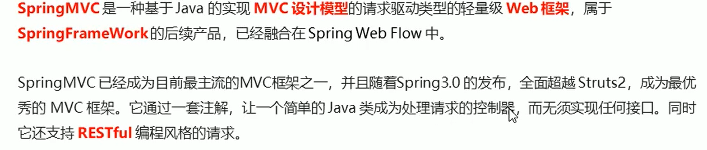
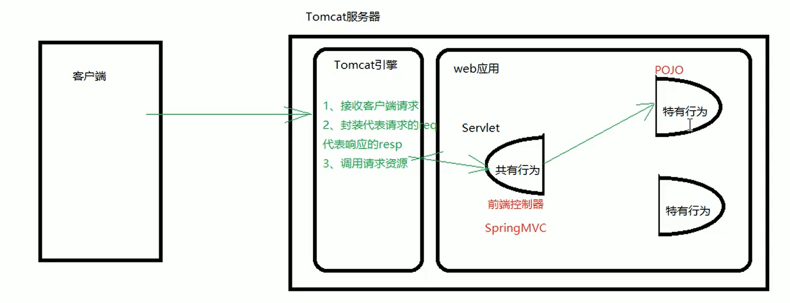
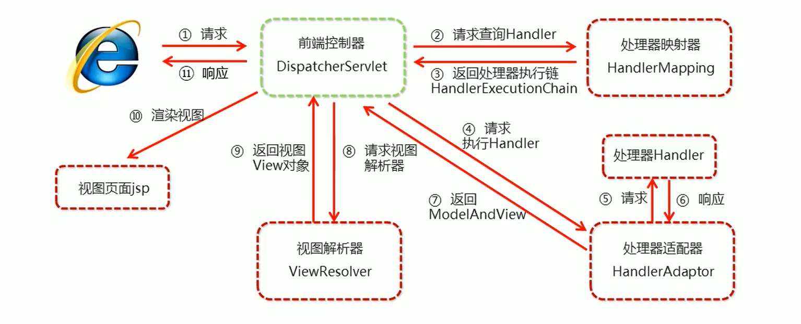
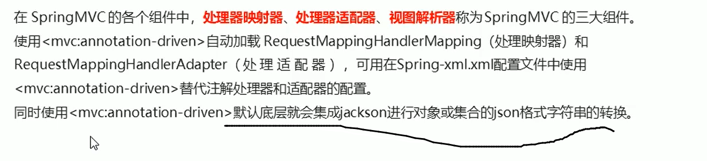

# SpringMVC

## spring继承web环境

### ApplicationContext应用上下文获取方式


### 1.自己造监听器，自己造tuils类

```java
/**
 * @author zrulin
 * @create 2021-04-07 8:56
 */
public class ContextLoaderListener implements ServletContextListener {
    @Override
    public void contextInitialized(ServletContextEvent servletContextEvent) {
        //获取ServletContext类
        ServletContext servletContext = servletContextEvent.getServletContext();
        //把设置在web.xml中的参数（配置文件的名字）拿出来！！解耦合
        String contextConfigLocation = servletContext.getInitParameter("contextConfigLocation");
        ApplicationContext app = new ClassPathXmlApplicationContext(contextConfigLocation);
        //让spring在整个web工程中只创建一次，把这个上下文参数存到ServletContext域中
        servletContext.setAttribute("app",app);
        System.out.println("spring容器创建了。。。。。。。。。。。。。。。。。");
    }

    @Override
    public void contextDestroyed(ServletContextEvent servletContextEvent) {

    }
}
```

可以让spring在整个web工程中只创建一次，把这个上下文参数存到ServletContext域中

```java
public class WebApplicationContextUtils {
    public static ApplicationContext getApplicationContext(ServletContext servletContext){
        return (ApplicationContext) servletContext.getAttribute("app");
    }
}
```

可以直接用  类.静态方法  的方式获得app,而不是通过ServletContext.getAttribute的方式，因为后者需要一个key才能获得值，key的名字就耦合死了。

### 2.Spring提供了获取应用上下文的工具


```xml
    <context-param>
        <param-name>contextConfigLocation</param-name>
        <param-value>classpath:applicationContext.xml</param-value>
    </context-param>
<!--    监听器-->
    <listener>
        <listener-class>org.springframework.web.context.ContextLoaderListener</listener-class>
    </listener>
```

## SpringMVC简介





**流程**


1.导入坐标：spring-webmvc

2.配置springMVC核心控制器DispathcerServlet

```xml
<servlet>
  <servlet-name>DispatcherServlet</servlet-name>
  <servlet-class>org.springframework.web.servlet.DispatcherServlet</servlet-class>
  <init-param>
    <param-name>contextConfigLocation</param-name>
    <param-value>classpath:springmvc.xml</param-value>
  </init-param>
  <load-on-startup>1</load-on-startup>
</servlet>
<servlet-mapping>
  <servlet-name>DispatcherServlet</servlet-name>
  <url-pattern>/</url-pattern>
</servlet-mapping>
```

3.创建Controller类和视图页面

```java
/**
 * @author zrulin
 * @create 2021-04-07 20:55
 */
@Controller
public class UserController {
    @RequestMapping("/quick")
    public String save(){
        System.out.println("userController running.............................");
        return "success.jsp";
    }
}
```

4.使用注解配置Controller类中业务方法的映射地址

如上。

5.配置springmvc的核心文件springmvc.xml

```xml
<context:component-scan base-package="com.zruliln.controller"/>
```

主要是在这个配置文件中开启了controller那一部分的组件扫描

6.客户端发起请求测试

自己去玩吧。

**流程图图示**


**执行流程**




## SpringMVC注解解析


## SpringMVC的xml配置解析

==1.视图解析器==


```xml
<!--       配置内部资源视图解析器 -->
        <bean id="viewResolver" class="org.springframework.web.servlet.view.InternalResourceViewResolver">
                <property name="prefix" value="/jsp/"/>
                <property name="suffix" value=".jsp"/>
        </bean>
```

==小总结==


## SpringMVC的数据响应方式

​	

### 页面跳转

**1.返回字符串形式**


配置视图解析器：

```xml
<!--       配置内部资源视图解析器 -->
        <bean id="viewResolver" class="org.springframework.web.servlet.view.InternalResourceViewResolver">
                <property name="prefix" value="/jsp/"/>
                <property name="suffix" value=".jsp"/>
        </bean>
```

**2.ModelAndView**

1. xml:

   ```java
   @RequestMapping("/quick1")
   public ModelAndView save1(){
       /*
       * model：模型，作用封装数据
       * vidw： 视图，作用展示数据
       * */
       ModelAndView modelAndView = new ModelAndView();
       modelAndView.setViewName("success");
       modelAndView.addObject("username","hello world");
       System.out.println("quick1");
       return modelAndView;
   }
   ```

   ==在这里面遇到了一个问题，用ModelAndView的时候jsp页面EL表达式没反应，然后我百度之后，在头部page里面加上这个就好了==：
   
   

2. xml:

   ```java
   @RequestMapping("/quick2")
   public ModelAndView save2(ModelAndView modelAndView){
       modelAndView.setViewName("success");
       modelAndView.addObject("username","hello2 world");
       System.out.println("quick2");
       return modelAndView;
   }
   ```

   直接参数放modelandview,不自己new然后springmvc会自动帮你弄好。

   3.xml:

   ```java
   @RequestMapping("/quick3")
   public  String save3(Model model){
           model.addAttribute("username","我很帅");
       return "success;
   }
   ```

   4.xml

   ```java
     @RequestMapping("/quick4")
       public String save4(HttpServletRequest request){
           request.setAttribute("username","request在搞鬼");
   //        System.out.println("userController running.............................");
           return "success";
       }
   ```

   可以用但不推荐

   

### 回写数据

**1.直接返回字符串**


第二种方式


升级后，用json

弄坐标


```java
@RequestMapping("/quick5")
@ResponseBody
public String save5() throws JsonProcessingException {
    User user = new User("tom","465315");
    ObjectMapper objectMapper = new ObjectMapper();
    return objectMapper.writeValueAsString(user);
}
```

升级后，不用再去手动把bean对象转json了


```xml
<!--        配置处理器映射器-->
        <bean class="org.springframework.web.servlet.mvc.method.annotation.RequestMappingHandlerAdapter">
                <property name="messageConverters">
                        <list>
                                <bean class="org.springframework.http.converter.json.MappingJackson2HttpMessageConverter"/>
                        </list>
                </property>
        </bean>
```

```java
@RequestMapping("/quick6")
@ResponseBody
public User save6() throws JsonProcessingException {
    return  new User("tom01","xx465315");
}
```

再升级，减去繁琐的配置过程，直接用注解代替。




## SpringMVC获得请求数据

### 获得请求参数


### 获得POJO类型参数


### 获得数组类型参数


### 获得集合类型参数


先建一个类，里面有list属性


表单提交之前获取的时候那个名称必须和那个名称一致。


### 获得集合类型参数2


### 静态资源访问的开启


springMVC容器找不到，就交给原始的容器去找


### 请求数据乱码问题


### 参数绑定注解@requestParam


### 获得Resful风格的参数


### 自定义类型转换器


1.定义转换类实现Converter接口：

```java
public class DateConverter implements Converter<String, Date> {

    @Override
    public Date convert(String source) {
        //将日期字符串转换成字符串对象
        SimpleDateFormat simpleDateFormat = new SimpleDateFormat("yyyy-MM-dd");
        Date date = null;
        try {
            date = simpleDateFormat.parse(source);
        } catch (ParseException e) {
            e.printStackTrace();
        }
        return date;
    }
}
```

2.在配置文件中声明转换器

```xml
<bean id="conversionService2" class="org.springframework.context.support.ConversionServiceFactoryBean">
        <property name="converters">
                <list>
                        <bean class="com.zruliln.converter.DateConverter"/>
                </list>
        </property>
</bean>
```

3.再<annotation-driven>中引用转换器

```xml
<mvc:annotation-driven conversion-service="conversionService2"/>
```


### 获取servlet相关API


### 获得请求头

**1.@RequestHeader**


2.@CookieValue


## 文件上传

==SpringMVC获得请求数据-文件上传==

**文件上传客户端三要素**


**文件上传原理**


服务端能获得表单的所有数据

**单文件上传步骤**


​	

1.导入fileupload和io坐标


2.配置文件上传解析器


3.编写 文件上传代码


**多文件上传实现**


## SpringMVC拦截器

**1.拦截器**


总结：在访问一些资源或方法时进行相应干预。

**2.拦截器和过滤器的区别**


拦截器不会拦截静态资源

**拦截器快速入门**

自定义拦截器三步：


1.创建拦截器类实现handlerInterceptor接口：

```java
public class MyInterceptor1 implements HandlerInterceptor {
    //在目标方法执行之前     执行
    @Override
    public boolean preHandle(HttpServletRequest request, HttpServletResponse response, Object handler) throws Exception {
        System.out.println("preHandle..........");
        return false;
    }
    //在目标方法执行之后，视图对象返回之前执行
    @Override
    public void postHandle(HttpServletRequest request, HttpServletResponse response, Object handler, ModelAndView modelAndView) throws Exception {
        System.out.println("postHandle.........");
    }
    //在流程都执行完毕后 执行
    @Override
    public void afterCompletion(HttpServletRequest request, HttpServletResponse response, Object handler, Exception ex) throws Exception {
        System.out.println("afterCompletion.......");
    }
}
```

2.配置拦截器：

```xml
<!--        配置拦截器-->
        <mvc:interceptors>
                <mvc:interceptor>
                        <mvc:mapping path="/**"/>
                        <bean class="com.zruliln.interceptor.MyInterceptor1"/>
                </mvc:interceptor>
        </mvc:interceptors>
```

3.测试拦截器拦截效果

**拦截器**


拦截的同时，判断，重定向或转发或放行

**拦截器方法说明：**


**补充知识点，拦截器配置的时候，排除拦截**


**补充知识点，当queryForObject查询不到数据的时候不会返回null，而是抛出一个异常**


在业务层抓异常，抓到就返回null

## SpringMVC的异常处理机制

**异常处理的思路**


**异常处理两种方式**


1.简单异常处理器SimpleMappingExceptionREsolver

​	

2.自定义异常处理器

处理步骤：


1.创建异常处理器类实现HandlerExceptionResolver


方法里面的东西：


2.配置异常处理器：


3.自己玩

4.自己玩

==知识小结==


