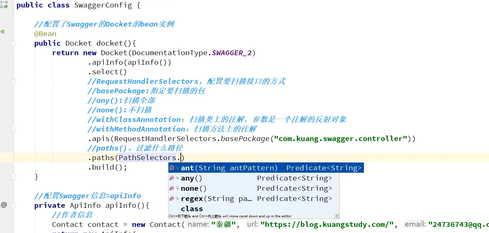
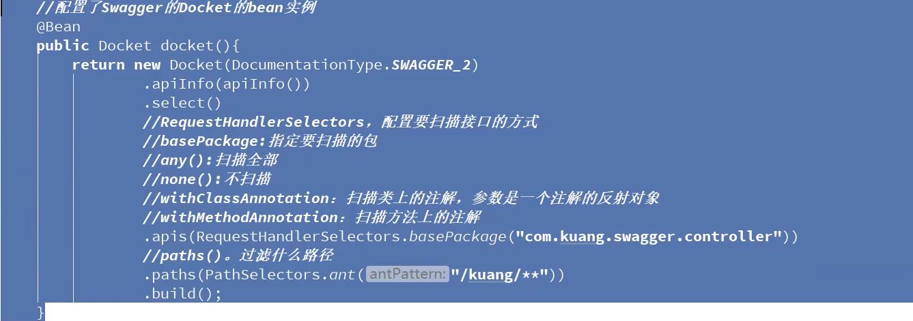
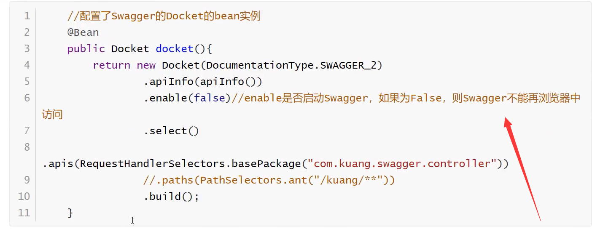
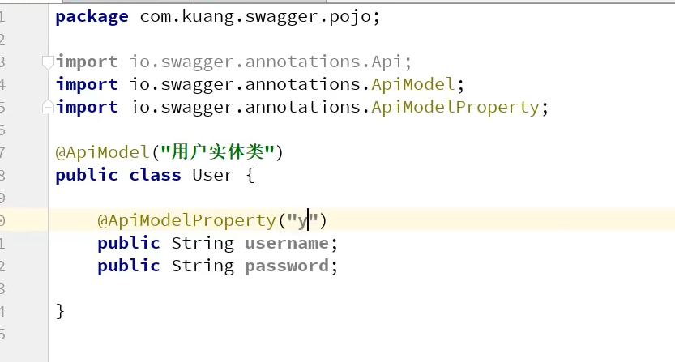

# Swagger

1.导坐标


```xml
<!--        swagger-->
        <dependency>
            <groupId>io.springfox</groupId>
            <artifactId>springfox-swagger2</artifactId>
            <version>2.9.2</version>
        </dependency>
        <dependency>
            <groupId>io.springfox</groupId>
            <artifactId>springfox-swagger-ui</artifactId>
            <version>2.9.2</version>
        </dependency>
```


2.设置配置类

```java
@Configuration
@EnableSwagger2
public class SwaggerConfig {

}
```


3.写详细信息

```java
package com.zrulin.findcomrade.config;

import org.springframework.context.annotation.Bean;
import org.springframework.context.annotation.Configuration;
import springfox.documentation.builders.RequestHandlerSelectors;
import springfox.documentation.service.ApiInfo;
import springfox.documentation.service.Contact;
import springfox.documentation.spi.DocumentationType;
import springfox.documentation.spring.web.plugins.Docket;
import springfox.documentation.swagger2.annotations.EnableSwagger2;

import java.util.ArrayList;

/**
 * @author zrulin
 * @create 2021-04-22 8:37
 */

@Configuration
@EnableSwagger2
public class SwaggerConfig {


    @Bean
    public Docket docket(){
        return new Docket(DocumentationType.SWAGGER_2)
                .apiInfo(apiInfo())
                .select()
                .apis(RequestHandlerSelectors.basePackage("com.zrulin.findcomrade.controller"))
                .build();
    }

    //配置swagger信息=ApiInfo
    public ApiInfo apiInfo(){
        //作者信息
        Contact contact = new Contact("zrulin", "http://www.apache.org/licenses/LICENSE-2.0", "2728466996@qq.com");
        return new ApiInfo("zrulin-Api文档",
                "加油",
                "v1.0",
                "urn:tos",
                contact,
                "Apache 2.0",
                "http://www.apache.org/licenses/LICENSE-2.0",
                new ArrayList());
    }
}
```





	

