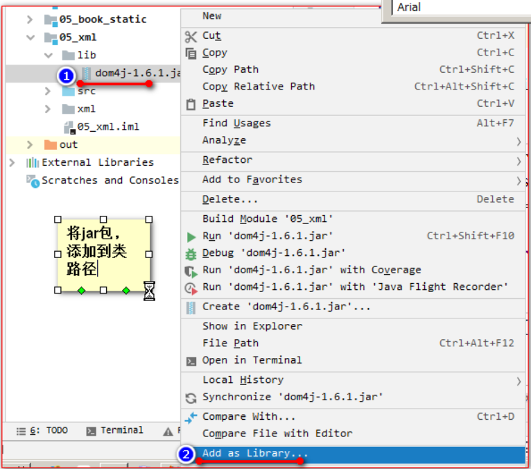
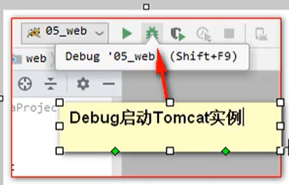

# Tomcat&Html

## 1、表单验证

```html
// 页面加载完成之后
$(function () {
      //给注册绑定单击事件
      $("#sub_btn").click(function () {
         //验证用户名，必须由字母，数字，下划线组成。并且长度为5到12位。
         //1.获取用户输入框的内容
         var usernameTest = $("#username").val();
         //2.创建正则表达式。
         var usernamePatt = /^\w{5,12}$/;
         //3.使用test()方法验证
         if(!usernamePatt.test(usernameTest)){
            //4.提示用户结果
            $("span.errorMsg").text("用户名不合法");

            return false;
         }

         //验证密码，必须由字母，数字，下划线组成，并且长度为5到12位。
         var passwordTest = $("#password").val();
         var passwordPatt = /^\w{5,12}$/;
         if(!passwordPatt.test(passwordTest)){
            $("span.errorMsg").text("密码不合法");
            return false;
         }

         //验证确认密码，是否和密码相同。
         //1.获取确认密码内容
         var repwdTest = $("#repwd").val();
         //2.和密码比较
         if(repwdTest != passwordTest){
            //3.提示用户
            $("span.errorMsg").text("两次密码输入不一致");
            return false;
         }
         //邮箱验证：xxxx@xxx.com
         //1.获取邮箱里的内容
         var emailText = $("#email").val();
         //2.创建正则表达式对象
         var emailPatt = /^\w+@\w+([-]\w+)*(\.\w+)+$/;
         //3.使用test方法验证是否合法
         if(!emailPatt.test(emailText)){
            //4.提示用户
            $("span.errorMsg").text("邮箱输入格式不合法");
            return false;
         }

         //验证码：现在只需要验证用户已输入，因为还没讲到服务器，验证码生成。
         var codeText = $("#code").val();
         codeText = $.trim(codeText);
         if(codeText == null || codeText == ""){
            $("span.errorMsg").text("验证码不能为空");
            return false;
         }

         $("span.errorMsg").text("");
      });

});
```

## 2、xml简介

### 2.1、什么是xml

xml是可扩展的标记性语言

### 2.2、xml的作用

xml的主要作用：

1. 用来保存数据，而且这些数据具有自我描述性

   ```xml
   student[id=1,name="张三"]
   student[id=2,name="李四"]
   
   student.xml
   <students>
       <student>
       			<id>1</id>
           		<name>张三</name>
       </student>
        <student>
       			<id>2</id>
           		<name>李四</name>
       </student>
   </students>
   ```

   

2. 它还可以作为项目或模块的配置文件

3. 它还可以作为网络传输数据的格式（现在以json为主）。

## 3.xml语法

1. 文档声明

2. 元素（标签）

3. xml属性

   xml的标签属性和html的标签属性是非常类似的，==属性可以提供元素的额外信息。==

   ​	

   在标签上可以书写属性：

   ​		一个标签上可以书写多个属性。==每个属性值必须使用 引号 括起来。==

4. xml注释

5. 语法规则

   所有xml元素都必须有关闭标签（也就是闭合标签）

   xml标签对大小写敏感

   xml必须正确的嵌套

   xml文档必须有根元素

   ​	根元素就是顶级元素

   ​			没有父标签的元素，叫顶级元素

   ​					根元素是没有父标签的顶级元素，而且是唯一一个才行

   xml的属性值必须加引号

   xml中的特殊字符

   ​	用转义字符

6. 文本区域（CDATA区）

   CDATA语法可以告诉xml解析器，我CDATA里的文本内容只是纯文本，不需要xml语法解析。

   CDATA格式：

   ​	<![CDATA[这里可以把你输入的字符原样显示，不会解析xml]]>

## 4、xml解析技术介绍

xml可扩展的标记语言

​	不管是html文件还是xml文件，它们都是标记型文档，都可以使用w3c组织制定的dom技术来解析。


document对象表示的是整个文档(可以是html文档，也可以xml文档)

早期JDK为我们提供了两种xml解析技术dom和sax简介（已经过时，但我们需要知道这两种技术）

dom解析技术是w3c组织制定的，而所有的编程语言都对整个解析技术使用了自己语言的特点进行实现。Java对dom技术解析标记也做了实现。

Sun公司在JDK5版本对dom解析技术进行升级：SAX（Simple API For Xml）sax解析，他跟w3c制定的解析不太一样，他是以类似事件机制通过回调告诉用户当前正在解析的内容。他是一行一行的读取xml文件进行解析的。不会创建大量的dom对象。所以他在解析xml的时候，在内存的使用上，和性能上。都优于dam解析。

​	第三方解析：

​			jdom在dom基础上进行了封装、

​			dom4j有对jdom进行了封装

​			pulll主要用在Android手机开发，是在跟sax非常类似都是事件机制解析xml文件。


这个Dom4j它是第三方的解析技术，我们需要使用第三方给我们提供好的类库才可以解析xml文件。

## 5、dom4j解析技术==（重点）==

### 5.1、dom4j变成步骤

第一步：先加载xml文件创建document对象

第二步：通过document对象拿到根元素对象

第三步：通过根元素.elelemts(标签名)；可以返回一个集合，这个集合里放着。所有你指定的标签名的元素对象。

第四步：找到你想要修改，删除的子元素，进行相应的操作

第五步：保存到硬盘上

### 5.2、获取document对象

创建一个lib目录，并添加dom4j的jar包，并添加到类路径。



 

## 6、Tomcat

### 什么是Javaweb

Javaweb是指，所有通过Java语言编写可以通过浏览器访问的的程序的总称，叫Javaweb。

Javaweb是基于请求和响应来开发的。

### 什么是请求

请求是指客户端给服务区发送数据，叫请求Request

### 什么是响应

响应是指服务器给客户端回传数据，叫响应Response

### 请求和响应的关系

请求和响应是成对出现的，有请求就有响应。


## 7、web资源的分类

web资源按实现的技术和呈现的效果不同，又分为静态资源和动态资源两种。

静态资源：html、css、js、txt、mp4视频、jpg图片

动态资源：jsp页面、Servlet程序

## 8、常用的web服务器

tomcat：由Apache组织提供的一种web服务器，提供对jsp和servlet的支持，它是一种轻量级的javaweb容器（服务器），也是当前应用最广的服务器（免费）。

jboss：是一个遵从JavaEE规范的，开放源代码的，纯Java的EJB服务器，它支持所有JavaEE的规范（免费）

ClassFish：由Oracle公司开发的一款Javaweb服务器，是一款强健的商业服务器，达到产品级质量（应用很少）

Resin：是CAUCHO公司的产品，是一个非常流行的服务器，对servlet和jsp提供了良好的支持，性能也比较优良，resin自身采用Java语言开发，（收费，应用较多）

Weblogic：是Orcle公司的产品，是目前应用最广泛的web服务器，支持JavaEE规范，而且不断的完善以适应新的开发要求，适合大型项目（收费，用的不多，适合大公司）

## 9、Tomcat服务器和Servlet版本的对应关系


servlet程序从2.5版本是现在世面使用最多的版本（xml配置）

到了servlet3.0之后，就是注解版本的servlet使用。

以2.5版本为主线讲解servlet程序。

## 10、Tomcat的使用

1. 目录介绍
2. 如何启动 Tomcat 服务器
3. Tomcat的停止
4. 如何修改Tomcat的端口号
5. 如何部署 web 工程到 Tomcat 中
6. 手托 html 页面到浏览器和在浏览器中输入 http://ip:端口号/工程名/访问的区别
7. ROOT 的工程的访问，以及 默认index.html页面的访问。

### 10.1、目录介绍

bin				专门用来存放Tomcat服务器的可执行程序

conf				专门用来存放Tomcat服务器的配置文件

lib				专门用来存放Tomcat服务器的jat包

temp				专门用来存放Tomcat运行时产生的临时数据

webapps				专门用来存放部署的web工程。

work				时Tomcat工作时的目录，用来存放Tomcat运行时jsp翻译为Servlet的源码，和Session钝化的目录。

**tomcat的安装**，（安装过好多遍了，不做笔记了）

### **10.2、tomcat的启动**：

打开文件bin目录，startup.bat

另一种：cmd命令行，还是打开bin目录，catalina run

### 10.3、Tomcat的停止

1. 点击tomcat服务器窗口的x关闭按钮
2. 把Tomcat服务器窗口置位当前窗口，然后按快捷键Ctrl+c
3. ==找到Tomcat的bin目录下的shutdown.bat双击，就可以停止Tomcat服务器。==

### 10.4、如何修改Tomcat的端口号 

操作过程：

（1）采用记事本打开Tomcat安装目录下的conf文件夹下的servlet.xml文件。

（2）在servlet.xml文件中找到以下代码：

<Connector connectionTimeout="20000" port="8080" protocol="HTTP/1.1" redirectPort="8443"/>

（3）将上面代码中的port="8080"修改为port="8081"，即可将Tomcat的默认端口设置为8081。在修改端口时，应避免与公用端口冲突。建议采用默认的8080端口，不要修改，除非8080端口被其他程序所占用。

<Connector connectionTimeout="20000" port="8081" protocol="HTTP/1.1" redirectPort="8443"/>

（4）修改成功后，为了使新设置的端口生效，还需要重新启动Tomcat服务器。


==找到Connector标签，修改port属性为你需要的端口号。（1-65535）==

==修改完端口号，一定要重启Tomcat服务器才能生效==

平时百度：http://www.baidu.com:80

HTTP协议默认的端口号时：80

### 10.5、如何部署web工程到Tomcat中

#### 第一种方法

只需要把web 工程的目录拷贝到Tomcat的webapps目录下即可


#### **第二种方法**

进入到 apache-tomcat-7.0.52\conf\Catalina\localhost 目录，新建一个 项目名.xml 文件

在 那个新建的 xml 文件中，增加下面配置语句

```xml
<Context  docBase="D:\book" reloadable="true" />
```

在浏览器输入路径：localhost:8080/xml文件名/访问的文件名

**每个项目分开配置，tomcat 将以\conf\Catalina\localhost 目录下的 xml 文件的文件名作为 web 应用的上下文路径，而不再理会 <Context>中配置的 path 路径，因此在配置的时候，可以不写 path。**

==xml文件名千万不要有空格，弄了我好久==

### 10.6、手托 html 页面到浏览器和在浏览器中输入 http://ip:端口号/工程名/访问的区别


### 10.7、ROOT的工程的访问，以及默认index.xml页面的访问

当我们在浏览器地址栏中输入访问地址如下：

​		http://ip:port/    ----->没有工程名的时候默认访问的是ROOT工程。

​		当我们在浏览器地址栏中输入的访问地址如下：

​		http://ip:port/工程名/	----->没有资源名，默认访问index.xml页面

## 11、IDEA整合Tomcat


## 12、IDEA创建动态web工程





 


