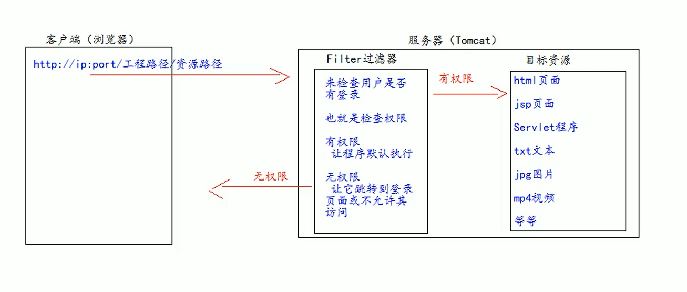
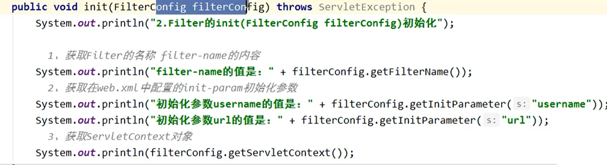
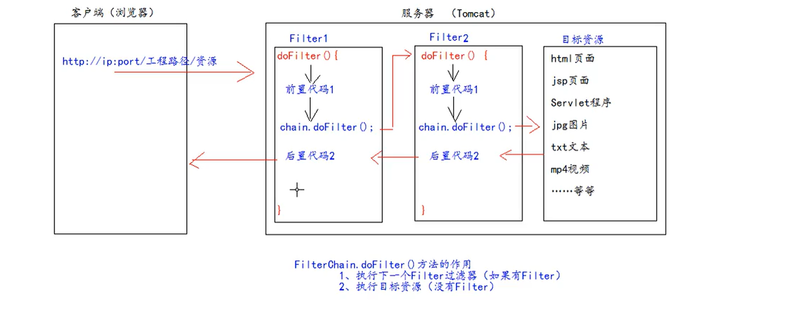
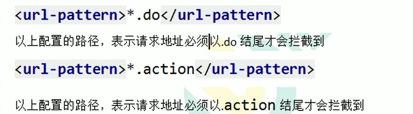

# filter过滤器

## 1、filter是什么过滤器

1、fitle过滤器他是JavaWeb的三大组件之一。三大组件分别是，servlet程序，Listener监听器，filter过滤器。

2、filter过滤器他是JavaEE的规范，也就是接口。

3、filter过滤器它的作用是：拦截请求，过滤响应。

拦截请求的常见应用场景有：

​	1、权限检查。

​	2、日记操作。

​	3、事务管理。

​				.............等等

## 2、filter的初体验

要求：在你的web工程下，有一个admin目录，这个admin目录下所有资源（html页面，jpg图片，jsp文件，等等）都必须是用户登录之后才允许访问。

Fiter过滤器的使用步骤：

​	1.编写一个类去实现Filter接口。

​	2.实现过滤方法doFilter()

​	3.到web.xml中去配置Filter的拦截路径。

## 3、Filter的生命周期

Filter的生命周期包含几个方法：

1、构造器方法。

2、init初始化方法

第 1、2 步 在web工程启动的时候执行。（Fiter已经创建）

3、doFilter过滤方法

第三步，每次拦截到请求，就会执行。

4、destroy销毁

第四步、停止web工程的时候、就会执行。（停止web工程，也会销毁Filter过滤器）

## 4、FilterConfig类

FilterConfig类见名知义，他是Filter过滤器的配置文件类。

Tomcat每次创建Filter的时候，也会同时创建一个FilterConfig类，这里包含Filter配置文件的配置信息。

FiterConfig类的作用是获取filter过滤器的配置内容 

​	1、获取Filter的名称，filter-name的内容

​	2、获取在Filter中配置的init-param初始化参数

​	3、获取ServletContext对象。

## 5、FilterChain 过滤器链

​	Filter			过滤器

​	Chain			链，链条

​	FilterChain		就是过滤器链	（多个过滤器如何一起工作）

在Filter过滤器执行的时候，他们执行的顺序是由他们在web.xml中从上到下配置的顺序决定！

多个Filter过滤器执行的特点:

​	1、 所有filter和目标资源都执行在同一个线程中。

​	2、多个Filter共同执行的时候，他们都使用同一个Request对象。

## 6、Filter的拦截路径

**精确匹配**

以上配置的路径，表示请求地址必须为：http://ip:port/工程路径/target.jsp

**目录匹配**

以上配置的路径，表示请求必须为：http://ip:port/工程路径/admin/*

**后缀名匹配**

以上配置路径，表示请求必须以.html结尾才会被拦截到。

后缀名匹配不能斜杠打头，就是中间那一些东西 不能以斜杠打头

Filter过滤器它只关心请求的地址是否匹配，不关心请求的资源是否存在！！！

## 7、ThreadLocal的使用

ThreadLocal的作用，它可以解决多线程的数据安全问题。

ThreadLocal它可以给当前线程关联一个数据。（可以是普通变量，可以是对象，也可以是数组，集合）

ThreadLocal的特点：

​	1、ThreadLocal可以为当前线程关联一个数据。（它可以像map一样存取数据，key为当前线程）

​	2、每一个ThreadLocal对象，只能为当前线程关联一个数据，如果要为当前线程关联多个数据，就需要使用多个ThreadLcoal对象实例。

​	3、每个ThreadLocal对象实例定义的时候，一般都是static类型。

​	4、ThreadLocal中保存数据，在线程销毁后，会由jvm虚拟机自动释放。