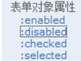

## jQuery

什么是jQuery？

JavaScript和Query的结合，辅助JavaScript开发的js类库。

核心思想：

write less ，do more (写的更少，做的更多)，实现了很多浏览器的兼容问题。

好处：

jQuery是免费的，开源的 ，jQuery的语法设计可以使开发更便捷，例如操作文档对象，选择DOM元素，制作动画效果，事件处理，使用Ajax以及其他功能。

### 1、say "helloworld"

```html
<!DOCTYPE html>
<html>
	<head>
		<meta charset="utf-8">
		<title>title</title>
		<script type="text/javascript" src="./js/jquery-1.7.2.js"></script>
		<script type="text/javascript">	
			// window.onload = function(){
			// 	var btnobj = document.getElementById("btn01");
			// 	btnobj.onclick = function(){
			// 		alert("js原生的单击事件");
			// 	}
			// 	document.getElementById("btn01").onclick = function(){
			// 		alert("js原生的单击事件");
			// 	}
			// }
			$(function(){	//表示页面加载完成之后，相当 window.onload = function (){}
				var $btnobj = $("#btn01");		//表示按标签查询id对象
				$btnobj.click(function(){	//绑定单击事件
						alert("jQuery 的单击事件");
				});
			});
		</script>
	</head>
	<body>
		<button id="btn01">say hello</button>
	</body>
</html>

```

常见问题？

1、使用jQuery一定要引入jQuery库吗?		答：是，必须

2、jQuery中的$到底是什么							答：他是一个函数

3、怎么为按钮添加点击响应函数的？			答：

​	1、使用jQuery查询到标签对象

​	2、使用标签对象.click（function(){}）;

### 2、jQuery核心函数 

$是jQuery的核心函数，能完成jQuery的很多功能，$()就是调用$这个函数。

**1、传入参数为	[函数] 时：**

​	表示页面加载完成之后自动调用，相当于window.onload(){}

**2、传入参数为[HTML字符串]时：**

​	会对我们创建这个HTML标签对象。

**3、传入参数为[选择器字符串]时：**

​	$("#id属性值")；id选择器，根据id查询标签对象

​	$("标签名");	标签名选择器，根据指定的标签名查询标签对象。

​	$(".class属性值")；	类型选择器，可以根据class属性查询标签对象。

**4、传入参数为[DOM对象]时：**

​	会把 dom对象 转化为 jQuery对象。

### 4、jQuery对象和Dom对象区分

#### 4.1、什么时jQuery对象，什么时Dom对象

**Dom对象**

1.通过getElementById()查询出来的标签对象是Dom对象。

2.通过getElementByName()查询出来的标签对象是Dom对象。

3.通过getElementByTagName()查询出来的标签对象是Dom对象。

4.通过creatElement()方法创建的对象，是Dom对象。


**jQuery对象**

5.通过jQuery提供的API创建的对象，是jQuery对象。

6.通过jQuery包装的Dom对象，也是jQuery对象。

7.通过jQuery提供的API查询到的对象，是jQuery对象。

#### 4.2、jQuery对象的本质

jQuery对象是dom对象的数组+jQuery提供的一系列功能函数。

#### 4.3、jQuery对象和Dom对象使用区别

jQuery对象不能使用dom对象的属性和方法。

dom对象不能使用jQuery对象的属性和方法。

#### 4.4、dom对象和jQuery对象的互转

==1、dom对象转化为jQuery对象==

1. 先有dom对象
2. $(Dom对象)就可以转换成jQuery对象

==2、jQuery对象转为dom对象==

1. 先有jQuery对象
2. jQuery对象[下标]取出相应的DOM对象。


 

### 5、==jQuery选择器==

#### 5.1、==基本选择器==

	


==#ID			选择器==：根据id查找标签对象

==.class		选择器==：根据class查找标签对象

==element	选择器==：根据标签名查找标签对象

==*				选择器==：表示任意的，所有元素的

==selector1,selector2 组合选择器==：合并选择器1，选择器2的结果并返回。

#### 5.2、==层级选择器==

	

==ancestor descendant 后代选择器==:在给定的祖先元素下匹配所有的后代元素

==parent>child子元素选择器==：在给定的父元素下匹配所有的子元素。

==prev+next相邻元素选择器==：匹配所有紧接在perv元素后的next元素。

==prev~sibings之后的兄弟元素选择器==：匹配prev火元素之后的所有siblings元素。

#### 5.3、过滤选择器

##### **基本过滤选择器**

	

==:first==											 获取第一个元素	

==:last										==获取最后一个元素

:not(selector)							去除所有给定选择匹配的元素

:even										匹配所有索引值为偶数的元素，从0开始计数。

:odd											匹配所有索引值为奇数的元素，从0开始计数

==:eq(index)==								匹配一个给定索引值的元素

:gt(index)								匹配所有大于给定索引值的元素

:lt(index)								匹配所有小于给定索引值的元素

:header									匹配如h1,h2,h3之类的标题元素

:animated								匹配所有正在执行动画效果的元素

##### **内容过滤选择器**

	

:contains(text)			匹配包含给定文本的元素

:empty						匹配所有不包含子元素或文本的空元素

:parent						匹配含有子元素或者文本的元素

:has(selelctor)			匹配含有选择器所匹配的元素的元素

##### **属性过滤选择器**

	

==[atrribute]==											匹配包含给定属性的元素

==[attribute = value]==							匹配给定的属性是某个特定值的元素

[attribute != value]							匹配所有不含指定的属性，或者属性不等于特定值的元素

[attribute ^= value]							匹配给定的属性是以某些值开始的元素

[attribute $= value]							匹配给定的属性是以某些值结尾的元素

[attribute *= value]							匹配给定的属性是以包含某些值的元素

[attrSel1] [attrSel2] [attrSelN]			复合属性选择器，需要同时满足多个条件同时使用。

##### **表单过滤选择器**

			

	

	

jQuery当中提供的遍历：

		

### 6、jQuery元素筛选

	


### 7、jQuery的属性操作

**jQuery属性操作**

	

html()		它可以设置和获取起始标签和结束标签中的内容。	和dom属性innerHTML一样

text()			它可以设置和获取起始标签和结束标签中的文本。	和dom属性innerText一样

vall()			它可以设置和获取表单项的value属性值。


val方法	可以同时设置多个表单项的示例代码：

```html
<!DOCTYPE html>
<html>
	<head>
		<meta charset="utf-8">
		<title>tiile</title>
		<script type="text/javascript" src="./js/jquery-1.7.2.js"></script>
		<script type="text/javascript">
			$(function(){
				// 批量操作单选
				// $(":radio").val(["radio2"]);
				// // 批量操作筛选框的选中状态
				// $(":checkbox").val(["checkbox1","checkbox2"]);
				// // 操作单选下拉框的选中状态
				// $("#single").val(["sin4"]);
				// // 批量操作多选的下拉框选中状态
				// $("#multiple").val(["mul1","mul3","mul4"]);
				
				$(":radio,:checkbox,#single,#multiple").val(["radio1","checkbox2","checkbox3","sin2","mul2","mul4"]);
				
			});
		</script>
	</head>
	<body>
		单选：
		<input name="radio" type="radio" value="radio1"/>radio1
		<input name="radio" type="radio" value="radio2"/>radio2
		<br/>
		多选：
		<input name="checkbox" type="checkbox" value="checkbox1" />checkbox1
		<input name="checkbox" type="checkbox" value="checkbox2" />checkbox2
		<input name="checkbox" type="checkbox" value="checkbox3" />checkbox3
		<br/>
		下拉多选：
		<select id="multiple" multiple="multiple" size="4">
			<option value="mul1">mul1</option>
			<option value="mul2">mul2</option>
			<option value="mul3">mul3</option>
			<option value="mul4">mul4</option>
		</select>
		<br/>
		下拉单选
		<select id="single">
			<option value="sin1">sin1</option>
			<option value="sin2">sin2</option>
			<option value="sin3">sin3</option>
			<option value="sin4">sin4</option>
		</select>
	</body>
</html>

```

	

attr()		可以设置和获取属性的值，不推荐操作checked	，readOnly	,selected	,disabled等等

prop()		可以设置和获取属性的值，只推荐操作checked	，readOnly	,selected	,disabled等等

```html
<!DOCTYPE html>
<html>
	<head>
		<meta charset="utf-8">
		<title>tiile</title>
		<script type="text/javascript" src="./js/jquery-1.7.2.js"></script>
		<script type="text/javascript">
				$(function(){
					alert($(":checkbox:first").attr("name"));	//获取
					$(":checkbox:first").attr("name","dangdang");	//设置
					
					// alert($(":checkbox:first").attr("checked"));	//官方觉得返回undefined是一个错误
					// alert($(":checkbox:first").prop("checked"));
					$(":checkbox:first").attr("abc","abcvalue");
					alert($(":checkbox:first").attr("abc"));
				});
		</script>
	</head>
	<body>
	<input name="hanhan" type="checkbox" value="checkbox2" />checkbox2
	<input name="checkbox" type="checkbox" value="checkbox3" />checkbox3
	</body>
</html>

```

### 8、DOM的增删改

	

**内部插入：**

appendTo()			a.appendTo(b)			把a插入到b元素的末尾，成为最后一个子元素

perpendTo()			a.perpendTo(b)		把a插入到b元素的前面，成为第一个子元素。

 

**外部插入：**

insertAfter()			a.insertAfter(b)			得到ba

insertBefore			a.insertBefor(b)			得到ab

**替换：**

replaceAll()				a.replaceAll(b)				用a替换掉所有的b

replaceWith()				a.replaceWith(b)		用b替换掉a

**删除：**

remove()					a.remove();			删除a标签

empty()						a.empty();				清空a标签里的内容	


### **9、添加删除记录代码**

```html
<!DOCTYPE HTML PUBLIC "-//W3C//DTD HTML 4.01//EN" "http://www.w3.org/TR/html4/strict.dtd">
<html>
<head>
<meta http-equiv="Content-Type" content="text/html; charset=UTF-8">
<title>Untitled Document</title>
<link rel="stylesheet" type="text/css" href="styleB/css.css" />
<script type="text/javascript" src="../../script/jquery-1.7.2.js"></script>
</head>
<body>
<script type="text/javascript">

	var deleteFunction = function(){
		var $trobj = $(this).parent().parent();
		var name = $trobj.find("td:first").text();
		// /*
		// * confirm() 是JavaScript语言提供的一个确认提示框函数。你给他传什么，他就提示什么
		// * 当用户点击了确定，就返回true，当用户点击了取消，就返回false.
		// * */
		if(confirm("你确定要删除["+name+"]吗?")){
			$trobj.remove();
		}
		// //return false可以阻止元素的默认行为
		return false;
	}
	$(function () {

		//给【submit】绑定单击事件

		$("#addEmpButton").click(function () {
			//获取输入框，姓名，邮箱，工资的内容。
			var name = $("#empName").val();
			var email = $("#email").val();
			var salary = $("#salary").val();

			//创建一个行标签对象，添加到显示数据的表格中
			var $trobj =	$("<tr>" +
					"<td>"+name+"</td>" +
					"<td>"+email+"</td>" +
					"<td>"+salary+"</td>" +
					"<td><a href=\"deleteEmp?id=001\">Delete</a></td>" +
					"</tr>");

			$trobj.appendTo($("#employeeTable"));

			//给添加的a标签绑上单击事件
			$trobj.find("a").click(deleteFunction);
			});
		// 给删除的a标签绑定单击事件
		$("a").click(deleteFunction);
	});


</script>

	<table id="employeeTable">
		<tr>
			<th>Name</th>
			<th>Email</th>
			<th>Salary</th>
			<th>&nbsp;</th>
		</tr>
		<tr>
			<td>Tom</td>
			<td>tom@tom.com</td>
			<td>5000</td>
			<td><a href="deleteEmp?id=001">Delete</a></td>
		</tr>
		<tr>
			<td>Jerry</td>
			<td>jerry@sohu.com</td>
			<td>8000</td>
			<td><a href="deleteEmp?id=002">Delete</a></td>
		</tr>
		<tr>
			<td>Bob</td>
			<td>bob@tom.com</td>
			<td>10000</td>
			<td><a href="deleteEmp?id=003">Delete</a></td>
		</tr>
	</table>

	<div id="formDiv">
	
		<h4>添加新员工</h4>

		<table>
			<tr>
				<td class="word">name: </td>
				<td class="inp">
					<input type="text" name="empName" id="empName" />
				</td>
			</tr>
			<tr>
				<td class="word">email: </td>
				<td class="inp">
					<input type="text" name="email" id="email" />
				</td>
			</tr>
			<tr>
				<td class="word">salary: </td>
				<td class="inp">
					<input type="text" name="salary" id="salary" />
				</td>
			</tr>
			<tr>
				<td colspan="2" align="center">
					<button id="addEmpButton" value="abc">
						Submit
					</button>
				</td>
			</tr>
		</table>

	</div>

</body>
</html>

```

### 10、css样式操作

addClass()			添加样式

removeClass()		删除样式

toggleClass()			有就删除，没有就添加样式。

offset()						获取和设置元素坐标

### 11、jQuery动画

#### 基本动画

show()			将隐藏的元素显示

hide()				将可见的元素隐藏

toggle()				可见就隐藏，隐藏就可见

​			以上动画都可以添加参数。

​					1.第一个参数是动画执行时长，以毫秒为单位

​					2.第二个参数是动画的回调函数(动画完成后自动调用的函数)

### 淡入淡出动画

fadeln()				淡入（慢慢可见）

fadeOut()			淡出（慢慢消失）

fadeTo()				在指定时长内慢慢的将透明度修改到指定的值，0透明，1完全可见，0.5半透明

fadeToggle()			淡入/淡出 切换

### 12、jQuery事件操作

**$(function(){});**

**和**

**window.onload=function(){}**

**的区别？**

他们分别是在什么时候触发？

​	1、Query的页面加载完成之后是浏览器的内核解析完页面的标签创建好DOM对象之后就会马上执行。

​	2、原生js的页面加载完成之后，除了要等浏览器内核解析完成标签创建好DOM对象，还要等标签显示时需要的内容加载完成。

他们触发的顺序？

​	1、jQuery页面加载完成之后先执行

​	2、原生js的页面加载完成之后

他们执行的顺序？

​	1、原生js页面加载完成之后，只会执行最后一次的赋值函数

​	2、jQuery的页面加载完成之后是全部把注册的function函数，依次顺序全部执行。

#### jQuery中其他事件的处理方法：

click()				它可以绑定单击事件，以及触发单击事件，（传function是单击事件，不穿function是触发事件）

mouseover()		鼠标移入事件

mouseout()			鼠标移除事件

bind()					可以给元素一次性绑定一个或多个事件

one()						使用上跟bind一样。但是one方法绑定的方法只会响应一次。

unbind()				跟bind方法相反的操作，解除事件的绑定

live()						也是用来绑定事件，它可以用来绑定选择器匹配的所有元素的事件，哪怕是这个元素是后面动态创建出来的也有效。

### 事件的冒泡

什么是事件的冒泡？

事件的冒泡是指，父子元素同时监听同一个事件，当触发子元素的事件的时候，同一个事件也传递到了父元素的事件里去响应。

那么如何阻止事件的冒泡呢？

在事件函数体内，return false；可以阻止事件的冒泡传递。

### JavaScript事件对象

事件对象，是封装有触发的事件信息的一个JavaScript对象。

我们重点关心的是怎么拿到这个JavaScript的事件对象，以及使用。


如何获取JavaScript对象？

在给元素绑定事件的时候，在事件的function（event）参数列表中添加一个参数，这个参数我们习惯使用event。这个event就是JavaScript传递参事件处理函数的事件对象。

比如：

//1.原生JavaScript获取事件对象

```html
window.onload = function (){
		document.getElementById("#xxxx").onclick = function(event){
		console.log(event);
		}
}
```

//2.jQuery代码获取事件对象

```html
$(function(){
	$("#xxx").click(function(event){
		console.log(event);
	});
});
```

//3.使用bind同时对多个事件绑定同一个函数。怎样获取当前操作是什么事件。

```html
$(function(){
	$("#xxx").bind("mouserover mouserout",function(event){
			if(event.type == "mouserover"){
				console.log("鼠标移入");
			}else if(event.type == "mouserout"){
					console.log("鼠标移出");
				}
	});
});
```

### 图片跟随

