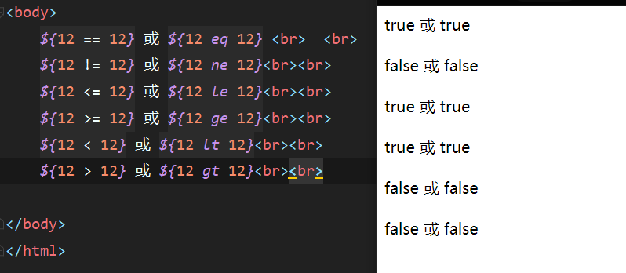
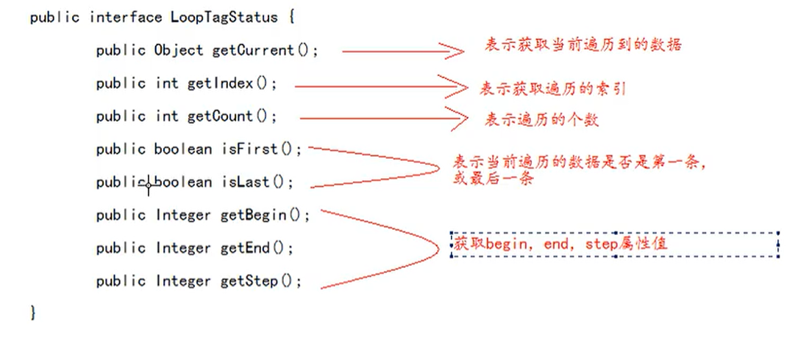

#   	 jsp

## 1、jsp的作用

1、jsp的全称是java server pages 。Java的服务器页面。

2、jsp的主要作用是，代替servlet程序回传html页面的数据

3、因为servlet程序回传html页面数据是一件非常繁琐的事情，开发成本和维护成本都极高。

- 如何创建jsp
  - 

## 2、jsp的本质是什么

​	jsp的本质上是一个servlet程序

​	当我们第一次访问jsp页面的时候，Tomcat服务器会帮我们把jsp页面翻译成一个Java源文件。并且对它进行编译成为.class字节码程序。我们打开java源文件不难发现其里面的内容是:


跟踪源码发现，HttpjspBase类他直接继承了HttpServlet类。也就是说，jsp翻译出来的java类，他间接继承了HttpServlet类，也就是说，翻译出来的是一个servlet程序。


总结：通过翻译的Java源码我们可以得到结果：jsp就是Servlet程序。

## 3、jsp的三种语法

### 1、jsp头部的page指令

jsp的page指令可以修改jsp页面中一些重要的属性，或者行为。

```jsp
<%@ page contentType="text/html;charset=UTF-8" language="java" %>
```

1、language 属性				表示jsp翻译后是什么语言文件。暂时只支持Java

2、contentType 属性			表示jsp返回的数据类型是什么，也是源码中的response.setContentType()参数值

3、pageEncoding属性			表示当前页面文件本身的字符集。

4、import属性						跟Java源代码中一样，用于导包，导类。

==================================================================================================================================================两个属性是给out输出流使用==============================================================================================================

5、autoFlush属性					设置当out输出流缓冲区满了之后，是否自动刷新冲级区。默认值是true

6、buffer属性							设置out缓冲区的大小默认是8kb


==================================================================================================================================================两个属性是给out输出流使用==============================================================================================================

7、errorpage 属性					设置当jsp页面运行时出错，自动跳转去的错误页面路径。

```jsp
<%--
    errorpage  表示错误后，自动跳转去的路径
    这个路径一般是以斜杠打头，他表示请求地址为：http://ip:port/工程路径/
    映射到代码的目录
--%>
```

8、isErrorPage属性				设置当前jsp页面是否是错误信息页面。默认是false。如果是true可以获取异常信息

9、session属性						设置访问当前jsp页面，是否会创建HttpSession对象。默认是true。

10、extend属性						设置jsp翻译出来的Java类默认继承谁。

### 2、jsp中的常用脚本

#### 1、声明脚本（极少使用）

​	声明脚本的格式是：<%! 声明Java代码 %>

作用：	可以给jsp翻译出来的Java类定义属性和方法，甚至是静态代码块，内部类。


1、声明类属性

2、声明static静态代码块

3、声明类方法

4、声明内部类


#### 2、表达式脚本（常用）

表达式脚本的格式是：<%= 表达式 %>

表达式脚本的作用是：在jsp页面上输出数据。

表达式脚本的特点：

​	1、所有表达式脚本都会被翻译到_jspService()方法

​	2、表达式脚本都会被翻译成 out.print()输出到页面上

​	3、由于脚本表达式翻译的内容都在_jspService()方法中，所以 _jspService()方法中的对象都可以直接使用。

​	4、表达式脚本中的表达式不能以分号结束。


练习：

1、输出整形

2、输出浮点型

3、输出字符串

4、输出对象

#### 3、代码脚本

代码脚本的格式是：

```jsp
<%
    Java语句
%>
```

代码脚本的作用是：	在jsp页面中编写我们自己需要的功能（写的是Java语句）

代码脚本的特点是：

​	1、代码脚本翻译之后都在_jspService方法中

​	2、代码脚本由于翻译到_jspService方法中，所以 _jspService方法中的所有现有对象都可以直接使用

​	3、还可以由多个代码脚本块组合完成一个完整的Java语句

​	4、代码脚本还可以和表达式脚本一起组合使用，在jsp页面上输出数据。

练习：

1、if语句

2、for循环语句

3、翻译后Java文件中_jspService方法内的代码都可以写


### 3、jsp中的三种注释

#### 1、html注释

<!--html注释-->

​	htmL注释会被翻译到Java源代码中。在_jspService 方法里，以 out.writer 输出到客户端。

#### 2、Java注释

<%

​	//单行Java注释

/*多行Java注释*/

%>

​	Java注释会被翻译到Java源代码中

#### 3、jsp注释

<%-- 这是jsp注释 --%>

jsp注释可以注掉jsp所有代码。

## 4、jsp九大内置对象

jsp的内置对象，是指tomcat在 翻译jsp页面成为Servlet源代码之后，内部提供的九大对象 ，叫内置对象。


==request==					请求对象

==response==				响应对象

==pageContext==			jsp的上下文对象

==session==						会话对象

==application==					ServletContext对象 

==config==								ServletConfig对象

==out==									jsp输出流对象

==page==								指向当前jsp的对象

==exception==						异常对象	

## 5、jsp的四大域对象

四大域对象分别是：

pageContext			(PageContextImpl类)			当前jsp页面内有效

resquest					（HttpServletRequest类）	一次请求内有效

session						(HttpSession类)					一个会话范围内有效（打开浏览器访问服务器，直到关闭浏览器）

application				(ServletContext类)				整个web工程内都有效（只要web 工程不停止，数据都在）

域对象是可以像Map一样存取数据的对象。四个域对象功能一样，不同的是他们对数据的存取范围。

​	

虽然四个域对象都可以存取数据。在使用上它们是有优先顺序的。

四个与在使用的时候，优先顺序分别是，它们从小到大的范围的顺序。

pageContext ----->>	request ----->>  session ----->>application

（在数据不要用的时候得到最快的释放，内存的优化）

scope.jsp页面：

```jsp
<body>
        <h1>scope.jsp页面</h1>
    <%
        //往四个域中都分别保存数据
        pageContext.setAttribute("key","pageContext");
        session.setAttribute("key","session");
        request.setAttribute("key","request");
        application.setAttribute("key","application");
    %>
        pageContext域内是否有值：<%=pageContext.getAttribute("key")%><br>
        session：<%=session.getAttribute("key")%><br>
        request：<%=request.getAttribute("key")%><br>
        application：<%=application.getAttribute("key")%><br>
    <%
        request.getRequestDispatcher("/scope1.jsp").forward(request,response);
    %>
</body>
```

scope1.jsp:

```jsp
<body>
        <h1>scope1.jsp页面</h1>
        pageContext域内是否有值：<%=pageContext.getAttribute("key")%><br>
        session：<%=session.getAttribute("key")%><br>
        request：<%=request.getAttribute("key")%><br>
        application：<%=application.getAttribute("key")%><br>
</body>
```

## 6、jsp中的out输出和response.getWrite输出的区别

response中表示响应，我们经常用于设置返回给客户端的内容（输出）

out也是给用户做输出使用的。


自己的理解：out输出总是回在response.getWrite输出后面。

由于jsp翻译之后，底层源代码都是使用out来进行输出，所以一般情况下。我们在jsp页面中统一使用out来进行输出。避免打乱页面输出内容的顺序。（这也就意味着，在jsp中直接写的代码都是输出在response.getWrite()后面）。


out.write()	输出字符串没有问题。（底层使用( char)i  实现的，也就是说直接把所有数据强转成字符串类型，出现的是ASCII码的值）

out.print()	输出任意数据没有问题（都转换成字符串之后调用的write()输出）

结论：在jsp页面中可以同意使用out.print（）输出

## 7、jsp的常用标签

### 1、jsp静态包含

需求：


“地址中的一个斜杠  /  表示http://ip:port/工程路径/” 映射到代码中

```jsp
<%--
    <%@include file=""%>就是静态包含
        file属性指定你要包含的jsp页面的路径
        地址中的第一个斜杠 / 表示为：http://ip:port/工程路径/ 映射到代码的web目录

        静态包含的特点：
        1、静态包含不会被翻译被包含的jsp页面
        2、静态包含其实是把被包含的jsp页面的代码拷贝到包含的位置执行输出 
--%>
```

### 2、jsp动态包含

```jsp
<%--
        <jsp:include page=""></jsp:include>     这是动态包含
        page属性 指定你要包含的jsp页面的路径
        动态包含也可以像静态包含一样，把被包含的内容执行输出到包含位置

        动态包含的特点：
        1.动态包含会把包含jsp页面也翻译为java代码
        2.动态包含底层代码使用如下代码去调用包含的jsp页面执行输出：
            JspRuntimeLibrary.include(request, response, "/include/footer.jsp", out, false);
        3.动态包含还可以传递参数
--%>
    <jsp:include page="/include/footer.jsp">
        <jsp:param name="password" value="dongshahn"></jsp:param>
        <jsp:param name="username" value="zrulin"></jsp:param>
    </jsp:include>
```

动态包含的底层原理：


### 3、jsp标签-转发 

```jsp
<%--
        <jsp:forward page=""></jsp:forward>     是请求转发标签 它的功能就是请求转发
        page 属性 设置请求转发的路径
--%>
```

**请求转发的使用说明**


## 8、什么是listener监听器

1、listenner监听器它是javaweb的三大组件之一。javaweb的三大组件分别是:Servlet程序，Fiter过滤器，LIstenner监听器。

2、listenner监听器它是JavaEE的规范，就是接口。3

3、监听器的作用是，监听某种事物的变化，然后通过回调函数，反馈给用户（程序）去做一些相应的处理。

### 8.1、ServletContextListenner监听器

ServletContextListenner它可以监听ServletContext对象的创建和销毁

ServletContext对象在web工程启动时创建，在web工程停止时销毁。

监听到创建和销毁之后都会分别调用ServletContextListenner监听器的方法反馈。

两个方法分别是：


第一个：在ServletContext对象创建之后马上调用，做初始化。

第二个：在ServletContext对象销毁之后调用

如何使用ServletContextListenner监听器监听ServletContext对象

1、编写一个类去实现ServletContextListenner

2、实现两个回调方法

3、到web.xml中去配置监听器

## 9、EL表达式

### 9.1、什么是EL表达式，作用？

EL表达式的全称是：Expression Language 是表达式语言

El 表达式有什么作用：El表达式主要替代jsp页面中的表达式脚本在jsp页面中进行数据的输出。因为EL表达式在输出数据的时候，要比jsp的表达式脚本简介很多。

```jsp
<body>
    <%
        request.setAttribute("key","值");
    %>
    表达式脚本输出key值：<%=request.getAttribute("key1")%> <br>
    EL表达式输出key：${key1}
</body>
```

El表达式输出的格式是：${表达式}

El表达式在输出NUll值的时候 ，输出的是空串。jsp表达式脚本输出null值的时候，输出的是null字符串。

### 9.2、EL表达式搜索域数据的顺序

EL表达式主要是在jsp页面中输出数据

主要是输出域对象中的数据。

```jsp
<body>
    <%
        //往四个域中都保存了数据
        pageContext.setAttribute("key","pageContext"); 
        request.setAttribute("key","request");  
        session.setAttribute("key","session");  
        application.setAttribute("key","application");      
    %>
    ${key}
</body>
```

当四个域都有相同的key的数据的时候，El表达式会按照四个域的从小到大的顺序去搜索，找到就输出。


### 9.3、EL表达式主要输出Bean的普通属性，数组属性，LIst集合属性，map集合属性。

--需求输出person类中的普通属性，数组属性。list集合属性，和map集合属性。

java代码：生成person bean对象

```jsp
<body>
    <%
        Persion persion = new Persion();
        persion.setName("zrulin");
        persion.setPhone(new String[]{"234253532","32424252525","2424242"});
        List<String> stringList = new ArrayList<String>();
        stringList.add("北京");
        stringList.add("长沙");
        stringList.add("上海");
        persion.setCicties(stringList);
        Map<String,Object> map = new HashMap<>();
        map.put("key1","dangran");
        map.put("key2","你在伽马n");
        map.put("key3","想peach");
        persion.setMap(map);
        pageContext.setAttribute("persion",persion);

    %>
    输出persion:${persion} <br/>
    输出persion中的name:${persion.name}<br/>
    输出persion中的:phone${persion.phone[1]}<br/><!--这个是String类型的数组，如果不带下标输出的会是地址而不是值-->
    输出persion中的cities:${persion.cicties}<br/>
    输出persion中的cities个别元素值:${persion.cicties[1]}<br/>
    输出persion中的:map${persion.map}<br/>
    输出persion中的:map个别元素值:${persion.map.key3}<br/>
    输出persion中的age:${persion.age}<br/>
</body>
```

### 9.4、El表达式----运算

语法：${运算表达式}，El表达式支持如下运算符

#### 1、关系运算




#### 2、逻辑运算

 


#### 3、算数运算


#### a、empty运算

empty运算可以判断一个数据是否为空，如果为空，则输出true，不为则输出false.

以下几种情况为空：

1、值为null的时候，为空。

2、值为空串的时候，为空。

3、值是Object类型的数组，长度为零的时候。

4、list集合，元素个数为零的时候。

5、map集合，元素个数为零的时候。	

```
    <%
//        1、值为null的时候，为空。
            request.setAttribute("emptynull",null);
//        2、值为空串的时候，为空。
            request.setAttribute("empty空串","");
//        3、值是Object类型的数组，长度为零的时候。
        Object objectempty = new Object[]{"ee"};
        request.setAttribute("emptyobject",objectempty);
//        4、list集合，元素个数为零的时候。
        List<String> emptylist = new ArrayList<String>();
        emptylist.add("daogn");
        request.setAttribute("emptylist",emptylist);
//        5、map集合，元素个数为零的时候。
        Map<String,Object> mapemtpy = new HashMap<String,Object>();
        mapemtpy.put("key1","你当你是谁啊");
        request.setAttribute("emptymap",mapemtpy);
    %>
    1、值为null的时候，为空。<br>
    ${empty emptynull} <br>
    2、值为空串的时候，为空。<br>
    ${empty empty空串} <br>
    3、值是Object类型的数组，长度为零的时候。<br>
    ${empty emptyobject} <br>
    4、list集合，元素个数为零的时候。<br>
    ${empty emptylist} <br>
    5、map集合，元素个数为零的时候。<br>
    ${empty emptymap} <br>
```

#### b、三元运算

表达式1？表达式2：表达式3

如果表达式1的值为真，返回表达式2的值，如果表达式1的值为假，返回表达式3的值。


#### c、"." 点运算 和 [] 中括号运算。

.点运算，可以输出bean对象中某个属性的值。

[]中括号运算，可以输出有序集合中某个元素的值。

并且中括号运算，还可以输出map集合中key里含有特殊字符的key的值。

```jsp
<%
    Map<String,Object> map = new HashMap<String,Object>();
    map.put("a.b.v","第一个");
    map.put("c-c-c","第er个");
    map.put("d=d=d","第san个");
    request.setAttribute("map",map);
%>
${map['a.b.v']}     //要用单引号或者双引号
```

### 9.5、EL表达式的11个隐含对象

|      | 变量             | 类型                 | 作用                                                 |
| ---- | ---------------- | -------------------- | ---------------------------------------------------- |
| +    | pageContext      | pageContextImpl      | 它可以获取jsp的九大内置对象                          |
| -    | pageScope        | Map<String,Object>   | 它可以获取pageContext域中的对象                      |
| -    | requestScope     | Map<String,Object>   | 它可以获取request域中的对象                          |
| -    | sessionScope     | Map<String,Object>   | 它可以获取session域中的对象                          |
| -    | applicationScope | Map<String,Object>   | 它可以获取Servletapplication域中的对象               |
| +    | param            | Map<String,String>   | 它可以获取请求参数的值                               |
| +    | paramValues      | Map<String,String[]> | 它可以获取请求参数的值，获取多个值的时候使用         |
| -    | header           | Map<String,String>   | 它可以获取请求头的信息                               |
| -    | headerValues     | Map<String,String[]> | 它可以获取请求头的信息，它可以获取多个值的情况       |
| +    | cookie           | Map<String,Cookie>   | 它可以获取当前请求的Cookie信息                       |
| +    | initParam        | Map<String,String>   | 它可以获取在web.xml中配置的<context-param>上下问参数 |

#### 1、El获取四个特定域中的属性

#### 2、pageContext对象的使用

1、协议

2、服务器IP

3、服务器端口号

4、获取工程路径

5、获取请求方法

6、获取客服ip地址

7、获取会话的id编号

```jsp
<%--
    request.getScheme() 它可以获取请求的协议
    request.getServerName() 获取请求的服务器ip或域名
    request.getServerPort() 获取请求的服务器端口号
    request.getContextPath()  获取当前工程路径
    request.getMethod() 获取请求方法
    request.getRemoteHost() 获取客户端ip地址
    session.getId() 获取会话的id编号
--%>
    <%=session.getId()%> <br>
1、协议 <br>
    ${pageContext.request.scheme} <br>
2、服务器IP <br>
    ${pageContext.request.serverName} <br>
3、服务器端口号<br>
    ${pageContext.request.serverPort} <br>
4、获取工程路径<br>
    ${pageContext.request.contextPath} <br>
5、获取请求方法<br>
${pageContext.request.method} <br>
6、获取客户端ip地址<br>
${pageContext.request.remoteHost} <br>
7、获取会话的id编号<br>
${pageContext.session.id} <br>
<%
    pageContext.setAttribute("req",request);    //小技巧
%>
获取客户端ip:
${req.remoteHost}
```

#### 3、其他隐含对象的使用

**param**


**paramValues**


**header**


​	


**headerValues**


**cookie**


​	


**initparam**


	

## 10、JSTL标签库	

​	JSTL标签库	全称是指 jsp Standard  Tag Library	jsp标准标签库。是一个不断完善的开放源代码的jsp标签库。

​	EL表达式主要是为了替代jsp中的表达式脚本，而标签库则是为了替换代码脚本，这样使整个jsp页面变得更加简洁。

 JSTL由五个不同功能的标签库组成


在jsp标签库中使用taglib指令引入标签库

```jsp
CORE标签库
<%@ taglib prefix = "c" uri = "http://java.sun.com/jsp/jstl/core"
XML标签库
<%@ taglib prefix = "x" uri = "http://java.sun.com/jsp/jstl/xml"
FMT标签库
<%@ taglib prefix = "fmt" uri = "http://java.sun.com/jsp/jstl/fmt"
SQL标签库
<%@ taglib prefix = "sql" uri = "http://java.sun.com/jsp/jstl/sql"
FUNCTIONS标签库
<%@ taglib prefix = "fn" uri = "http://java.sun.com/jsp/jstl/functions"
```

### 10.1、JSTL标签库的使用步骤

1、先导入jstl标签库的jar包。


2、第二步，使用taglib指令引入标签库。

<%@ taglib prefix = "c" uri = "http://java.sun.com/jsp/jstl/core"

### 10.2、core 核心库的使用。

#### 1、< c:set/>

​	作用：set标签可以往域中保存数据。

```jsp
<body>
<%--
   < c:set/>
  作用：set标签可以往域中保存数据。
    scope属性设置保存到哪个域
            page表示PageContext域  (默认值 )
            request表示request域
            Sssion表示session域
            application表示ServletContext域
    var属性设置 key是多少
    value属性设置 value多少
--%>
     保存之前：${requestScope.abc} <br>
    <c:set scope="request" var="abc" value="abcvalue" />
     保存之后：${requestScope.abc} <br>
</body>
```

#### 2、< c:if/>

```jsp
<%--
    <c:if />
    if标签用来做if判断
    test属性表示判断的条件（使用El表达式输出）
--%>
    <c:if test="${12==12}">
        <h1>12等于12</h1>
    </c:if>
<c:if test="${12!=12}">
    <h1>12等于12</h1>
</c:if>
```

#### 3、< c:choose/> < c:when/> < c:otherwise/>标签

作用：多路判断。跟switch....case....default非常接近

```jsp
<%--
    < c:choose/> < c:when/> < c:otherwise/>标签
    作用：多路判断。跟switch....case....default非常接近
    choose标签开始选择判断
    when 标签表示每一种判断情况
        test表示当前这种判断情况的值
    otherwise标签表示剩下的情况
    < c:choose/> < c:when/> < c:otherwise/>标签使用时需要注意的点：
        1、标签里不能使用html注释，要使用jsp注释
        2、when标签的父标签一定要是choose标签
--%>
    <c:set scope="request" var="height" value="198" />
    <c:choose>
        <c:when test="${requestScope.height > 190}">
            <h2>小巨人</h2>
        </c:when>
        <c:when test="${requestScope.height > 180}">
            <h2>很高</h2>
        </c:when>
        <c:when test="${requestScope.height > 170}">
            <h2>还行</h2>
        </c:when>
        <c:otherwise>
            <h2>剩下的小于170的情况</h2>
        </c:otherwise>
    </c:choose>
```


#### 4、< c:forEach/>标签

作用：遍历输出使用。

1、遍历1到10，输出

2、遍历Object数组

3、遍历List集合-----list中存放Person类，有属性，编号，用户名，密码，年龄，电话信息。

4、遍历Map集合

```jsp
<%--
        < c:forEach/>标签
        作用：遍历输出使用。
--%>
<%--1、遍历1到10，输出
        begin属性设置开始的索引
        end属性设置结束的索引
        var属性表示循环的变量(也是当前正在遍历到的数据)
--%>
    <table border="1">
        <c:forEach begin="1" end="10" var="i">
            <tr>
                <td>
                        第${i}行
                </td>
            </tr>
        </c:forEach>
    </table>
<hr>
<%--2、遍历Object数组--%>
   <%
       request.setAttribute("phone",new String[]{"979797","46115648431","46413564"});
   %>
    <c:forEach items="${requestScope.phone}" var="itme">
        ${itme} <br>
    </c:forEach>
<hr>
<%--3、遍历List集合-----list中存放Person类，有属性，编号，用户名，密码，年龄，电话信息。--%>
    <%
        List<Dog> stringList = new ArrayList<Dog>();
        for (int i = 0; i < 10; i++) {
            stringList.add(new Dog(12 + i, "香花+" + i, "donghsan+" + i, 32 + i, "96325871+" + i));
        }
        request.setAttribute("doglist",stringList);
    %>
<table border="1" cellspacing="0">
    <tr>
        <th>编号</th>
        <th>用户名</th>
        <th>密码</th>
        <th>年龄</th>
        <th>电话</th>
    </tr>

    <c:forEach items="${requestScope.doglist}" var="item">
     <tr>

         <td>  ${item.id} <br></td>
         <td>   ${item.username} <br></td>
         <td>     ${item.password} <br></td>
         <td>       ${item.age} <br></td>
         <td>       ${item.phone} <br></td>

     </tr>
    </c:forEach>

</table>

<hr>
<%--4、遍历Map集合--%>
<%
    Map<String,Object> map = new HashMap<String,Object>();
    map.put("key1","当然是的");
    map.put("key2","你觉得是吗");
    map.put("key3","你觉着啥东西");
    request.setAttribute("mapforeach",map);
%>
<c:forEach items="${requestScope.mapforeach}" var="item">
    ${item} <br>
    ${item.key} <br>
    ${item.value} <br>
</c:forEach>
```




## 11、文件的上传和下载

文件的上传和下载，是非常常见的功能。很多系统中，或者软件中都经常使用文件的上传和下载。

比如：QQ头像，就使用了上传

邮箱中有附件的上传和下载功能。

OA系统中审批有附件材料的宣传。

### 	1、文件的上传

1、要有一个form标签，method=post请求。（get长度限制）

2、标签的encType属性值必须为mutipart/form-data值。

3、在form标签中使用 input  type=file添加上传的文件。

4、编写服务器代码接收，处理上传的数据。


encType=mutipart/form-data 表示提交的数据，以多段（每一个表单项一个数据段）的形式进行拼接，然后以二进制流的形式发送给服务器。

#### 1.1、文件上传的http协议内容介绍


​	

#### 1.2、commons-fileupload.jar 常用API介绍说明

commons-fileupload.jar 需要依赖 commons-io.jar 这个包，所以两个包我们都要引入。


第一步引入两个jar包：

commons-fileupload.jar 

commons-io.jar


**在commons-fileupload.jar ，commons-io.jar 包中，我们常用的类：**

ServletFileUpload类，用于解析和上传数据

Filetem表示每一个表单项

**方法：**

boolean ServletFileUpLoad.isMultipartContent(HttpServletRequest request)

判断当前上传的数据的格式是否是多段的格式。


public List<FileItem> parseRequest(HttpServletRequest request)

解析上传的类


boolean  FileItem.isFormfiled ()

判断这个表单项，是否是普通的	表单项，还是上传的文件类型。

true 表示普通的文件

false表示上传的文件类型


String FileItem.getFiledName()

获取表单项的name属性值


String FileItem.getString()

获取当前表单项的值


String FileItem.getName()

获取上传的文件名

void FileItem.write( file )

将上传的文件写到 参数file所指向的磁盘位置。

```java
  protected void doPost(HttpServletRequest req, HttpServletResponse resp) throws ServletException, IOException {
//        System.out.println("文件上传过来了");
//        ServletInputStream inputStream = req.getInputStream();
//        byte[] buffer = new byte[1024000];
//        int read = inputStream.read(buffer);
//        System.out.println(new String(buffer,0,read));

            if(ServletFileUpload.isMultipartContent(req)){
//        创建FileItemFactoruy工厂实现类
                FileItemFactory fileItemFactory = new DiskFileItemFactory();
//                创建用于解析上传数据 的工具类ServletFileUpload类
                ServletFileUpload servletFileUpload = new ServletFileUpload(fileItemFactory);
                try {
//                解析上传的数据，得到每一个表单项FileItem.
                    List<FileItem> list = servletFileUpload.parseRequest(req);
                        for(FileItem fileItem : list){
                            if(fileItem.isFormField()){
//                                普通表单项
                                System.out.println("表单项的name属性值："+fileItem.getFieldName());
//                                参数UTF-8，解决乱码问题
                                System.out.println("表单项的value值："+fileItem.getString("UTF-8"));
                            }else {
//                                上传的文件
                                System.out.println("表单的name属性值："+fileItem.getFieldName());
                                System.out.println("上传的文件名："+fileItem.getName());
                                fileItem.write(new File("f:\\"+fileItem.getName()));

                            }
                        }
                } catch (Exception e) {
                    e.printStackTrace();
                }

            }
    }
```

### 2、文件的下载

```java
/**
 * @author zrulin
 * @create 2020-12-15 14:47
 */
public class DownloadServlet extends HttpServlet {
    @Override
    protected void doGet(HttpServletRequest req, HttpServletResponse resp) throws ServletException, IOException {
//        1、获取要下载的文件名
            String downloadFilename = "greenery.png";

//        2、读取要下载的文件内容 (通过servletContext对象可以读取)
        ServletContext servletContext = getServletContext();
        InputStream resourceAsStream = servletContext.getResourceAsStream("/file/" + downloadFilename);
//        获取要下载的文件类型
        String mimeType = servletContext.getMimeType("/file/" + downloadFilename);
        System.out.println("下载的文件类型："+mimeType);

//        4、再回传前通过响应头告诉客户端返回的数据类型
        resp.setContentType(mimeType);

//        5、还要告诉客户端收到的数据是用于下载使用的
        //Content-Disposition 响应头，表示收到的数据怎么处理
        //attachment 表示附件，表示下载使用
        //filename 表示指定下载文件名
        resp.setHeader("Content-Disposition","attachment;filename="+downloadFilename);

//        3、把下载的文件内容回传给客户端
        OutputStream outputStream = resp.getOutputStream();
        //读取输入流中全部的数据，复制给输出流，输出给客户端
        IOUtils.copy(resourceAsStream,outputStream);
    }
}
```

#### 2、URLEncoder解决谷歌和IE浏览器中文下载名乱码问题（url编码）

在上述代码某个地方改动：

```java
//URL编码是把汉字转换成%xx%xx的格式 （xx是十六进制）
```


#### 3、BASE64编解码，解决火狐浏览器的附件中文名乱码问题

BASE64编码操作：


BASE64解码操作：


​	

#### 4、动态切换不同方案解决所有浏览器附件中文乱码问题

