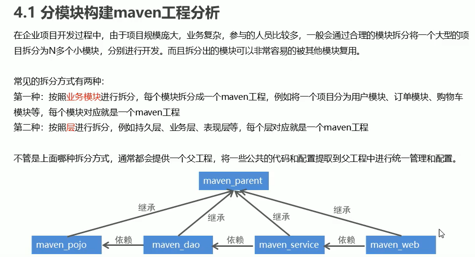

# ssm框架整合和maven

## spring整合Mybatis


框架原代码：E:\ideasProjects\Spring\ssmyuanshi


## maven


没有写，默认的依赖范围是compile

## Maven的依赖传递


## maven的依赖冲突


 


 


 


## maven构建ssm工程案例

 


 


## pom.xml

```xml
  <properties>
    <project.build.sourceEncoding>UTF-8</project.build.sourceEncoding>
    <maven.compiler.source>1.8</maven.compiler.source>
    <maven.compiler.target>1.8</maven.compiler.target>
    <spring.version>5.0.5.RELEASE</spring.version>
    <springmvc.version>5.0.5.RELEASE</springmvc.version>
    <mybatis.version>3.4.5</mybatis.version>
  </properties>
<!--  锁定jar版本-->
  <dependencyManagement>
    <dependencies>
<!--      Mybatis-->
      <dependency>
        <groupId>org.mybatis</groupId>
        <artifactId>mybatis</artifactId>
        <version>${mybatis.version}</version>
      </dependency>
<!--      springmvc-->
      <dependency>
        <groupId>org.springframework</groupId>
        <artifactId>spring-webmvc</artifactId>
        <version>${springmvc.version}</version>
      </dependency>
<!--      spring-->
      <dependency>
        <groupId>org.springframework</groupId>
        <artifactId>spring-context</artifactId>
        <version>${spring.version}</version>
      </dependency>
      <dependency>
        <groupId>org.springframework</groupId>
        <artifactId>spring-beans</artifactId>
        <version>${spring.version}</version>
      </dependency>
      <dependency>
        <groupId>org.springframework</groupId>
        <artifactId>spring-core</artifactId>
        <version>${spring.version}</version>
      </dependency>
      <dependency>
        <groupId>org.springframework</groupId>
        <artifactId>spring-aop</artifactId>
        <version>${spring.version}</version>
      </dependency>
      <dependency>
        <groupId>org.springframework</groupId>
        <artifactId>spring-web</artifactId>
        <version>${spring.version}</version>
      </dependency>
      <dependency>
        <groupId>org.springframework</groupId>
        <artifactId>spring-expression</artifactId>
        <version>${spring.version}</version>
      </dependency>
      <dependency>
        <groupId>org.springframework</groupId>
        <artifactId>spring-test</artifactId>
        <version>${spring.version}</version>
      </dependency>
      <dependency>
        <groupId>org.springframework</groupId>
        <artifactId>spring-aspects</artifactId>
        <version>${spring.version}</version>
      </dependency>
      <dependency>
        <groupId>org.springframework</groupId>
        <artifactId>spring-context-support</artifactId>
        <version>${spring.version}</version>
      </dependency>
      <dependency>
        <groupId>org.springframework</groupId>
        <artifactId>spring-jdbc</artifactId>
        <version>${spring.version}</version>
      </dependency>
      <dependency>
        <groupId>org.springframework</groupId>
        <artifactId>spring-tx</artifactId>
        <version>${spring.version}</version>
      </dependency>
    </dependencies>
  </dependencyManagement>

  <dependencies>
      <!--    mybatis 和 mybatis与spring的整合-->
      <dependency>
          <groupId>org.mybatis</groupId>
          <artifactId>mybatis</artifactId>
      </dependency>
      <dependency>
          <groupId>org.mybatis</groupId>
          <artifactId>mybatis-spring</artifactId>
          <version>1.3.1</version>
      </dependency>
<!--      Mysql驱动-->
      <dependency>
          <groupId>mysql</groupId>
          <artifactId>mysql-connector-java</artifactId>
          <version>5.1.37</version>
      </dependency>
<!--      druid数据库连接池-->
      <dependency>
          <groupId>com.alibaba</groupId>
          <artifactId>druid</artifactId>
          <version>1.0.10</version>
      </dependency>
<!--      springmvc核心-->
      <dependency>
          <groupId>org.springframework</groupId>
          <artifactId>spring-webmvc</artifactId>
      </dependency>
<!--      spring相关-->
      <dependency>
          <groupId>org.springframework</groupId>
          <artifactId>spring-context</artifactId>
      </dependency>
      <dependency>
          <groupId>org.springframework</groupId>
          <artifactId>spring-core</artifactId>
      </dependency>
      <dependency>
          <groupId>org.springframework</groupId>
          <artifactId>spring-beans</artifactId>
      </dependency>
      <dependency>
          <groupId>org.springframework</groupId>
          <artifactId>spring-expression</artifactId>
      </dependency>
      <dependency>
          <groupId>org.springframework</groupId>
          <artifactId>spring-jdbc</artifactId>
      </dependency>
      <dependency>
          <groupId>org.springframework</groupId>
          <artifactId>spring-tx</artifactId>
      </dependency>
      <dependency>
          <groupId>org.springframework</groupId>
          <artifactId>spring-aop</artifactId>
      </dependency>
      <dependency>
          <groupId>org.springframework</groupId>
          <artifactId>spring-web</artifactId>
      </dependency>
      <dependency>
          <groupId>org.springframework</groupId>
          <artifactId>spring-aspects</artifactId>
      </dependency>
      <dependency>
          <groupId>org.springframework</groupId>
          <artifactId>spring-context-support</artifactId>
      </dependency>
      <dependency>
          <groupId>org.springframework</groupId>
          <artifactId>spring-test</artifactId>
      </dependency>
<!--      junit测试-->
      <dependency>
          <groupId>junit</groupId>
          <artifactId>junit</artifactId>
          <version>4.12</version>
          <scope>test</scope>
      </dependency>
<!--      servlet-->
      <dependency>
          <groupId>javax.servlet</groupId>
          <artifactId>servlet-api</artifactId>
          <version>2.5</version>
          <scope>provided</scope>
      </dependency>
      <dependency>
          <groupId>javax.servlet.jsp</groupId>
          <artifactId>jsp-api</artifactId>
          <version>2.0</version>
          <scope>provided</scope>
      </dependency>
<!--      jstl-->
      <dependency>
          <groupId>javax.servlet</groupId>
          <artifactId>jstl</artifactId>
          <version>1.2</version>
      </dependency>
<!--      json数据类型转换-->
      <dependency>
          <groupId>com.fasterxml.jackson.core</groupId>
          <artifactId>jackson-databind</artifactId>
          <version>2.9.0</version>
      </dependency>
      <dependency>
          <groupId>com.fasterxml.jackson.core</groupId>
          <artifactId>jackson-annotations</artifactId>
          <version>2.9.0</version>
      </dependency>
  </dependencies>
    <build>
        <plugins>
            <plugin>
                <groupId>org.apache.maven.plugins</groupId>
                <artifactId>maven-compiler-plugin</artifactId>
                <version>3.1</version>
                <configuration>
                    <source>1.8</source>
                    <target>1.8</target>
                    <encoding>UTF-8</encoding>
                </configuration>
            </plugin>
        </plugins>
    </build>
```

## 分模块构建maven工程

 

   

 

  

父工程进行jar包版本的锁定，子工程去定义jar包


