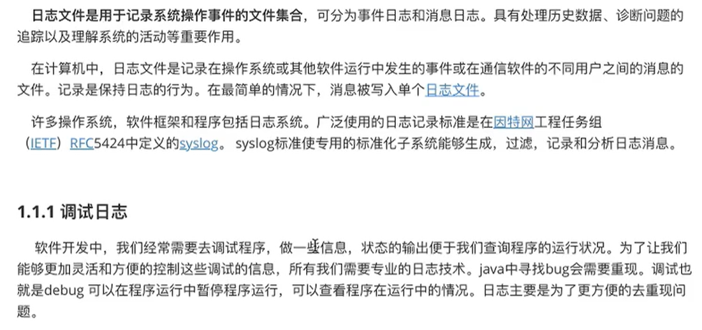
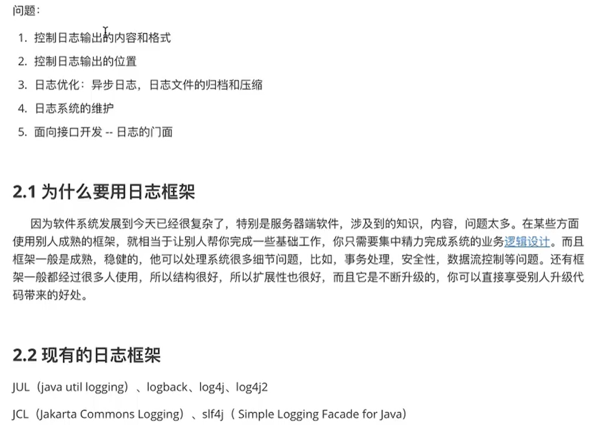
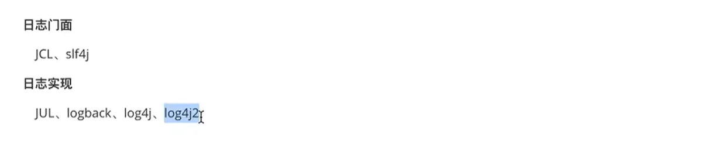
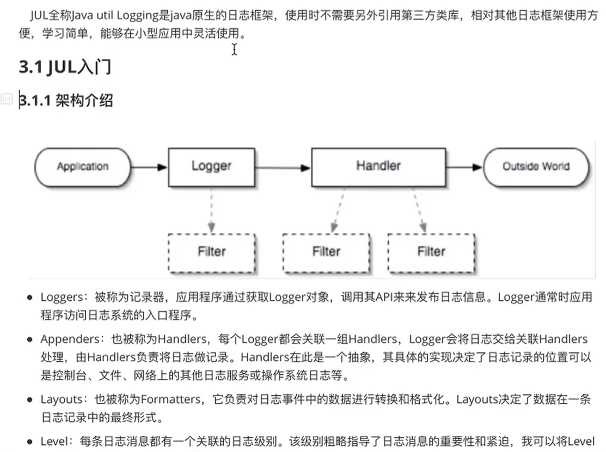

# 日志技术

E:\ideasProjects\Projects\test\log

## 1、日志的概念

### 2、日志文件



## 2、JAVA日志框架





### 1、JUL学习



application要做日志记录的话，需要调用jul提供的一个对象，叫做logger，这哥们称为日志记录器，我们是通过日志记录器来进行日志的记录和输出的， 日志记录器底层什么都没有做，他是调用了一个Hander处理器。处理器在其他的框架中也被称为Appenders，它的主要功能是将日志进行记录，格式化的转换以及输入到指定的位置，比如说控制台，文件，和网络上的一些路径。它底层也调用了一个对象叫做layouts，在我们jul框架中也称为Formatters，转化器的意思，转化完毕之后通过handers进行一个日志的输出，最终到达我们的一个指定的路径。下面由很多虚线称为过滤器。通过这些过滤器可以定制哪些信息被记录，哪些信息将被放过。level级别，当我们在设置logger对象的时候，通过logger对象指定级别，以及输出的消息格式，底层调用handler

```java
//快速入门
@Test
public void testQuick(){
    //1.获取日志记录对象
    //每一个日志记录器都要有一个唯一标识，通常我们以当前类的全限定类名进行命名
    Logger logger = Logger.getLogger("com.zrulin.JULTest");
    //2.日志记录输出
    logger.info("hello jul");
    //3.通用方法进行日志记录
    logger.log(Level.INFO,"hello jul");
    //4.通过占位符  方式输出变量
    String name = "tom";
    int age = 21;
    logger.log(Level.INFO,"用户信息：{0},{1}",new Object[] {name,age});
}
```

关注两个点，第一日志的级别，第二日志输出消息。

 一共七个级别：

- SEVERE
  - 错误的级别，当我们的程序出现严重的问题造成了程序的终止
- WARNING
  - 警告信息，记录程序发生的一些问题，问题不会造成程序的终止，但是我们也需要进行管理
- INFO
  - 消息，比如记录一些数据库的连接信息等等
- CONFIG
  - 配置信息，加载了配置文件，读取了配置文件的参数这个时候就可以用config来记录
- FINE
  - 颗粒度低
- FINER
- FINEST
  - 颗粒度高，信息比较详细
    - ​    这哥三都是debug日志记录的消息，记录一些程序运行的状况
- ALL
  - 所有级别都开启，值            cf766是最小的
- OFF
  - 所有级别都关上，值是最大的 
