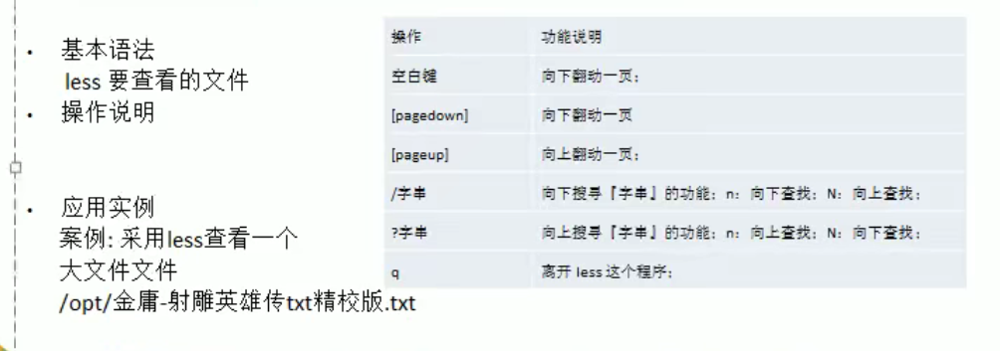
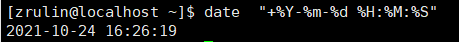
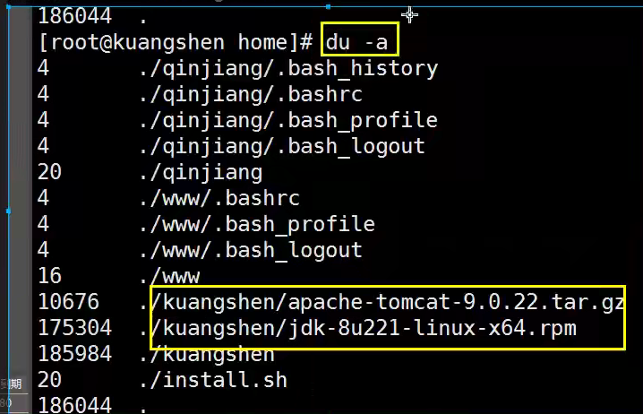
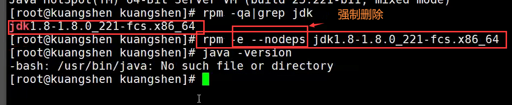

# Linux


linux的发行版本


linux和Unix 的关系


- Linux和Windos的比较


## VM和Linux系统的安装

(Centos)

- 虚拟机和Centos的关系


## VM虚拟机网络连接的模式

- 

  建议选择NAT模式

- 桥连接
  -  
  - 为linux也单独分配一个这个网络上的IP地址，外部可以访问它，它也可以访问外部，每个人都开虚拟机都用桥连的话，会出现ip不够用，一般不这么用。
- NAT模式
  -  
  - 王五使用NAT模式的时候，它的windows会被分配两个ip地址，一个用来和教室网络通信，一个用来和linux系统组成网络，linux可以通过Windows代理的方式，访问的教室的网络。
- 主机模式，linux 是一个独立的主机不能访问外网。


- linux安装的时候存储分区
  - 1.  /boot 分区 ：linux启动的时候需要一些引导文件，引导文件默认就会放在这个分区里面
    2. swap分区 ：交换程序，当系统内存不够用的时候，可以用swap暂时的替代内存
    3.  /  分区  ：根分区


- 安装VMtools
- 
- 可以在虚拟机和主机之间共享文件夹

目录	用途

- bin	可执行二进制文件的目录，存放着常用的命令ls、tar、mv、cat等
- boot	放置linux系统启动时用到的核心文件，自己的安装别放在这里。建议单独分区，分区大小100M即可
- dev	存放linux系统下的设备文件，访问该目录下某个文件，相当于访问某个设备
- etc	系统配置文件存放的目录，不建议在此目录下存放可执行文件
- home	存放普通用户的家目录，新增用户账号时，用户的家目录都存放在此目录下。建议单独分区，并设置较大的磁盘空间，方便用户存放数据
- lib	系统使用的函数库的目录
- mnt	挂载目录，临时挂载别的文件系统，比如将光驱挂载到/mnt/上，就可以进入目录查看光驱里的内容
- opt	给主机额外安装软件所摆放的目录，比如你安装oracle数据库就可以放倒这个目录下，默认是空的。以前的 Linux 系统中，习惯放置在 /usr/local 目录下
- proc	虚拟目录，是系统内存的映射，可以直接访问此目录获取系统信息。由于数据都存放于内存中，所以不占用磁盘空间
- root	系统管理员root的家目录，系统第一个启动的分区为/，所以最好将/root和/放置在一个分区下
- run	是一个临时文件系统，存储系统启动以来的信息。当系统重启时，这个目录下的文件应该被删掉或清除。如果你的系统上有 /var/run 目录，应该让它指向 run
- sbin	s表示Super User，放置系统管理员使用的可执行命令，如fdisk、shutdown、mount等。与/bin不同的是，这几个目录是给系统管理员root使用的命令，一般用户只能”查看”而不能设置和使用。
- srv	service缩写，服务启动之后需要访问的数据目录
- sys	这是linux2.6内核的一个很大的变化。该目录下安装了2.6内核中新出现的一个文件系统 sysfs
- tmp	存放临时文件的目录
- usr	应用程序存放目录，类似于windows下的program files目录，建议单独分区，设置较大的磁盘空间
- var	放置系统执行过程中经常变化的文件，如随时更改的日志文件。建议单独分区，设置较大的磁盘空间

**远程操控linux服务器**


## Vi和Vim的三种常见模式


wq:写入，退出

q: 退出

q! 强制退出，做了修改之后，不想保存

- 快捷键 的使用案例
  - 1.拷贝当前行   yy  。拷贝当前向下的5行   5yy  ,并粘贴（P）
  - 2.删除当前行    dd  。 删除当前行向下的5行  ， 5dd
  - 在文件中查找某个单词[命令行下  /关键字  ，回车， 查找，输入n就是查找下一个 ]
  - 设置文件的行号，取消文件的行号，【命令行下， :set nu , 和   :set nonu】
  - 到达文档的最末行【G】和最首行【gg】这些都是在正常模式下执行 
  - 在文件中输入一个“hello” ，然后又撤销这个动作，在正常模式下输入u
  -  将光标移动到第20行
    - 第一步，显示行号 set  nu
    - 第二部，输入20这个数
    - 第三步，输入shift+g
- 

## 关机和重启命令

- shutdown
  - shutdown -h now 表示立即关机
  - shutdown -h 1  表示一分钟之后关机
  - shutdown -r now  表示立即重启
- halt  就是直接使用，效果等价于关机
- reboot 就是重启系统
- ==sync  把内存的的数据同步到磁盘==

**注意：**当我们重启系统或者是关闭系统，首先要运行sync命令，把内存中的数据写到磁盘中。 

-------------

- 用户登录和注销
  - 登陆时尽量少用root账号登录，因为他是系统管理员，有最大的权限，避免操作失误，可以利用普通用户登录，登录后再用“su-用户名” 命令来切换称管理员系统
  - 在提示符下输入logout即可注销用户
- 使用细节
  - logout注销指令在图形运行级别无效，在运行级别3下有效

## 用户管理


有许多用户，用户会属于一个用户组，用户登录时会自动进入到自己的家目录中

- 添加用户
  -  useradd  [选项]  用户名
  - 当执行这个指令，就会创建一个用户，如果没有指定这个用户属于哪个组，就会创建一个组，把这个用户归属于新创建的组 
  - 用户创建成功后，会自动创建和用户名同名的家目录
  - 也可以通过useradd  -d  指定目录  用户名 给新创建的用户指定家目录
  - 
  - 这里指定目录的时候，这个目录不要事先创建
- 指定/修改密码
  - passwd  用户名	
  - 

- 删除用户

  - userdel 用户名
  - 1.删除用户，但是保留家目录
    - 不带任何参数，直接使用删除
  - 2.删除用户以及用户子目录
    - userdel -r 用户名
  - 实际工作中一般不会删除家目录

- 查询用户信息 

  - id 用户名

  

  用户不存在：返回“无此用户”

- 切换用户
  - su - 用户名
  - 用exit返回
  -  
  - 从权限高的用户切换到权限低的用户不需要密码，反之需要
- 查看当前用户
  - whoami

-----------

- 用户组
  - 类似于角色，系统可以对有共性的多个用户进行统一的管理
  - 增加组
    - groupadd  组名
  - 删除组
    - groupdel  组名
  - 增加用户时直接指定这个用户在哪个组
    - useradd -g 用户组 用户名
    - 
  - 修改用户的组
    - usermod -g 用户组 用户名
- 用户和组的相关的文件
  - 
  - /etc/passwd
    - 
    - 
  - /etc/shadow
    - 
    -  加密的密码存在这里
  - /etc/group
    -   
    - 
    - 后面的组内用户列表做了处理，看不到


## 实用指令

- 指令运行级别
  - 0：关机
  - 1：单用户【找回丢失密码】
  - 2：多用户状态没有网络服务
  - 3：多用户状态有网络服务
  - 4：保留
  - 5：图形界面
  - 6：系统重启
  -  系统运行级别的指定文件：/etc/inittab
- 切换到指定运行级别的指令
  - init[012356]
  - 如果在图形化界面，输入 init 3  就可以切换到命令行界面，在命令行界面输入init 5 就可以切换回来。
  - 输入init 0 可以关机
- 找回root密码
  - 进入到单用户模式，然后修改root密码，因为进入单用户模式，root 不需要密码就可以登录。

- 帮助指令
  - 
  - 
  - 百度更直接
- 文件目录类
  - pwd指令
    - 显示当前目录绝对路径
    - 
    
  - ls指令
    - ls 【选项】【目录或者是文件】
    - 常用选项
      - -a   ：显示当前目录所有的文件和目录，包括隐藏的
      - -l   ：以列表的方式显示信息 
      - 
      - 
    
  - cd指令
    - cd 【参数】
    - 切换到指定目录
    - 常用参数
      - 绝对路径和相对路径
        - 
      - cd~ 或者cd           : 回到自己的家目录
      - cd..  回到当前目录的上一级目录
    
  - makdir指令
    - makdir 【选项】 要创建的目录
    - 常用选项
      - -p   ：创建多级目录
    - 
    -  
    
  - rmdir指令
    - rmdir指令删除空目录
    - rmdir 【选项】要删除的空目录
    - 细节
      - rmdir 删除的是空目录，如果目录下有内容时无法删除
      - 如果需要删除非空目录，需要使用 rm -rf 要删除的目录
    - 
    
  - touch指令
    - touch指令创建空文件
    - touch   文件名称
    -  
    - 一次性创建多个文件
      - 
    
  - cp指令【重要】
    - cp指令拷贝文件到指定目录
    - cp  【选项】 source dest
    - 常用选项
      - -r  ：递归复制整个文件夹
    - 
    - 
    - 细节
      - 强制覆盖不提示的方法：\cp
      - 
    
  - rm指令

    - rm指令移除文件或者目录
    - rm  【选项】 要删除的文件或目录
    - 常用选项
      - -r  ： 递归删除整个文件夹
      - -f   ：强制删除不提示
    - 
    - 

  - mv指令

    - mv指令移动文件与目录或重命名
    - 基本语法
      - mv   odNameFile    newNameFile  (重命名)
      - mv   /temp/movefile     /targetfile    (移动文件)
      - 
      - 

  - cat指令

    - cat指令查看文件内容，是以只读的方式打开
    - cat  【选项】  要查看的文件
    - 常用选项
      - -n   ：显示行号
    - 细节
      - cat 只能浏览文件，而不能修改文件，为了浏览方便，一般会带上 管道命令，| more
      - 

  - more指令

    - more指令是一个基于VI编辑器的文本过滤器，它以全屏幕的方式按页显示文本文件的内容，more指令中内置了若干快捷键
    - 
    - 

  - less指令

    - less指令用来分屏查看文件内容，它的功能与more指令相似，但是比more指令更加强大，支持各种显示终端，less指令在显示文件内容时，并不是一次将整个文件加载之后才显示，而是根据显示需要加载内容，**对于显示大型文件具有较高的效率**
    - 
    - 、

  - ```
    >  指令和 >> 指令
    ```

    - ```
      > 输出重定向  和  >>  追加
      ```

    - 输出重定向：会将原来的文件覆盖

    - 追加：不会覆盖原来的文件

    - 基本语法

      - ls -l > 文件	（列表的内容写入文件中（覆盖写））
      - ls  -al  >> 文件     （列表的内容追加到文件末尾）
      - cat  文件1 >  文件2       (将文件1的内容覆盖到文件2)
      - echo  “内容”  >>  文件	 (追加，把双引号里面写的内容直接追加到文件)

    - 

    - 

    - 

    -  

    - 

    - cal 显示日历

  - echo指令

    - 输出内容到控制台
    - echo  【选项】【输出内容】
    - 用处
      - 输出环境变量
      - 
      - 输出一些简单的文本

  - head指令

    - 用于显示文件的开头部分内容，默认情况下head指令显示文件的前10行内容
    - 基本语法
      - head 文件  （查看文件的头10行内容）
      - head  -n  5  文件  （查看文件的头5行内容，5可以是任意行数）
      - 

  - tail指令

    - 用于输出文件中尾部的内容，默认情况下，显示文件的后10行内容
    - 基本语法
      - 
    - 
    - 

  - ln 指令

    - 软连接，也叫符号链接，类似于windows里的快捷方式，主要存放了链接其他文件的路径基本语法
    - ln  -s  【源文件或目录】【软链接名】（给源文件创建一个软连接）
    - 
    - 
    - 当我们使用pwd指令查看目录时，仍然看到的是软连接所在目录
    
  - history指令
  
    - 查看已经执行过的历史命令，也可以执行历史命令
    - 基本语法
      - history  	
    - 
    - 
    - 

---------------------

- 时间日期类指令
  - date指令
    - 显示当前日期
    - date   (显示当前时间)
    - date +%Y    (显示当前年份)
    - date  +%m    （显示当前月份）
    - date  +%d   （显示当前是哪一天）
    - date  "+%Y-%m-%d  %H:%M:%S"    （显示年月日时分秒）
    - 
    - 
    - 
  - cal指令
    - 查看日历信息
    - cal   【选项】
    - 
    - 

-------------------------

- 搜索查找类
  - find指令
    - find指令将从指定目录向下递归的遍历其各个子目录，将满足条件的**文件或者是目**录显示在中断
    - find  【搜索范围】【选项】
    - 选项说明
      -  -name  <查询方式>  按照指定的文件名查找模式查找文件
      - -user  <用户名>	 查找属于指定用户名的所有文件
      - -size <文件大小>    按照指定的文件大小查找文件
    - 
    - 
    -  
    -  按照通配符查找
    -  
  - locate指令
    -  快速定位文件路径，locate指令利用事先建立的系统中所有文件名称及路径的locate数据库实现快速定位给定的文件，locate指令无需遍历整个文件系统，查询速度较快，为了保证查询结果的准确度，管理员必须定期更新locate时刻。
    - 基本语法
      -  locate  搜索文件
    -  由于locate 指令基于数据库进行查询，所以第一次运行时必须使用updateb指令创建locate数据库
    -  
  - grep指令和管道符号 |
    -  grep 过滤查找，管道符，”|“，表示将前一个命令的处理结果传递给后面的命令处理
    -  在文件内部查找
    -  
    -  默认是区分大小写的
    -  -n  输出行号
    -  -i  不区分大小写

-----------------

- 压缩和解压缩类
  - gzip用于压缩文件，gunzip用于解压
    - 基本语法
      - gzip   文件		（压缩文件，只能将文件压缩为*.gz文件）
      - gunzip   文件.gz  (解压缩文件命令)
    - 
    - 压缩完之后原来的文件就没了
  - zip / unzip指令
    - zip 用于压缩文件，unzip用于解压缩文件
    - 
    - 
    - 
  - tar指令
    - 

 

## 磁盘管理

- df（列出文件系统整体的磁盘使用量）du（检查磁盘空间使用量）
- 
-  
- 

- mount
- 
- 

## 进程管理

- 基本概念
  - 
- 命令
  - ps
    -  查看当前系统中正在执行的各种进程的信息
    - ps -xx:
      - -a  显示当前终端运行的所有的进程信息	（当前的进程）
      - -u   以用户的信息显示进程
      - -x  显示后台运行进程的参数
      - 
    - ps  -ef
      - 可以查看到父进程的信息
    - pstree    显示树结构
      - -p    显示父id
      - -u    显示用户组
      - pstree -pu 
      - 
    -  结束进程，杀掉进程
    - 

## 环境安装

安装软件一般有三种方式：

rpm（jdk：在线发布一个SpringBoot项目），

解压缩（tomcat，启动并通过外网访问，发布网站），

yum在线安装（docker：直接安装运行跑起来）。

### JDK安装

- 下载JDK  rpm 

- 

- 安装java环境

  - 检测当前是否存在java环境，java  -version
  - 如果有的话先卸载
  - rpm -qa | grep jdk    #监测jdk版本信息
  - rpm -e --nodeps jdk版本号
  - 
  - 卸载完毕后即可安装jdk安装
  - rpm  -ivh  rpm包
  - 
  - 配置环境变量	 /etc/profile   在文件的最后面增加java的配置，和window安装环境变量一样的
  - 
  - 
  - 让这个配置文件生效       source   /etc/profile
  - 

### Tomcat安装

ssm  war  就需要放到tomcat中运行

1.下载tomcat  .  官网下载，

2.解压这个文件

​	tar -zxvf  apache-tomcat-9.0.54.tar.gz

3.启动tomcat测试，   ./xxx.sh   脚本即可运行

```
#  执行    ./startup.sh
#  停止    ./shutdown.sh
```

- 防火墙
- 查看firewall 服务状态
  - systemctl status firewalld
- 开启，重启，关闭，firewalld,service 服务
- 开启
  - service firewalld start
- 重启
  - service firewalld restart
- 关闭
  - service firewalld  stop
- 查看防火墙规则
  - filewall-cmd --list-all	查看全部信息
  - firewall -cmd --list-ports  查看端口信息
- 开启端口
  - 开端口命令 
    - firewall -cmd --zone=public  --add-port=80/tcp --permanent
  - 重启防火墙
    - systemctl restart firewalld.service
- 命令意义
  - --zone   作用域
  - --add-port=80/tcp   添加端口，格式为：端口/通讯协议
    - --permanent   永久生效，没有此参数重启后失效
- 

### Docker(yum安装)

官网：https://docs.docker.com/engine/install/centos/

1.检测CentOS 7

```
root@iZf8zbo1wv4ol3891y45qzZ bin]# cat /etc/redhat-release
CentOS Linux release 7.9.2009 (Core)
```

2.安装我们的准备环境

### Mysql安装

1.检查是否已经安装mysql

rpm -qa | grep mysql

rpm -e mysql -libs  如果有，删掉他

ram -e --nodeps mysql -libs  删不掉？试试强制删除 


安装编译代码需要的包

yum -y install make gcc-c++ cmake bison-devel ncurses-devel


解压mysql压缩包

tar -zxvf mysql-8.0.27-el7-x86_64.tar.gz


- 找好自己的mysql安装路径以及data所在路径
- 我的分别是 /usr/local/mysqldb/mysql   /usr/local/mysqldb/data
- 增加一个Mysql用户并赋权限
  - 

- 切换到mysql安装目录

  - 

- 生成初始密码并记录

  - 在生成密码之前，我的linux-centos7版本缺少**libaio.so.1**文件，要先安装执行：

    - yum install -y libaio

  - 生成密码

    - ```mysql
      mkdir -p /usr/local/mysqldb/data && ./mysqld --initialize --user=mysql --basedir=/usr/local/mysqldb/mysql --datadir=/usr/local/mysqldb/data
      ```

    - Mg?P(Dvjo4-E

  - data目录不用自己创建

- 在 /etc/profile 下修改，或新增 my.cnf文件 并配置

  - ```
    [mysql]
    default-character-set=utf8
    socket=/var/lib/mysql/mysql.sock
    [mysqld]
    port=3306
    server-id=3306
    datadir=/var/lib/mysql
    socket=/var/lib/mysql/mysql.sock
    basedir=/usr/local/mysqldb/mysql
    datadir=/usr/local/mysqldb/data
    character-set-server=utf8
    max_connections=200
    max_connect_errors=10
    ```

- 创建上面用到的目录

  - mkdir -p /var/lib/mysql&&chmod 777 /var/lib/mysql

- mysqld

  - mv /usr/local/mysqldb/mysql/support-files/mysql.server /etc/init.d/mysqld
  - chmod +x /etc/init.d/mysqld

- 配置mysqld

  - vim mysqld  打开这个文件
  - 
  - 配置

- 配置mysql开机自启动

  - [root@izbp1f9ue9eymz6k6quuoiz init.d]# chkconfig --add mysqld
    [root@izbp1f9ue9eymz6k6quuoiz init.d]# chkconfig --list mysqld
  - [root@izbp1f9ue9eymz6k6quuoiz init.d]# chkconfig --level 35 mysqld on

- 配置环境变量

  - 

- 启动mysql

  - mysql -uroot -p

- 修改密码

  - alter user 'root'@'localhost' indentified by '123456'

- 授权操作

  - 进入到mysql数据库，user表中可以看到
  - select * from user /G   （\G格式化）
  - 
  - host是localhost  这里仅本地可以使用，修改它
  - 
  - grant all on *.* to 'root'@'%';
  -  flush privileges；刷新

- 设置防火墙


CLcrRmFfZ8/a

https://blog.csdn.net/shipfei_csdn/article/details/104426465ls
