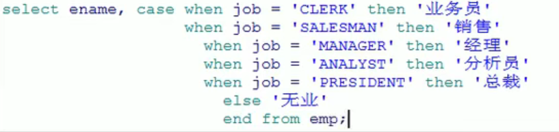
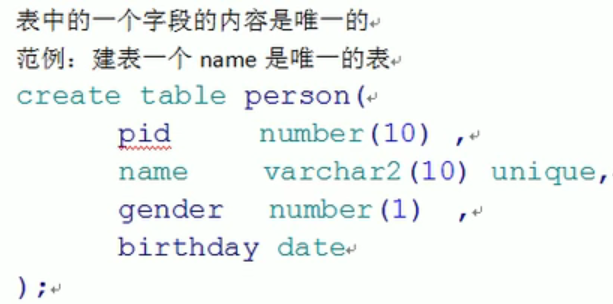
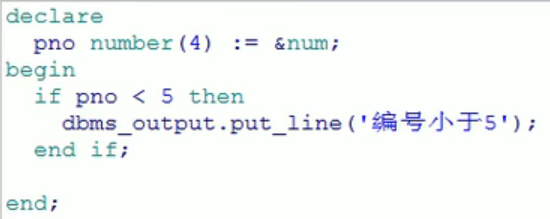
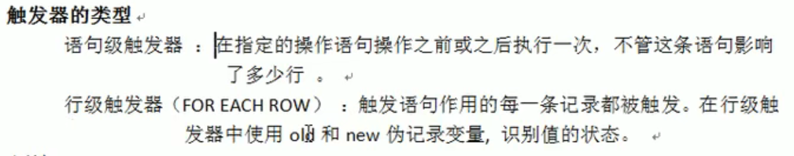

# Oracle

参考视频：https://www.bilibili.com/video/BV1AE411p79z

## 1、Oracle的基本概念

**安装oracle的时候注意：**

1.安装的时候记住那些个口令

2.安装完成后首先创建数据库， 也就是创建实例，然后，如果口令错误的话，可以在sqlplus里面更改system  和 sys的密码。

先输入 sys as sysdba  口令可以为空，进去后，更改system的口令，alter user system identified by 123456 就把密码改成123456了，用develop连接实例，用这个system的用户名和口令连接，sid是你在创建数据库实例的时候设定的，然后再登录之后可以创建用户，授予权限，然后就可以用自己的创建的用户进行操作了。然后要注意的是，再创建数据库实例的时候一定要开启监听，没有的话就添加监听再开启，记住开启监听的端口号。

- mysql的格式是，一个用户下有多个数据库，我们直接操作这些个数据库。
  - 
- Oracle的格式是，oracle数据库下有多个实例，一般我们创建一个实例，然后在这些个实例里面创建用户，操作这个用户里面的表，就像mysql里面操作数据库里面的表一样。每一个实例后面有一组的进程来支撑。我们能在右键计算机管理，里面的服务看到oracle的各个进程的运行。
  - 
  - 创建用户的时候会给用户分配默认表空间，用户的一些实体，比如触发器，存储过程，函数等等都存放在这个默认表空间中。表空间实际上是一个文件系统，里面由一些.dbf .ora文件组成，虽然不同用户可能使用相同的默认表空间，但是他们在表空间里面的数据是隔离的，不会起冲突。
  - 
  - 
  - 

  

## 2、oracle简单命令

1. 登录
   1.  
   2.  超级管理员就加上 as sysdba
2. 查看当前已连接的用户
   1.  
3. 用户的切换：
   1.  
4. 查看用户下的表：
   1.  
5. 用户和用户之间创建的表是相互隔离的，相互之间是不能互相查询的，但是管理员能够查询到普通用户的表。
   1.  

## 3、Oracle简单查询

**数据类型：** 字段Mysql  int  对应Oracle  number(x,y) x表示总长度，后面表示多少位小数。

- 查询：
  - 	

- 别名：
  -  
  - as 可以省略，as 后面的别名不需要引号。
- 去重：
  - 
  - 查出来的结果是相同的就去掉了。
- 字符串连接查询：
  - 
  - 进行连接的字符串需要引号。
- 四则运算：
  -  
  - 不推荐sql语句四则运算，影响性能。

## 4、Oracle限定查询

在查询的后面加上查询条件。

 

**空和非空：**

 

**多个条件之间用and :**

 

**多个条件之间用or：**

 

**not用法：**

 

**between ... and 用法：**

 

用在日期中间：	

 

 Oracle所查询到的**值**是**区分大小写**的：

 

 

**in 和 not in**  ,只要在这个括号里边的就为真。

**模糊查询：**

使用Like语句来执行，%匹配任何长度的内容，_匹配一个长度的内容。

 

**不等号：<>  !=**

 

- 对结果的排序，默认是升序，省略了asc
  -  
  - 降序：
    -  
  - 先按照前边的排序再按照后边的排序。
    -  
  -  无论有什么样的sql语句，排序的语句尽量放到最后面。

## 5、Oracle单行函数

==伪表的概念==：如果我们要查询的值没有地方去查找，就可以从dual伪表中去查找。

 

- ==**字符函数**==

- 大小写的转换 
  -  小写变为大写：upper()
  -  
  - 大写变为小写：lower()
  -  
- 首字母大写：initcap()
  - 
- 字符串的连接：concat()
  - 
- 字符串的截取：substr()
  - 
  - 写成0和1的效果是一样的，但是它的索引是从1开始的。
- 获取字符串的长度：length()
  -  
- 字符串的替换：replace()
  - 
  - 将字符串中的 l 替换成 x

- **==数值函数==**

- 四舍五入：round()
  -  
  - 结果是13
  - 可以自定义要保留的小数位数
  -  
  - 结果是12.48
- 取整trunc():
  -  
  - 结果是12
  -  
  - 可以保留小数，但是不会四舍五入。
  - 结果是12.63
- 取余 mod（）
  -  
  - 结果是1

- ==**日期函数**==

Oracle中提供了很多的日期相关的函数，包括日期的加减，在日期加减是由一些规律：

 

- 当前日期：sysdate
  -  
- 查询雇员进入公司的周数：
  - 
- 获得两个时间段中的月数：months_between()
  - 查询所有雇员进入公司的月数
  -  
  - 查询的时候用函数括号里面，前面的值放最近的日期。
- 获得几个月后的日期：add_months()
  - 求出三个月后的日期
  - 
- 指定给出下次某日期数：next_date()
  - 
  - 求下一个星期一是什么时候。
- 求出一个日期的最后一天：last_day()
  -  
  - 求本月的最后一天

- ==**转换函数**==
- 字符串转换函数：to_char()
  -  
  -  
  - 在结果中10以下的月前面被补了前导零，可以使用fm去掉前导零。
  -  
- to_char()  给数字做格式化
  -  
  -  
  -  
- 数值转换函数：to_number()
  - 可以把字符串转换成数值。
  -  
  - 结果是20
- 把字符串转化成时间：to_date()
  -  

==**通用函数**==

- 空值处理：nvl()
  - 
  - 范例是：我们需要把一个表中的工资和奖金加起来，但是工资人人都有，奖金就有些人没有，所以奖金这一列里面，有些值它是null，然后不处理的话，直接相加，空值加上有值就会是null。所以需要处理一下空值。
  - 

- Decode函数
  - 相当于if...else if...else
  -  
  -  
- case when 函数
  - 可以和decode起到一个相同的效果。
  -  
  -  

## 6、Oracle多表查询

使用一张以上的表做的查询。

 

两张表不做任何限定查询，查出来的是两张表记录数的乘积，也就是笛卡尔积。

多表查询，自己练呗。

## 7、Oracle外连接（左右连接）

可以保留一张表的数据是全量。两张表关联的时候，另一张表中即使没有相应的数据能关联上，也不会把我的当前数据给筛选掉。

- 外连接：
  - 两张表做连接查询的时候，其中一张表的要查询全量的数据（不会因为另外一张表的数据的关联而被筛选掉。）
  - 在两张表关联的时候，非全量表的关联字段后面加上(+)  ,就可以做外连接查询了。
  -  
- 以左边表为全量表的查询就叫做左连接。
- 

## 8、sql1999对sql的支持

- 交叉连接：cross join(了解)、
  -  
  - 这样的查询对我们来说是没意义的，没有筛选，存在着笛卡尔积。
- 自然连接：natural join(了解)
  -  
  - 自动找两张表中的关联条件，两张表字段相同，就认为是关联的。
- Using 子句 ，联合查询（了解）
  -  
  - 可以指定关联字段，还可以写where
- ON子句，（重要）
  - on 相当于 where
  -  
  - 这两个基本是完全一致的。
- 外连接
  - 左连接
    -  
    -  
  - 右连接
    -  
    -  

## 9、Oracle分组函数,统计

==**分组函数**==

- 统计记录数 count()
  -  
  - 不建议使用count(*)，可以使用一个具体的列，以免影响性能。
  -  
- 最小值查询：min()
  -  
- 最大值查询：max()
  -  
- 查询平均值：avg（）
  -  
- 求和函数：sum()
  -  

==**分组统计**==

 

- 根据一个列的字段值来分组
  - 
- 不分组会报错
  -  
- 
- 查询人数大于五的部门。
  - 这里不能在where后面增加条件，要用having ,在group by 后面使用，作用于分组函数上。
  -  
  - 不可以用别名
  -  
- 查询部门平均工资大于两千
  -  

## 10、子查询

在一个查询的内部还包括另一个查询，则称此查询为子查询。

sql的任何位置都可以加入子查询。

 范例：查询比7654工资高的： 

所有子查询都必须在（）中编写。

子查询在操作中有三类：

1.单列子查询：返回的结果是一列的一个内容。

2.单行子查询：返回多个列，有可能是一个完整的记录。

​	可以用in，把这个查询作为in里面的内容。

3.多行子查询：返回多条记录

​	可以把多行认为是一张表。

 

 

## 11、Oracle中的exists和not exists

 

在这个里面in要少用，因为性能低，为什么呢？

 

 

 

## 12、 Oracle中的Union 和 Union All 

 

Union All  求并集而且不去重。

并集合并的时候列类型必须一致，列名可以不一致，两个合并的并集列数必须一致。

## 13、Oracle的增删改

**添加：**

 

**修改**

 

 

**删除**

 

 

## 14、Oracle事务

在你做数据库变更的时候都要开启事务。

老师是这么演示的，首先建立一个sql文件a，里边写查询语句，再建立一个新的sql文件b，里面写删除语句，查询语句，执行之后，看到已经删除了，回到a里面查询，发现好像没删除。

 

增删改都需要事务的提交。

commit;

回滚：

rollback;

 

执行update时没有提交之前事务是挂起状态，这个时候这条数据被锁住，也就是说如果此时有另一个sql语句来操作这个数据，就会处于等待的状态。阻塞。

执行一批数据也是一样的。

这个锁很重要，在后面做项目的时候，这个锁可以防止并发。

## 15、Oracle表的管理

常用的数据类型：

 

**建表：**

 

**删表：**

 

  

**表的修改：**

 

 

 

**截断表：**

 

不需要提交，删除之后无法回滚，谨慎使用。

## 16、Oracle约束

在数据库开发中，约束是必不可少的，使用约束可以更好的保护数据的完整性。

==**主键约束**==

 

主键唯一，不可为空。

自定义主键名称：

 

这个自定义主键约束的名称，而不是改变主键那一列的名称。

多对多的表中的一种中间表是没有它自己的一种主键的。	

==**非空约束**==

 

==**唯一约束**==

 自定义唯一约束名称：

 

==**检查约束**==

 

自定义检查约束名；

 

==**外键约束**==

多表之间的约束，更好的保证数据的完整性：

  

foreigh key (自己的哪个键) references(关联外部的哪个键)

 

## 17、Oracle的rownum和分页

rownum：表示行号，实际上是一个列，但是这个列是一个伪列，此列可以在每张表中出现。

 

# Oracle视图

方便我们做查询的实体。

视图就是封装了一条复杂查询的语句。

如果查询语句复杂，且经常用就可以作为视图。

操作视图间接的操作这条查询

- 试图中是不允许查询中有列的重复的。
- 创建视图或者覆盖视图。
  - 有就创建，没有就覆盖。
  -  
- 修改视图，也修改了表
  - 
  - 视图不建议修改
  - with read only 创建只读的视图
  -  

# Oracle序列

 

默认值：

 

  

吧自增的序列插入表中：

 

# Oracle索引

加速存取数据的对象。

 

索引不能随便建，有些索引用不到但是我们需要维护他，那么就会耗费系统的性能。

- 单例索引
  -   
  - 每张表的主键自动带索引。
  -  
- 复合索引
  -  
  - 当你的查询条件中包含复合索引的这些列的时候，就会自动的使用索引。
  - 符合索引是有顺序的。
  -  
  - 这两种查询所用的复合索引也是不一样的。
-  

# Oracle   pl/sql

**语法：**

 

### **变量部分**

- 基础数据类型变量：

每一个语句之后都要分号 ;

赋值：  冒号加等号 :=

- 引用变量：

 

  

%type 引用表中的一列的属性。

- 记录行变量

 

### if

 

-----------

 

-------

### Loop循环语句

 

常用： 

  

 

 

 

从1到100    1 .. 100

更适合于连续的数值的遍历。

### 游标

 

 

 

带参数的游标：

 

### 例外

 

对应Java中的异常。

### 触发器

数据库触发器是一个与表相关联的，存储的PL/SQL 程序，每当一个特定的数据操作语句（insert,update , delete ）在指定的表上发出时，Oracle自动的执行触发器中定义的语句序列。

 

 

 

 

 

 

考试所搜的东西：

---------------------

# 存储过程

 

# 存储函数

 

 

