# 左神讲算法


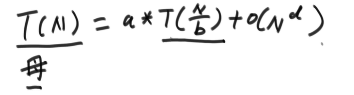

- T(N)母问题的规模是N个数据
- 每一次调用的子过程都是等量的，都是N/b的规模
- 调用a次子过程
- 最后一 个  big O () 除 了子过程之外剩下的过程的时间复杂度

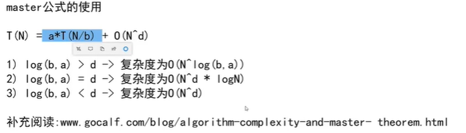

​	


- 异或运算就是不进位相加，0加1是1，1加1是0，0加0是0，1加0是1

- 异或满足交换律和结合律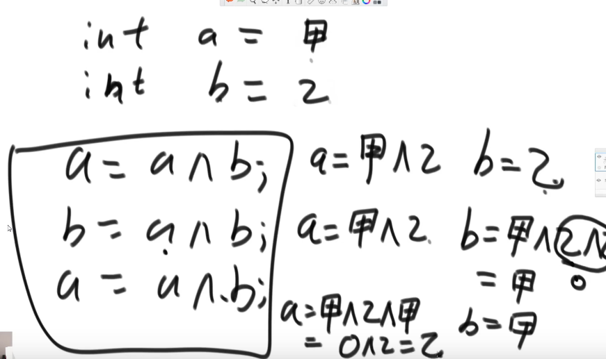

  前提是 a和b不能是指向同一块内存区，因为同一块内存里面的东西异或，会给洗成0

- 异或的题

  - 1.一个数组中只有一个数字出现奇数次，其他所有的数字都出现了偶数次，找出这个出现奇数次的数
  - 2.一个数组中只有两个数字出现奇数次，其他所有数字都出现偶数次，找出这个出现奇数次的两个数

第一问：定义一个变量eor  让eor和数组中的每一个数异或，最后eor就是要找的这个数

```java
    public int test (int[] arr){
        int eor = 0;
        for(int data : arr){
            eor = eor ^ data;
        }
        return eor;
    }
```

第二问

```java
public void test1(int[] arr){
    int eor = 0;
    for(int data : arr){
        eor = eor ^ data;
    }
    // eor等于 a^b
    // eor 不等于零
    //eor 必然有一个位置上是1（二进制数）
    int rightOne = eor & (~eor +1); //提取出最右的1

    int onlyOne = 0 ; //就是 ero'
    for(int data: arr){
        if((data & rightOne) == 0){
            onlyOne = onlyOne^data;
        }
    }
    System.out.println(onlyOne+"+"+onlyOne^ero);    
}
```

冒泡排序和选择排序，最短ye要O(n平方)

插入排序，情况特别好可以是O(n)

- 对数器

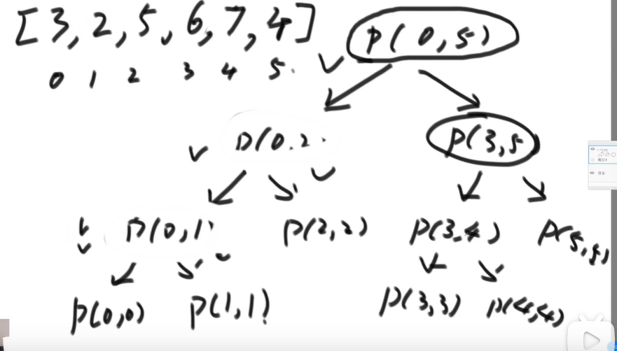

```java
public static int process(int[] arr, int L , int R){
    if(L == R) return arr[L];  //范围上只有一个数，直接返回
    /*
    这里是求中间位置，本来应该是(L+R)/2,但是为了防止小概率时间，L+R导致溢出，也就是超出整数的范围。
    所以改成  L + (R- L)/2  , 然后右移一位比除2要快。
     */
    int mid = L + (R - L)>>1;
    int leftMax = process(arr,L , mid);
    int rightMax = process(arr, mid+1 , R);
    return Math.max(leftMax,rightMax);

}
```

递归就是一个压栈的过程，预先不知道第一个的结果，它会生成一个树形结构的样子，然后由这个树形结构的底部，一点一点的往上返回值。

## 堆排序

结构是一个完全二叉树

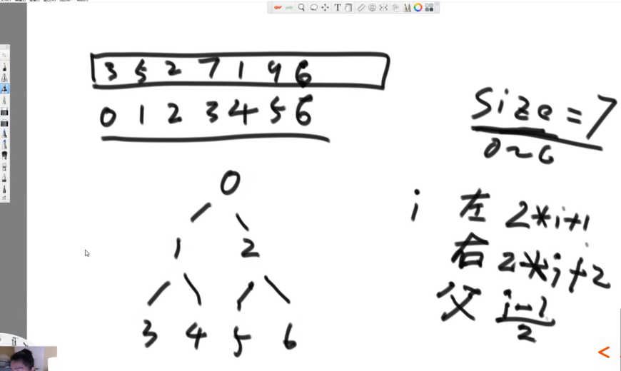

 

大根堆：完全二叉树的每一个子树的最大值都是它的父节点

小根堆：完全二叉树的每一个子树的最小值都是它的父节点


完全二叉树从上至下，高度是logN级别的。

额外空间复杂度是O（1）

优先级队列结构就是堆结构


**比较器**


**不基于比较的排序**

根据数据状况来定制，比如：

**计数排序**

来个词频来统计一下

要对一个公司的员工按年龄进行排序，年龄其实是有范围的，最大不会超过200岁，最小不会小于16岁

可以直接定义一个从16到201的数组

**基数排序：**

**桶的结构可以是数组可以是队列**

数据量大的话，是多少进制就准备多少个桶

 

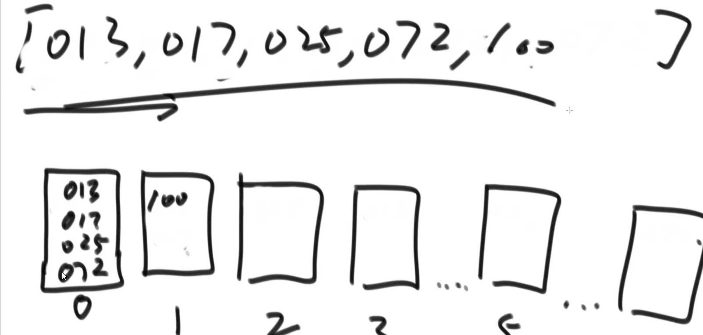

上面这个图的话，本来是一些十进制的数，然后按照这些数里面最高位是百位，所以把其他数的百位都补零，然后按照个位大小进对应数字的桶，出来的话每个桶都是先进先出，然后在进十位的桶，规则一样，进去的时候个位上的优先级就保留下来了，然后再按照百位进桶。


**排序算法的稳定性及其汇总**

同样值的个体之间，如果不因为排序而改变相对次序，就说这个排序是有稳定性的，否则就没有。

不具备稳定性的排序

选择排序，快速排序，堆排序

具备稳定性的排序：

冒泡排序，插入排序，归并排序，一切桶排序思想下的排序


目前没有找到时间复杂度O(N*logN) ,额外空间复杂度O(1)，又稳定的排序。

排序的是基本类型数据的时候，稳定性没有什么用

**稳定性主要用**在非基础类型：

比如说：

一个学生类，他有年龄，有班级，我需要首先按照班级排序，然后按照年龄排序。

这个时候一些已经拍好年龄的班级，再去按照班级排序的时候年龄就要求不能乱。


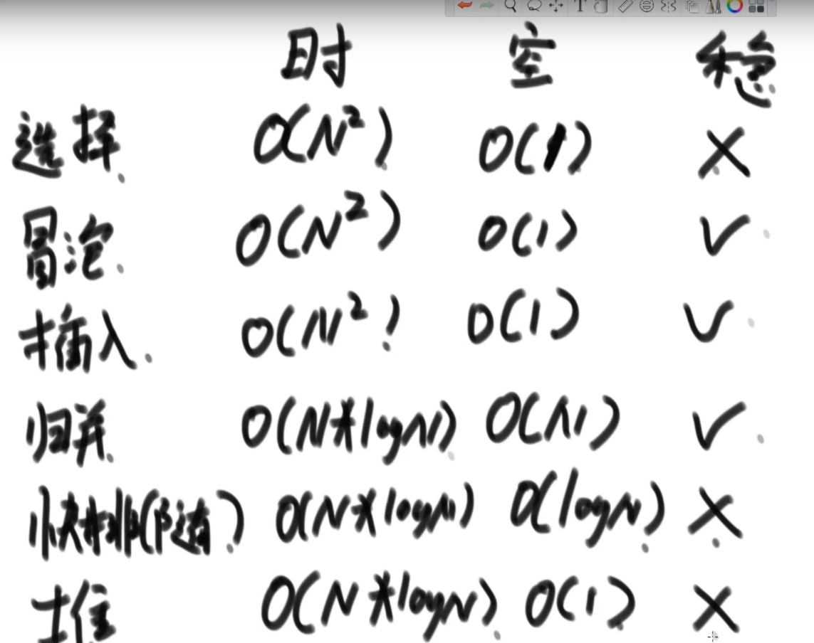

一般情况下用快排，首先快速排序的时间复杂度是O(N*logN)的，其次快排它的常数项经过实验的结果是最低的。经过实验快排是最快的，实在是有空间的限制，就用堆排。归并的话需要用到稳定性的时候会用到它

归并的劣势就是空间复杂度较高，优势就是稳定性能做到

快排的优势就是它常数项低，它实际上跑的时候是最快的排序，但是它的劣势是它的空间复杂度没有办法做到O(1)它稳定性也没法做到。

堆排的优势就是它的空间使用很低。

问题：基于比较的排序，能不能做到时间复杂度在O(N*logN)以下，目前没有找到。	

时间复杂度在O(N*logN)，空间复杂度要求O(N)以下，还要求稳定性，目前没有找到这种算法。

目前为止排序算法的研究状况，就是你想要时间复杂度好且空间复杂度低还想要稳定性，就要牺牲空间复杂度。


归并排序能把空间复杂度变成O(1)但是失去稳定性，何必呢，用堆不好？（归并排序，内部缓存法）

归并排序让空间复杂度变成O(1)但是时间复杂度变成O(N2)  垃圾，插入 都比他好（原地归并排序）

快速排序能做到稳定性，但是做到的同时会让空间复杂度变成O(N)，何必呢，代码更复杂，直接归并排序不香嘛。（01  stable sort）

**关于学术的尤其是计算机的学术方面，、不推荐google以外的任何搜索引擎，其他的没什么鸟用，搜题目的话可以用国内搜索引擎。左神说的。**

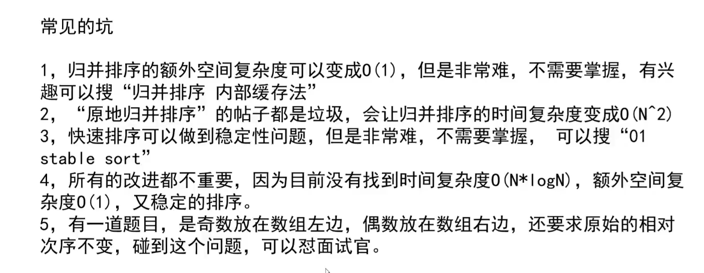

排序在工程上的使用。

往往是将多种排序一起使用的综合排序，比如说在快速排序的时候插入一段，当数据容量小于60（也就是小样本的时候）的使用使用插入排序，而不是使用快速排序。在小样本的情况下虽然是n平方，但是它的瓶颈不明显，反而插入的常数时间，我们众所周知是极低的，这样一来，在大调度上利用了快排调度上的时间复杂度上的优势，在小样本上他又利用了插入排序上常数项低的优势。

Arraylist.sort上的排序，发现是基本数据类型就会用快排，自定义类型就会用归并。稳定性。

## 哈希表和有序表

1. **哈希表**

- 哈希表在使用层面上可以理解为一种集合结构
- 如果只有key,没有伴随数据value,可以使用HashSet结构
- 如果既有key,又有伴随数据value,可以使用HashMap结构
- 有无伴随数据，是HashMap和HashSet唯一的区别，底层实际结构是一回事。
- 使用哈希表，增删改查，的操作，可以认为时间复杂度为O(1)，但是常数时间比较大。
- 放入哈希表中的东西，如果是基础数据类型，内部按值传递，内存占用就是这个东西的大小,一律8字节
  - 在底层的哈希表中会拷贝数据的值到哈希表
- 放入哈希表中的东西，如果不是基础类型，内部按引用传递，内存占用就是内存地址的大小。
  - 哈希表中记录的是内存地址，而不是值

这个key的存储就像虚拟机栈里面的局部变量表一样，存储基本数据类型和对象引用


**2.有序表**

- 有序表在使用层面上可以理解为一种集合结构
- 如果只有key,没有伴随数据value , 可以使用TreeSet结构
- 如果只有key，没有伴随数据value，可以使用TreeMap结构
- 有无伴随数据，是TreeSet和TreeMap唯一的区别，底层的实际结构是一回事。
- 有序表和哈希表的区别是，有序表把key 按照顺序组织起来，而哈希表完全不组织.
- 红黑树，AVL树，size-balance-tree和跳表都属于有序表结构，只是底层具体实现不同 ，而且性能都一样，复杂度指标都一样。
- 放入有序表的东西，如果是基础数据类型，内部按值传递，内部占用就是这个东西的大小。
- 放入有序表中的东西，如果不是基础类型，**必须提供比较器**，内部按引用传递，内存占用是这个东西内存地址的大小

既然是有序表也就意味着key是可以比较的。

增删改查时间复杂度都是O(logN)的

有序表的常用操作方法：

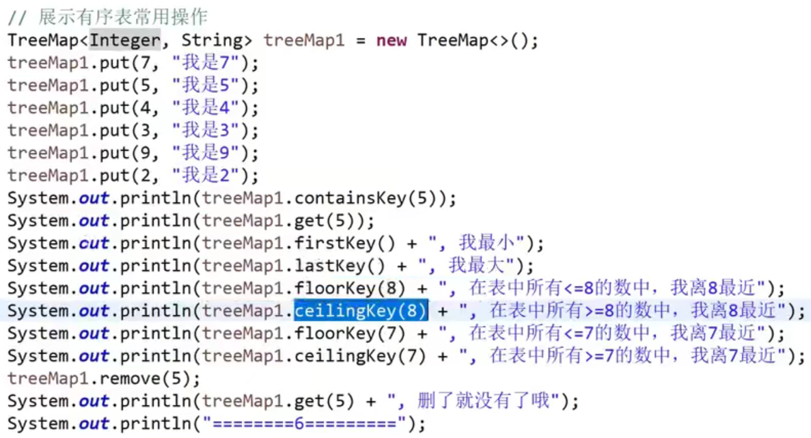

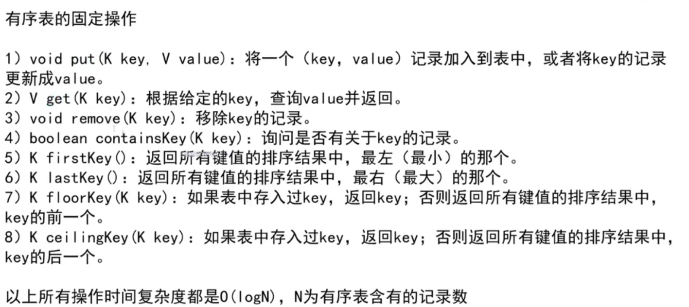

## 链表

反转单项链表和双向链表是个coding问题，自己去练

- **单链表公共部分：**

两个指针指向两个链表的头部

比较，谁小谁往后移动，相等就打印，然后一起往后移动。

直到有一条越界。


- **面试时，链表的技巧：**

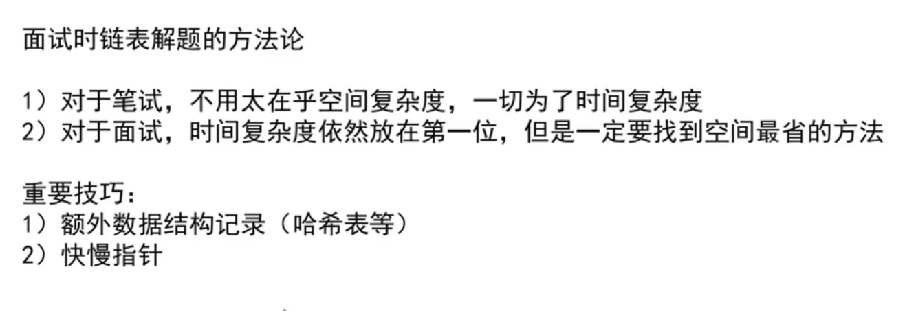

- **判断一个链表是不是回文链表：**

笔试：

用栈容器，先遍历链表，把元素都压入栈，然后再遍历链表和栈依次弹出进行比较，相当于正序和逆序进行比较，如果是回文那么正序等于逆序。

引申出一个问题：如果我能把链表的后半部分压栈，相较于全部压栈，空间复杂度减少了一半。后半部分的逆序和前半部分比较也能体现判断逆序的效果

引出一个思路：那我怎么知道到了链表的中间呢？怎么知道后半部分开始了要开始压栈了呢？**快慢指针**：两个指针进行移动，快指针每次走两个单位，慢指针每次走一个单位，当快指针走到尽头的时候慢指针就走到了中间。

面试：回文：自己练：1:30:21

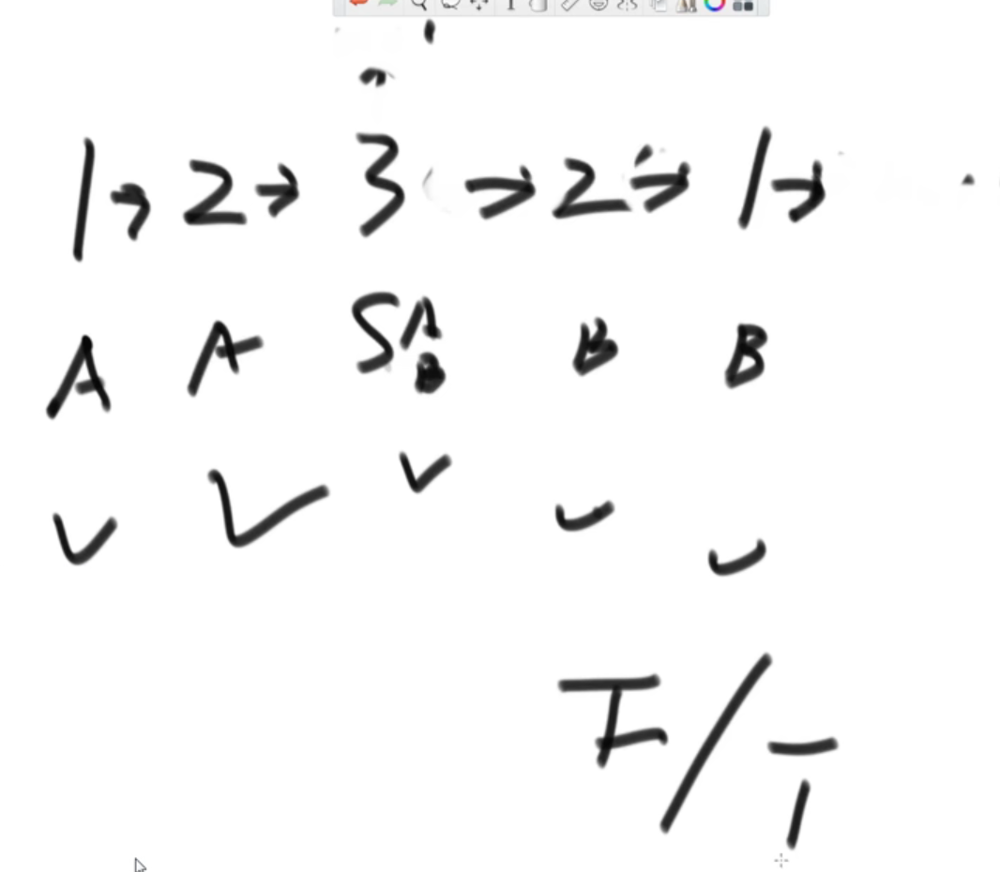


**将单链表按某值划分成左边小，中间相等，右边大的形式**

面试：

吧链表存入节点数组里面，然后把数组进行快排的精髓Partition

这样字增加了数字的空间复杂度

笔试：

创建六个节点，分别指向，大于部分，等于部分，小于部分的头尾。

然后遍历链表，按照节点值的大小，将节点分别插入各个部分。

最终再把各个部分连接起来，连接的时候注意有些部分没有值，为空的情况

空间复杂度O(1)

