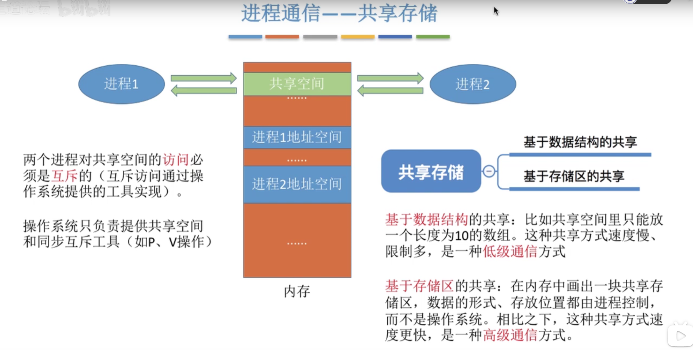
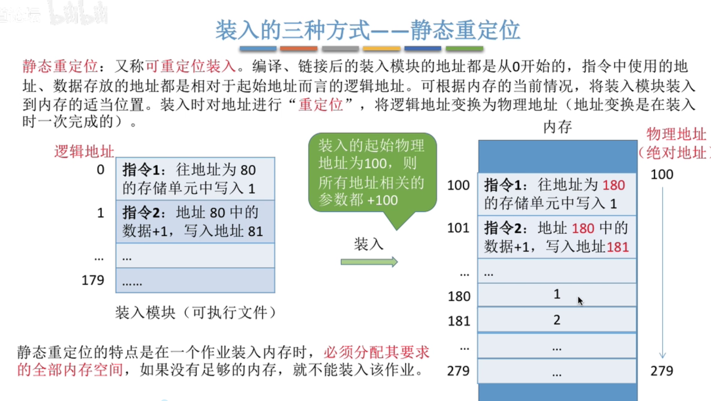
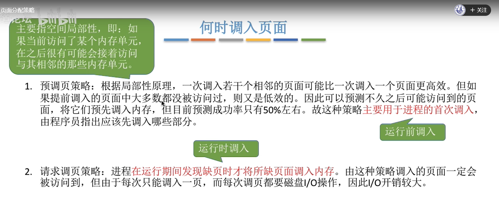
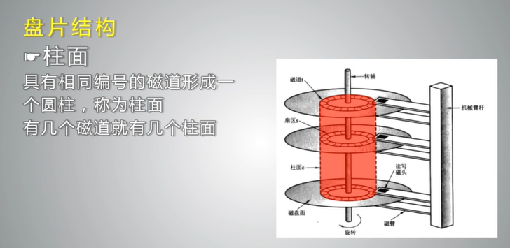
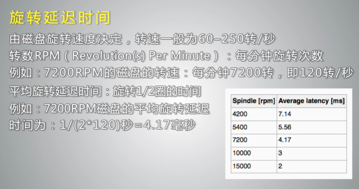

# 操作系统(OS)

参考视频：https://www.bilibili.com/video/BV1YE411D7nH

 

## 1、OS的功能和目标

- 概念
  - 负责管理协调硬件，软件等计算机资源的工作
  - 为上层用户，应用程序提供简单易用的服务
  - 是一种系统软件
- 功能和目标
  - 资源的管理者
    - 处理机管理
    - 存储器管理
    - 文件管理
    - 设备管理
  - 向用户提供服务
    - 命令接口
      - 联机命令接口
      - 脱机命令接口
    - 程序接口
      - 由一组系统调用组成
    - GUI用户图形界面
  - 对硬件机器的扩展
    - 扩充机器

### 1.1、作为用户和计算机硬件之间的接口

- 提供的功能
  - 命令接口：允许用户直接使用
    - 联机命令接口 = 交互式命令接口 （用户说一句，系统做一句）
    - 脱机命令接口 = 批处理命令接口（用户说一堆，系统做一堆）
  - 程序接口：允许用户通过程序间接使用，由一组系统调用组成，（程序接口 = 系统调用）
    - 
  - GUI（图形用户界面）：现代操作系统中最流行的图形用户接口
    - 

### 1.2、作为最接近硬件的层次

- 需提供的功能和目标
  - 实现对硬件机器的拓展
  - 没有任何软件支持的计算机称为裸机
  - 在裸机上安装操作系统，可以提供资源管理功能和方便用户的服务功能
  - 通常把覆盖了软件的机器称为扩充机器，又称之为虚拟机

## 2、OS的特征

- 并发
- 共享
  - 互斥共享技术（如对摄像头设备的共享使用）
  - 同时共享技术（如对硬盘资源的共享使用）
- 虚拟
  - 空分复用技术（如虚拟机存储技术）
  - 时分复用技术（如虚拟机处理器技术）
- 异步

-----------------

- 并发和共享是两个最基本的特征，两者互为存在条件
- 没有并发和共享，就谈不上虚拟和异步，因此并发和共享是操作系统两个最基本的特征

### 2.1、并发

- 指两个或多个事件在同一时间间隔内发生。这些事件在宏观上是同时发生的，在微观上是交替发生的。
- （易混淆）并行：指两个或多个事件在同一时刻同时发生
  - 并发：
    - 
  - 并行：
    - 
  - 
  - 
  - 

### 2.2、共享

共享即资源共享，是指系统中的资源可供内存中多个系统并发执行的进程共同使用

- 两种资源共享方式
  - 互斥共享方式	
    - 系统中的某些资源，虽然可以提供给多个进程资源使用，但一个时间段内只允许一个进程访问该资源
  - 同时共享方式
    - 系统中的某些资源，允许一个时间段内由多个进程“同时”对他们进行访问
    - 
  - 如果失去并发性
    - 则系统中只有一个程序正在运行则共享性失去存在的意义
  - 如果失去共享性
    - 则qq和微信不能同时访问硬盘资源，就无法实现同时发送文件，也就无法并发

### 2.3、虚拟

虚拟是指把一个物理上的实体变为若干个逻辑上的对应物，物理实体（前者）是实际存在的，而逻辑上的对应物（后者）是用户感应到的。

- 虚拟机中的空分复用技术
  - 
- 虚拟机中的时分复用技术
  - 

### 2.4、异步

异步是指，在多道程序环境下，允许多个程序并发执行，但由于资源有限，进程不是一贯到底的，而是走走停停，以不可预知的速度向前推进这就是进程的异步性。

## 3、OS的发展与分类

- 手工操作阶段
  - 缺：人机速度矛盾

- 批处理阶段
  - 单道批处理系统(引入脱机输入输出技术)
    - 优：缓解人机速度矛盾
    - 缺：资源利用率依然很低
  - 多道批处理系统（操作系统开始出现）
    - 优：多道程序并发执行，资源利用率高
    - 不提供人机交互功能
- 分时操作系统
  - 优：提供人机交互功能
  - 缺：不能优先处理紧急任务
- 实时操作系统
  - 硬实时系统
    - 必须在绝对严格的规定时间内完成处理
  - 软实时系统
    - 能接受偶尔违反时间规定
  - 优：能优先处理紧急任务
- 网络操作系统
- 分布式操作系统
- 个人计算机操作系统

**手工操作阶段：**

**批处理阶段--单道批处理系统**：

**批处理阶段--多道批处理**：

​	

**分时操作系统：**

轮流为各个用户服务，不区分任务的紧急性

**实时操作系统：**

优先响应一些紧急任务

硬实时操作系统：

​	必须在绝对严格的规定事件内完成处理

软实时操作系统：

​	能接收偶尔违反时间规定，比如12306有时候刷不出票

**其他几种操作系统**

## 4、OS的运行机制和体系结构

 

- 运行机制
  - 两种指令
    - 特权指令
    - 非特权指令
  - 两种处理器状态
    - 核心态
    - 用户态
  - 两种程序
    - 内核程序
    - 应用程序
- 操作系统内核
  - 时钟管理
  - 中断处理
  - 原语
  - 对系统资源进行管理的功能
    - 进程管理
    - 存储器管理
    - 设备管理
- 操作系统的体系结构
  - 大内核
  - 微内核

---------

- 特权指令只能在核心态下执行
- 内核程序只能在核心态下执行

### 4.1、运行机制

**两种指令：**

**指令：**

==cpu能识别，执行的最基本命令==

- 特权指令
  - 如内存清零指令
- 非特权指令
  - 如普通的运算指令

**如何判断是否可以执行特权指令呢？**

为此规定了cpu的两种状态，用户态和核心态

- 两种处理器状态
  - 用户态（目态）
    - 如果cpu处于用户态，此时cpu只能执行非特权指令
  - 核心态（管态）
    - 如果cpu处于管态，此时特权指令，非特权指令都可以执行

**用==程序状态字==寄存器（PSW）中的某标志位来标识当前处理器处于什么状态，如0为用户态，1为核心态**

有的程序需要使用特权指令 ，而有的程序只能使用非特权指令，因此计算机又把这些程序分为了两种

- 内核程序
  - 是系统资源的管理者，既可以执行特权指令，又可以执行非特权指令，运行在核心态
- 应用程序
  - 为了保证系统能安全运行，普通应用程序只能执行非特权指令，运行在用户态。

### 4.2、操作系统内核

- 内核是计算机上配置的底层软件，是操作系统最基本的，最核心的部分。
- 实现操作系统内核功能的那些程序就是内核程序。

--------------------

与硬件关联较紧密的模块

- 时钟管理
  - 实现计时功能
- 中断处理
  - 负责实现中断机制
- 原语
  - 是一种特殊的程序
  - 处于操作系统最底层，最接近硬件的部分。 

如果把进程管理，存储器管理，设备管理等功能也包含在内核里，那这个就是一个大内核

如果说操作系统的内核中只包含一些操作系统中最基本的功能，那么这种体系结构就称之为微内核

### 4.3、操作系统的体系结构

- 大内核
  - 将操作系统的主要功能模块都作为系统内核，运行在核心态。
  - 优点：高性能
  - 缺点：内核代码庞大，结构混乱，难以维护
- 微内核
  - 只把最基本的功能保留在内核
  - 优点：内核功能少，结构清晰，方便维护
  - 缺点：需要频繁的在用户态和核心态之间切换，性能低。
- 

## 5、中断和异常

- 中断机制的诞生
  - 为了实现多道程序并发执行而引入的一种技术
- 中断的概念和作用
  - 发生中断，就意味着 需要操作系统介入开展管理工作，cpu会立即进入核心态
  - “中断” 是cpu从用户态进入核心态的唯一途径
- 中断的分类
  - 内中断（也称异常，例外，陷入）
    - 自愿中断--------指令中断
    - 强迫中断
      - 硬件故障
      - 软件中断
  - 外中断
    - 外设请求
    - 人工干预
  - 补充：内中断的另一种分类方式
    - 陷阱，陷入
    - 故障
    - 终止
- 外中断的处理过程
  - 每条指令执行结束之后，cpu都会检查是否有外部中断信号
  - 若有外部中断信号，则需要保护被中断进程的cpu环境
  - 根据中断信号类型转入相应的中断处理程序
  - 恢复原进程的cpu环境并退出中断，返回原进程继续往下执行

### 5.1、中断机制的诞生

**早期的计算机**

在计算机的内存中同一时刻最多只能有一道程序，这种方式导致计算机资源利用率特别低

-  （用户态）cpu收到计时器发出的中断信号，切换为核心态对中断进行处理，
- （核心态）操作系统的内核通过操作系统内核负责对中断信号进行处理，判断，进程一的时间片已经用完，换进程二运行 

**本质：**发生中断就意味着需要操作系统介入，开展管理工作

### 5.2、中断的概念和作用

- 当中断发生时，cpu立即进入核心态
- 当中断发生后，当前运行的进程暂停运行，并由操作系统内核对中断进行处理。
- 对于不同的中断信号，会进行不同的处理

用户态和核心态之间时怎么切换的呢？

答：用户态切换到核心态是通过中断实现的，并且中断是唯一途径，“核心态切换到用户态”是通过执行一个特权指令，将程序状态字（psw）的标志设置为用户态。

### 5.3、中断的分类

- 内中断（也称异常，例外，陷入）
  - 信号来源：cpu内部，与当前执行的指令有关
  - 自愿中断----指令中断
    - 如：系统调用时使用的访管指令（又称陷入指令，trap指令）
  - 强迫中断
    - 硬件故障
      - 如：缺页
    - 软件中断
      - 如：整数除零
- 外中断（中断<狭义的中断>）
  - 信号来源：cpu外部，与当前执行的指令无关
  - 外设请求
    - 如：I/O操作完成发出的中断信号
  - 人工干预
  - 用户强行终止一个进程

**另一种中断方式：**

- 内中断
  - 陷阱，陷入
    - 用户程序有益而为之的异常，如系统调用
  - 故障
    - 由错误条件引起的，可能被故障处理程序修复，如缺页
  - 终止
    - 不可恢复的致命错误造成的结果，终止处理程序不再将控制返回给引发终止的应用程序，如整除零
- 外中断
  - I/O中断请求 
  - 人工干预

### 5.4、外中断的处理过程

## 6、系统调用

- 什么是系统调用，有何作用
  - 操作系统提供给应用程序使用的接口
  - 应用程序通过系统调用来请求获得操作系统的服务
  - 系统调用会使处理器从用户态进入核心态
  - 分类
    - 设备管理
    - 文件管理
    - 进程控制
      - 凡是与资源有关的操作，会直接影响到其他进程的操作，一定需要操作系统的介入，即需要通过系统调用来实现
    - 进程通信
    - 内存管理
- 系统调用和库函数的区别
  - 系统调用使操作系统向上层提供的接口
  - 有的库函数是对系统调用的进一步封装
  - 当今编写的应用程序大多是通过高级语言提供的库函数间接的进行系统调用
- 系统调用背后的过程
  - 传递系统调用参数
  - 执行陷入命令
  - 执行系统调用相应服务程序
  - 返回用户程序
  - 系统调用是发生在用户态的，对系统调用的处理发生在核心态。执行陷入指令会产生内中断，使处理器从用户态进入核心态。

 **什么是系统调用，有何作用?**

- 系统中各种共享资源都由操作系统统一掌管
- 因此在用户程序中，凡是与资源有关的操作（如存储分配，I/O操作，文件管理等），这些都==通过系统调用的方式==向操作系统发出服务请求，由操作系统代为完成，保证系统的安全性和稳定性

系统调用（按功能分类）

**6.1、系统调用与库函数的区别**

- 系统调用的相关处理在核心态进行
- 有些库函数涉及系统调用，有些库函数不涉及系统调用

**6.2、系统调用背后的过程**

  

系统调用多种多样，比如说写文件操作和创建文件操作 这两种系统调用的操作肯定不是对应的不是同一个处理的函数操作系统是怎么分辨具体需要运行哪一个处理函数的呢？

通过int指令（陷入指令/访管指令）的参数 

- 陷入指令是在用户态执行的，但执行完陷入指令之后立即引发一个内中断，从而cpu进入核心态。
- 发出系统调用的请求是在用户态，而对系统调用的相应处理在核心态下进行。
- 陷入指令是唯一 一个只能在用户态下执行，而不可在核心态执行的指令

## 7、进程

- 定义
  - 进程是进程实体的运行过程，是系统进行资源分配和调度的一个独立单位。
- 组成
  - PCB
    - 进程描述信息
    - 进程控制和管理信息
    - 资源分配清单
    - 处理机相关信息
  - 程序段
    - 存放要执行的代码
  - 数据段
    - 存放程序运行过程中处理的各种数据
- 组织方式
  - 链接方式
    - 按进程状态将PCB分为多个队列
  - 索引方式
    - 按照进程状态建立几张索引表，各表项指向一个PCB
- 特征
  - 动态性
    - 进程的最基本特征
  - 并发性
  - 独立性
    - 进程是系统进行资源分配，调度的基本单位
  - 异步性
    - 各进程以不可预知的速度向前推进，可能导致运行结果的不确定性
  - 结构性

**早期的计算机**只支持单道程序

​	可以把程序段存放在低地址部分，数据段存放到高地址部分，找到低地址部分，执行的时候一条一条的往下执行就可以了

- 操作系统怎么寻找程序段存放在什么位置。
- 系统中的各种I/O设备以及资源也可能使分配给不同的正在运行的程序的。
- 每一个正在运行的程序被分配了 哪些系统资源
- **这些信息都需要被记录下来**
- 为了方便管理，完成各程序的并发执行，引入了进程实体的概念。
- 操作系统执行之前为每个程序配置一个数据结构，称为进程控制块（PCB），用来描述进程的各种信息（如程序代码存放的位置 ）
- **PCB，程序段，数据段三部分就构成了进程实体**（进程映像）

==程序段，数据段，PCB==三部分组成了==进程实体==（进程映像），一般情况下，我们把进程实体就简称为进程，例如，所谓创建进程，实质上是创建进程实体中的PCB；而撤销进程，实质上是撤销进程实体中的PCB。

==PCB是进程存在的唯一标志==

### 7.1、进程的定义

从**不同的角度**进程有**不同的定义**

传统典型的定义：

- 进程是程序的一次**执行过程**
- 进程是一个程序及其数据在处理机上顺序执行时所**发生的活动**
- 进程是具有独立功能的程序在数据集合上**运行的过程**，它是系统发生资源分配和调度的一个独立单位

共：都在强调动态性，

### 7.2、进程的组成

进程（进程实体）由程序段、数据段、PCB三部分组成。

- 程序代码存放在程序段
- 程序运行时使用，产生的运算数据。如全局变量，局部变量，宏定义的常量 就存放在数据段内。
- PCB中应该包含操作系统对其进行管理所需的各种信息，操作系统通过PCB来管理进程。

### 7.3、进程的组织

进程的组织方式：

- 链接方式
  - 按照进程状态将PCB分为多个队列
  - 操作系统持有指向各个队列的指针
- 索引方式
  - 根据进程状态的不同，建立几张索引表
  - 操作系统持有指向各个索引表的指针

链接方式，其实就是操作系统会持有一系列的指针，每一个指针会指向不同状态的进程队列，比如说执行指针就会指向当前运行状态的进程

索引方式和链接方式很类似，无非就是这些指针指向的是一些索引表，而不是一个队列的队头 ，操作系统会为不同状态的进程建立不同的索引表。各个索引表的表向又指向不同的pcb

 

###  7.4、进程的特征

- 动态性是进程最基本的特征
- 进程是资源分配，接受调度的基本单位
- 异步性会导致并发程序执行结果的不确定性，具体会在“进程同步”相关小节学习

### 5、进程的状态与转换

- 状态：
  - 运行状态
  - 就绪状态
  - 阻塞状态
  - 创建状态
  - 终止状态
- 进程状态之间的转换
  - 就绪态---->运行态
  - 运行态---->就绪态
  - 运行态---->阻塞态
  - 阻塞态---->运行态

三种基本状态：运行状态，就绪状态，阻塞状态

其实还有另外两种状态，创建状态和终止状态

创建状态：需要分配内存，划分数据段，程序段创建pcb

终止状态：撤销进程相关的工作，完成将分配给进程的资源回收，撤销进程pcb等工作。

 

进程状态的转换：

 

 

### 6、进程控制

 

用原语来实现进程控制。

采用“关中断指令”和“开中断指令”实现

原语运行在核心态。

 进程控制相关的原语：

使用创建原语： 

进程的终止：（使用撤销原语）

 

 

阻塞原语和唤醒原语：

 

进程切换相关的原语：

 

 

进程控制使用原语来实现的，原语的执行必须一气呵成，不可中断。

### 7、进程通信

 

进程是分配系统资源的单位(包括内存地址空间)，因此**各进程**拥有的**内存地址空间相对独立。**

 

进程空间相对独立，为了安全，进程之间不能直接访问，但是进程之间的通信是必须的，所以为了进程之间的安全通信。提供方法。

1.共享存储：

​	 

2.管道通信：

 

3.进程通信：

 

 

### 8、线程

 

#### 1、定义

 

​	 

为了满足一个进程同时宏观上同时做很多事情，引入了线程来增加系统的并发度。有了线程之后，cpu的服务对象就不再是进程，而是进程当中的线程。

传统的进程是程序执行流的最小单位。

引入线程后，线程成为了程序执行流的最小单位。

每个线程有各自不同的代码，这些代码都是并发的被cpu处理，也就是程序执行流的概念。

线程是轻量级进程。

 

 **线程的属性：**

 

**线程的实现方式：**

用户级线程：

 

 在有的操作系统中支持用户级线程，有的操作系统中支持内核级线程。

 

**多线程模型：**

多对一：

 

一对一的模型：

纯粹的内核级线程：

 

多对多模型：

 

 

### 2、处理机调度

 

  

​	 

 

 

 

 

## 8、进程调度

### 1、进程调度的时机，切换和或称，方式

 

 

 

 

 

### 2、调度算法的评价指标

  

 

 

 

 

 

 

### 3、调度算法

 

#### 先来先服务 （fcfs）

 

#### 短作业优先 (sjf)

  

 

 

#### 高响应比优先 (hrrn)

 

 

  

 

#### 时间片轮转(RR)

 

 

 

 

 

时间片不能太大也不能太小

 

一般来说： 

 

#### 优先级调度算法

 

 

 

 

#### 多级反馈队列调度算法

 

 

## 9、进程同步和进程互斥

 

 

 

 

 

### 1、进程互斥的软件实现方法

 	

1、单标志法

 

2、双标志检查法

 

双标志先检查法，违反了忙则等待原则。

3、双标志后检查法

违背了空闲让进和优先等待原则，会因各进程长期无法访问灵界资源而产生“饥饿”现象。 

## 内存管理

### 1、基础知识

 

 

装入的三种方式，完成从逻辑地址到物理地址的转换。

 

绝对装入：在编译的时候就知道程序将放到内存中的哪个位置。

缺点：灵活性低，知识和单道程序环境。

 

静态重定位：在装入模块把逻辑地址变为物理地址。

 

动态重定位：

链接的三种方式：

- 静态链接
- 装入时动态链接
- 运行时动态链接

 

### 2、概念

- 内存空间的分配和回收

- 内存空间的扩展

 

- 地址转换

  

- 内存保护

 

 

 

### 3、覆盖技术与交换技术

- 覆盖技术

使用覆盖技术实现内存的扩充。

 

让不可能同时存在的程序段共享一个覆盖区。

 

- 交换技术

 

将内存中的一些进程暂时换出内存，pcb存放他们的外存地址之类的信息。

 

 

### 4、连续分配管理方式

内存空间的分配：

- 单一连续分配

 

内存被分为系统区和内存区，内存中只能由一道用户程序，有内部碎片。

- 固定分区分配

 

 

- 动态分区分配

 

动态的分配分区。

怎么样进行内存空间的回收和分配呢。

用==动态分区分配算法==，从空闲分区中选出一个分区分配给作业。

 

回收的时候相邻的内存分区合二为一。

 

 

### 5、分页管理

**非连续分配方式：**

 

 

 

 

 

### 6、页式管理

 

要注意对页号是否越界的讨论。

 

要访问两次内存，第一次查页表，第二次访问目标内存单元。

### 7、具有块表的地址变换机构

 

内存中的页表常称为慢表。

  

 

### 8、两级页表 

 

### 9、基本分段存储管理

- 分段和段页式内存管理
  - 分页内存管理的问题
  - 用户视角的内存和实际物理内存的分离
- 分段
  - 支持用户观点的内存管理机制
  - 逻辑地址空间是由一组段组成，每个段都有名称和长度。地址指明了段名称和段内偏移。
  -  逻辑地址由一个有序对组成<段号，偏移>。称为二维地址。

按照自身的逻辑关系分为多个段。

每段从0开始编址。

  

编译程序会将段名转化为段号。

段表由段号段长基址组成。

  

 

### 10、段页式管理

 

逻辑地址由段号，页号，页内偏移量组成。

 

### 11、虚拟内存

 

  

 

 

请求调页就是指，在请求分页存储管理当中，如果说所需要的分页还不在内存当中，操作系统要负责把这个页面从外存调入内存，并且完善一系列的处理。

页面置换是指，内存空间不够的时候，操作系统要把内存中暂时用不到的分页或者暂时用不到的分段先换出内存当中。

### 12、请求分页管理

请求分页管理是在基本分页的基础上进行拓展，从而实现的一种虚拟内存管理技术。

 

 

  

如果页面被换出内存的话，快表当中的相应表项也要删除。

  

 

 

### 13、页面置换算法

 

#### 最佳置换算法opt

 

页面中断不一定就发生了页面置换，如果还有可用的内存块，就不用置换。

 

最佳置换算法是理想化的算法，是不可能实现的。

 

#### 先进先出置换算法fifo

 

 

#### 最近最久未使用置换算法lru

  

 

#### 时钟置换算法clock

 

改进型：

 

### 14、页面分配策略

​	 

 

 

 

 

 

## 文件系统

### 文件系统接口

- 文件
  - 文件概念
  - 文件属性
    -  
  - 文件操作
    -  
  - 文件类型
    -  
  - 文件结构
    -  

 

- 逻辑文件及其访问方法
  - 逻辑文件是文件呈现在用户面前的组织结构	
  - 顺序文件
  - 索引文件
  - 直接文件

文件访问就是对文件进行检索，读，写等操作

 

## 磁盘

- 磁盘组成
  - 盘片	
    - 存储数据的介质
    - 正反两面可以存储数据
  - 磁头
    - 读写数据
    - 沿磁盘半径移动，有多少盘面就有多少个磁头
  - 主轴
    - 马达驱动，是盘片旋转，固定速度
  - 接口
  - 磁盘控制器
    - 控制磁盘的读写操作利用磁盘缓冲区来暂存数据
  - 盘片结构
    -  
    -  
    -  
- 磁盘访问时间
  - 定位时间/随机访问时间
    - 寻道时间+旋转延迟时间
    -  
    -  
    -  
    -  
- 地址映射
- 磁盘管理
  - 低级格式化/物理格式化
    - 把磁盘分为扇区，方便磁盘控制器进行读写
  - 分区
    - 把磁盘分为分区
    - 主分区和扩展分区
  - 高级格式化
    - 创建文件系统
  - 引导块
  - 操作系统安装在启动分区中
- 磁盘调度
  - 降低磁盘访问时间
  - 提高文件系统访问效率
  - 优化磁盘的访问时间的关键是优化寻道时间
- 先来先服务算法fcfs
  - 按照提交时间访问，先提交先访问，后提交后访问
  - 优点
    - 简单公平
    - 容易实现
  - 缺点
    - 寻道时间长
    - 效率低
- 最短寻道时间优先算法sstf
  -  
  - 优点：
    - 寻道距离短
  - 缺点：
    - 存在饥饿
    - 磁头频繁的变换移动方向
    - 增加寻道时间
- scan算法：
  -  
  -  
  - 优点
    - 同一方向扫描，寻道时间短
  - 缺点
    - 磁头在一端响应请求的时候，另外一段的请求等待时间长。
- c-scan算法
  -  
  -  
- look算法
  -  
- c-look 算法
  -  
- Raid技术
  -   
  -  
  - 位级分散
    -  
  - 块级分散
    -  
  -  
  -  
  -  
  - 
  
    
