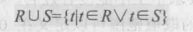
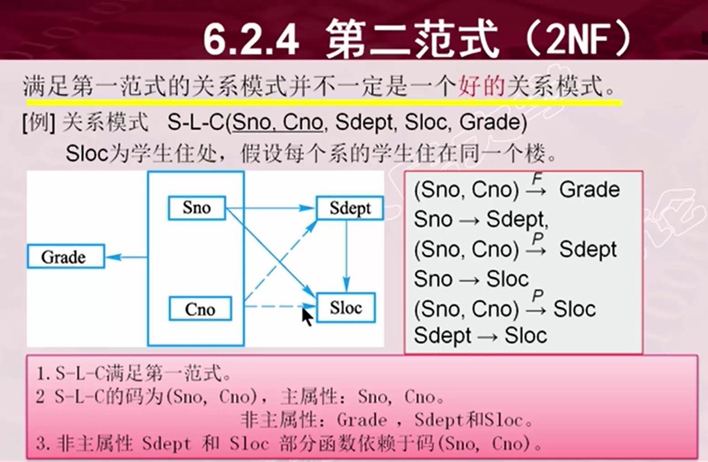
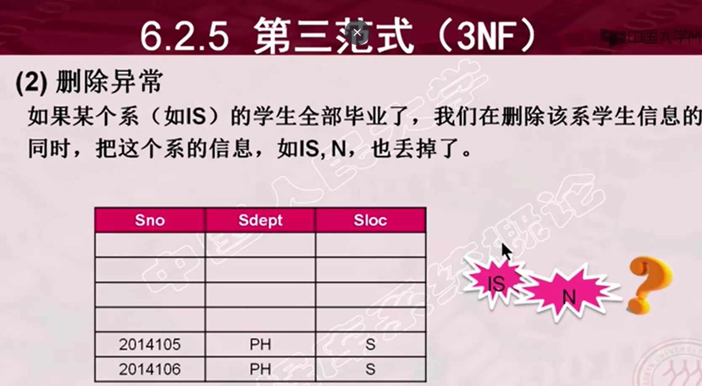
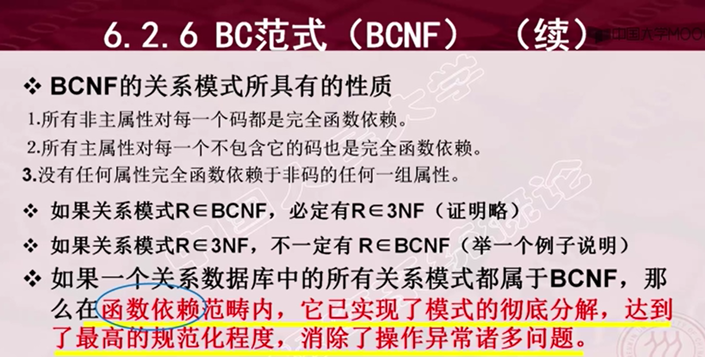
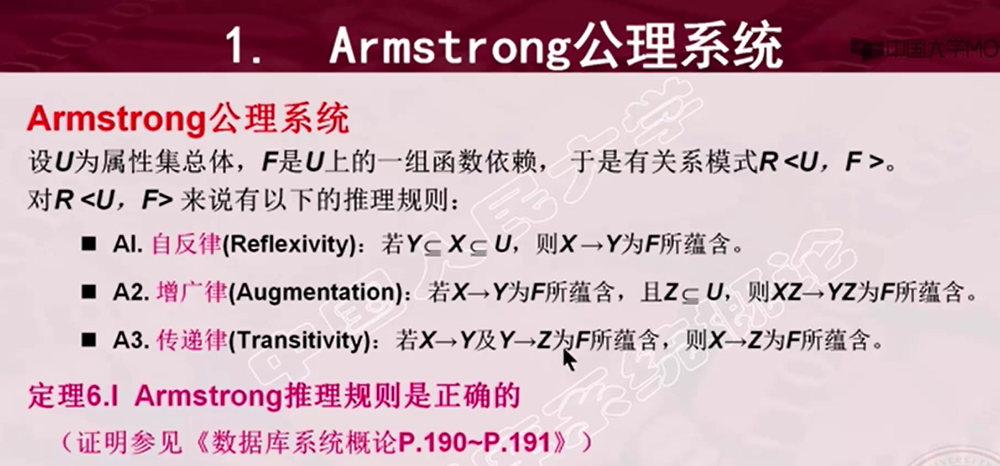
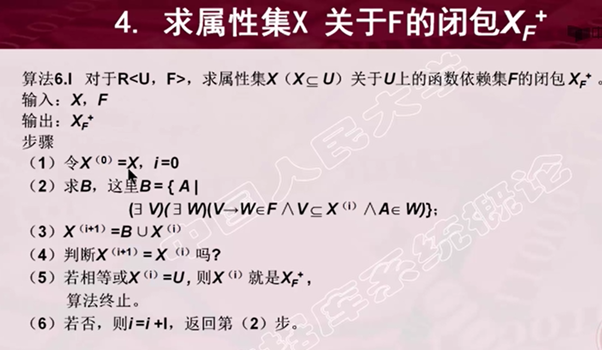

# 数据库

## 1、数据库系统概论

### 1.1、绪论

#### 1.1.1、数据库系统概述

**数据库的四个基本概念**

- 数据
  - 描述事务的符号记录
  - 数据的含义称为语义
- 数据库
  - 数据库是长期储存在计算机内，有组织的，可共享的，大量数据的集合。
- 数据管理系统
  - 和操作系统一样，是计算机的基础软件。
  - 组要功能
    - 数据定义功能
    - 数据操作功能
    - 数据库的事务管理和运行管理
    - 数据库的建立和维护功能
    - 其他功能
- 数据库系统
  - 数据库系统是由数据库，数据库管理系统（及其应用开发工具）应用程序和数据库管理员组成存储，管理，处理，和维护数据的系统。

**数据库管理技术的产生和发展**

- 人工管理阶段
  - 数据不保存
  - 应用程序管理数据
  - 数据不共享
  - 数据不具有独立性
- 文件系统阶段
  - 数据可以长期保存
  - 由文件系统管理数据
  - 数据共享性差
  - 数据独立性差
- 数据库系统阶段
  - 从文件系统到数据库系统标志着数据管理系统的飞跃

**数据库系统的特点**

- 数据结构化
  - 实现整体的数据结构化，这是数据库的主要特征之一，也是数据库系统，与文件系统的本质区别。
  - 不仅是数据内部的结构化，而且是整体结构化，数据之间是具有联系的。
- 数据的共享性高，冗余度低，且易补充
  - 数据共享大大减少了数据冗余，节约存储空间，避免数据之间的不相容性和不一致性。
  - 使数据库弹性大，易于扩充。
- 数据独立性高
  - 包括数据的物理独立性和逻辑独立性。
  - 物理独立性是指应用程序与数据库中数据的物理存储是相互独立的（用户程序不需要了解数据在数据库中如何储存，由数据库管理系统管）。
  - 逻辑独立性是指用户的应用程序与数据的逻辑结构是相互独立的（也就是说，数据的逻辑结构改变时用户程序可以不变）。
- 数据由数据库管理系统统一管理和控制（数据库管理系统必须提供的控制功能如下）
  - 数据安全性保护
    - 防止不合法的使用造成数据泄密和破坏
  - 数据的完整性保护
    - 数据的正确性，有效性，和兼容性
  - 并发控制
    - 处理多个用户的并发进程同时存取，修改数据库。
  - 数据库恢复
    - 将数据库从错误状态恢复到某一已知的正确状态

#### 1.1.2、数据模型

==定义：数据模型也是一种模型，它是对现实世界数据特征的抽象==

**两类数据模型：**

- 概念模型
  - 将现实世界抽象为信息世界
- 逻辑模型和物理模型
  - 将信息世界转化为机器世界

**概念模型：**

- 信息世界中的基本概念：
  - 实体
    - 客观存在并且可相互区别的事务
  - 属性
    - 实体所具有的某一特性
  - 码
    - 唯一标识实体的属性集
  - 实体集
  - 联系
    - 实体之间的联系有一对一，一对多和多对多等多种类型。
- 概念模型的一种表示方法：
  - 实体-联系方法
  - E-R方法也称E-R模型

**数据模型的组成要素：**

- ==数据模型通常由数据结构，数据操作和数据的完整性约束条件组成==
- 数据结构
  - 描述数据库的组成对象以及对象之间的联系
- 数据操作
  - 对数据库中各种对象（型）的实例（值）允许执行的操作的集合，包括操作及有关的操作规则。
- 数据的完整性约束条件
  - 是一组完整性规则，完整性规则是给定的数据模型中数据及其联系所具有的制约和依存规则。

**常用的数据模型：**

- 层次模型
- 网状模型
- 关系模型
- 面向对象数据模型
- 对象关系数据模型
- 半结构化数据模型

**层次模型：**

- 层次模型的数据结构：
  - 有且只有一个节点没有双亲节点，这个节点称为根节点
  - 根以外的节点有且只有一个双亲节点
  - 树结构
- 层次模型的数据操纵和完整性约束：
  - 如果没有对应的双亲节点值就不能插入他的子女节点值
  - 如果删除双亲结点的值，则相应的子女节点值也会同时被删除。
- 层次模型的优缺点：
  - 结构比较简单清晰
  - 查询效率高
  - 层次数据模型提供了良好的完整性支持
  - 现实世界中很多联系是非层次性的，如节点之间具有多对多联系，不适合用层次模型表示
  - 表示一个节点具有多个双亲结点的过程繁琐
  - 查询子节点必须通过双亲节点
  - 由于结构严密，层次命令趋于程序化

**网状模型：**

- 网状模型的数据结构：
  - 允许一个以上的节点无双亲
  - 一个节点可以有多于一个的双亲

- 网状模型的数据操纵与完整性约束：
  - 支持记录码的概念
  - 保证一个联系中双亲记录和子女记录之间是一对多的联系
  - 可以支持双亲记录和子女记录之间的某些约束条件
- 网状模型的优缺点：
  - 能够更直接的描述现实世界
  - 具有良好的性能，存取的效率高
  - 结构比较复杂，不利于用户最终掌握
  - 网状模型的DDL，DML比较复杂
  - 由于记录之间的联系是通过存取路径来实现的，应用程序来访问数据时必须选择适当的存取路径，因此用户必须了解系统结构的细节，加重了编写应用程序的负担。

**关系模型：**

- 关系模型的数据结构：
  - ==关系模型是最重要的一种数据模型==
  - 关系
    - 一个关系对应通常说的一张表
  - 元组
    - 表中的一行即为一个元组
  - 属性
    - 表中的一列即为一个属性
  - 码
    - 它可以唯一确定一个元组
  - 域
    - 一组具有相同数据类型的值的集合
  - 分量
    - 元组中的一个属性值
  - ==关系模型要求关系必须时规范化的，关系的每一个分量必须是一个不可分的数据项==
- 关系模型的数据操纵与完整性约束：
  - 实体完整性
  - 参照完整性
  - 用户定义完整性
- 关系模型的优缺点：
  - 严格建立在数学概念的基础上
  - 概念单一，数据结构简单清晰，用户易懂
  - 存取路径对用户隐蔽，从而具有更高的数据独立性，更好的安全保密性 ，简化了程序员的工作和数据库开发建立的工作。
  - 查询效率不如格式化模型

#### 1.1.3、数据库系统的结构

- 从数据库应用开发人员角度看，数据库系统采用三级模式结构
- 从数据库的最终用户来看，数据库系统的结构分为单用户结构，主从式结构，分布式结构，客户-服务器，浏览器-用户服务器/数据库服务器多层结构等
- 数据库系统模式的概念
  - 在数据模型中有 “型” 和 “值” 的概念。
  - 模式的一个具体值称为模式的一个实例，同一个模式可以有多个实例。
  - 模式是相对稳定的，实例是相对变动的。
- 数据库系统的三级模式结构
  - 模式
    - 模式也称逻辑模式，是数据库系统中 全体数据的逻辑结构和特征的描述，是所有用户的公共数据视图。
  - 外模式
    - 也称子模式或用户模式，他是数据库用户（包括应用程序员和最终用户）能够看见和使用的局部数据和逻辑结构的特征和描述，是数据库用户的数据视图，是与某一应用有关的数据的逻辑表示。
  - 内模式
    - 也称存储模式，一个数据库只有一个内模式，他是数据物理模式和存储方式的描述，是数据在数据库内部的组织方式。
- 数据库的二级映像功能和数据独立性
  - 1.外模式/模式映像
    - 当模式改变时，由映像做相应的改变，可以使外模式保持不变，应用程序是依据数据的外模式编写的，从而应用程序不必修改，保证了数据和程序的逻辑独立。
  - 2.模式/内模式映像
    - 当数据库的存储结构发生改变时，由数据库管理员对映像做相应改变，可以使模式保持不变，从而应用程序也不必改变，保证了数据与程序的物理独立性，简称为数据的物理独立性。

#### 1.1.4、数据库系统的组成

1. 硬件平台及数据库
   - 要有足够大的内存，存放操作系统，数据库管理系统的核心模块，数据缓冲区，和应用程序。
   - 足够大的磁盘或磁盘阵列等设备存放数据库，有足够大的磁带或光盘做数据备份。
   - 要求系统有较高的通道能力，以提高数据传送率。
2. 软件
   - 数据库管理系统
   - 支持数据库管理系统的操作系统
   - 具有数据库接口的高级语言及其编译系统
   - 以数据库系统为核心的应用开发工具
   - 为特定应用环境开发的数据库应用系统
3. 人员
   - 数据库管理员
   - 系统分析员和数据库设计人员
   - 应用程序员
   - 用户

### 1.2、关系数据库

==应用数学方法来处理数据库中的数据==

**==关系数据库的结构及形式化定义==**

#### 1.2.1、关系

**域：**

- 域是一组具有相同数据类型的集合

**笛卡尔积：**

- 其中笛卡尔积的每一个元素叫做一个n元组，简称元组，元组中的每一个值叫做一个分量。
- 一个域允许的不同取值个数称为这个域的基数。

**关系：**

- （笛卡尔积的子集叫做在域上的关系）
- 关系中某一属性组能唯一标识一个元组，而其子集不能，则称该属性组为候选码
- 若一个关系有多个候选码，则选定一个为主码。
- 候选码的诸属性称为主属性，不包含在任何候选码中的属性称为非主属性或者非码属性。
- 关系模式所有属性是这个关系模式的候选码，称为全码。
- 关系的三种类型
  - 基本关系（又称为基本表或基表）
  - 查询表
  - 视图表
  - 条件：无限关系在数据库系统中是无意义的，限定关系数据模型中的关系必须是有限集合
  - 条件：通过为关系的每个列附加一个属性名的方法取消关系属性的有序性。
- 基本关系具有以下六条性质
  - 列是同质的，即每一列中的分量是同一类型的数据，来自同一个域。
  - 不同的列可以出自同一个域，称其中的每一个列为一个属性，不同的属性要给予不同的属性名。
  - 列的顺序无所谓
  - 任意两个元组的候选码不能取相同的值
  - 行的顺序无所谓
  - 分量必须取原子值即每一个分量必须是不可分的数据项。

**关系模式：**

- 定义
  - 关系的描述称为关系模式
- 形式化的表示：
  - R(U , D , DOM, F )	
    - R为关系名，U为组成该关系的属性名集合，D为U中属性所来自的域，DOM为属性向域的映像集合，F为属性间数据的依赖关系集合。
- 通常可以简记为：
  - R(U) 或者R(A1, A2, A3, ....., An)：
    - 其中R为关系名 ，A1, A2, A3, ....., An为属性名。
- 关系是关系模式在某一时刻的状态或内容，关系模式是静态的 稳定的，而关系是动态的，随时间不断变化的。

**关系数据库：**

- 关系数据库的型 ， 称为关系数据库模式，是对关系数据库的描述。
- 关系数据库的值是这些关系在某一时刻对应的关系的集合，通常就称为关系数据库。

#### 1.2.2、关系操作

- 基本关系操作
  - 包括查询操作和插入，删除修改操作，两大部分
  - 查询操作又可分为，选择（select），投影（project）,连接（join），除（divide）,并（union）,差（except）,交（intersection），笛卡尔积等。
  - 其中选择，投影，并，差，笛卡尔积是五种基本操作。
  - 操作的对象都是集合。
- 关系数据语言的分类
  - 关系代数语言
  - 关系演算语言
    - 元组关系演算语言
    - 域关系演算语言
  - 具有关系代数和关系演算双重特点的语言（例如SQL）

#### 1.2.3、关系的完整性

- 实体完整性
  - 二目运算，包括并，差，交，笛卡尔积，四种运算
  - 实体完整性规则：若属性（指一个或一组属性）A是基本关系R的主属性，则A不能取空值，所谓空值就是，不知道，不存在，无意义的值。
- 参照完整性
  - 参照完整性规则：若属性（或属性组）F是基本关系R的外码，它与基本关系S的主码Ks相对应，(基本关系R和S不一定是不同的关系），则对于R中的每个元组在F上的值必须：或者取空值（F的每个属性均为空值）；或者等于S中某个元组的主码值。
  - 外码定义：设F是基本关系R的一个或一组关系，但不是关系R的外码，它与基本关系
- 用户定义完整性
  - 用户定义完整性就是针对某一具体关系数据库的约束条件，它反映某一具体应用所涉及的数据必须满足的语义要求
  - 例如应用的要求学生不能没有姓名，则学生定义就不能取空值

#### 1.2.4、关系代数

==他用关系的运算来表示查询==

**关系代数的运算按运算符分为：**

- 传统的集合运算
  - 传统的集合运算是二目运算，包括，并，交，差，笛卡尔积，四种运算
  - 并
    - 
  - 交
    - 
  - 差
    - 
  - 笛卡尔积
    - 
- 专门的关系运算
  - ==包括选择，投影，连接，除运算==
  - 象集的定义
  - 选择
    - 
    - 选择则运算是从行的角度进行运算
  - 投影
    - 
    - 投影操作是从列的角度进行运算
    - 去掉了重复的元组
  - 连接
    - 等值连接
    - 自然连接
      - 去掉重复的属性列的等值连接
    - 
    - 一般的连接操作都是从行的角度进行运算，但自然连接后还需要取消重复列，所以是同时从行和列的角度进行运算。
    - 被舍弃的元组称为悬浮元组
    - 如果把悬浮元组也保存在结果关系中，而在其他属性上填空值。这种连接就叫做外连接。
    - 如果只保留左边关系R中的悬浮元组，就叫做左外连接。
    - 如果只保留右边关系S中的悬浮元组就叫做右外连接。
  - 除运算
    - 没细看
  - 关系代数中，这些运算经有限次复合后形成的表达式称为关系表达式。

### 1.3、关系数据库基本语言SQL

#### 1.3.1、sql的产生和发展

- 目前没有一个数据库系统能够支持SQL标准的所有概念和特性
  - 以一种语法结构提供多种使用方式
- 同时许多软件厂商对SQL基本命令集还进行了不同程度的扩充和修改，又可以支持标准以外的一些功能特性。

#### **1.3.2、sql的特点**

- 综合统一
  - SQL集数据定义语言，数据操纵语言，数据控制语言，和功能为一体，语言风格统一，可以独立完成数据库生命周期中全部活动。
- 高度非过程化
  - 只要提出“做什么”，而无需指明“怎么做”，因此无需了解存储路径，存取路径的选择以及sql的操作过程由系统自动完成
- 面向集合的操作方式
- 语言简洁，易学易用

#### 1.3.3、sql的基本概念

- 支持SQL的关系数据库管理系统同样支持关系数据库三级模式结构，其中外模式包括若干视图和部分基本表，模式包括若干基本表，内模式包括若干存储文件。
- 基本表和视图一样都是关系
- 一个或多个基本表对应一个存储文件
  - 一个表带若干索引，索引也存放在存储文件中
    - 索引是一种单独的，物理的对数据库中一列或多列的值进行排序的一种存储结构，索引的作用相当于图书的目录

**学生-课程数据库**

#### 1.3.4、数据定义

- 包括模式定义，表定义，视图和索引的定义
- SQL标准不提供修改模式定义和修改视图定义的操作，只能删除再重建
- SQL标准也没有提供索引相关的语句
- 现代的关系数据库管理系统，一个关系管理系统的实例中可以建立多个数据库，一个数据库中可以建立多个模式，一个模式通常包括多个表，视图和索引等数据库对象。
- 模式的定义和删除
  - 定义模式
    - CREATE SCHEMA <模式名>AUTHORIZATION<用户名>
    - CREATE SCHEMA <模式名>AUTHORIZATION<用户名>[<表定义子句>|<视图定义子句>|<授权定义子句>]
  - 删除模式
    - DROP SCHEMA <模式名><CASCADE|RESTRICT>
    - 其中CASCADE和RESTRICT两者必须选其一
    - CASCADE表示删除模式的同时把模式中所有的数据库对象全部删除
      - RESTRICT，表示如果该模式中已经定义了下属的数据库对象，则拒绝删除语句的执行。
- 基本表的定义，删除，和修改

### 1.4、数据库安全性

#### 1.4.1、数据库安全性概述

数据库的安全性是指保护数据库以防止不合法的使用所造成的数据泄露，更改或破坏。

- 所有计算机系统都存在不安全因素
- 只是在数据库系统中，由于大量数据集中存放，而且众多最终用户直接共享，安全问题更为突出。

**数据库的不安全因素：**

- 非授权用户对数据库的恶意存取和破坏
  - 一些黑客和犯罪分子，假冒合法用户偷取，修改，甚至破坏用户数据。
  - 数据库管理系统提供的安全措施：用户身份鉴别，存取空值和视图等技术
- 数据库中重要或敏感的数据被泄露
  - 黑客和敌对分子盗窃数据库中的重要数据。
  - 数据库管理系统提供的主要技术有：强制存取控制，数据加密存储和加密传输。
  - 安全性要求较高的部分提供审计功能
- 安全环境的脆弱性
  - 操作系统安全的脆弱，网络协议安全保障的不足等

**为此在计算机安全技术方面逐步发展了一套可信计算机系统的概念和标准**

**安全标准简介：**

- 1985年美国国防部可信计算机系统评估准则（TCSEC）

**在此基础上：**

- 1993年加拿大可信计算机产品评估准则（CTCPEC）
- 1991年欧洲信息技术安全评估准则（ITSEC）
- 1993年 美国信息技术啊暖联邦标准（FC）草案

**这些准则1993年起开始联合行动，解决原标准关于概念和技术上的差异，将各自独立的准则集合成一组单一的，能被广泛的使用的IT安全准则。这一行动称为通用准则（Common Criteria）CC项目**

- CC  V2.1版于1999年被ISO采用为国际标准，2001年被我国采用为国家标准

TCSEC又称桔皮书，TCSEC/TDL即紫皮书，将TCSEC扩展到数据库管理系统

- 从四个方面来描述安全性级别划分的指标，即安全策略，责任，保证和文档。

**计算机系统根据对各项指标的支持情况，TDSEC/TDL将系统划分为4组7个等级：**

- D级（最小保护）	
  - 为了将一切不符合更高标准的系统，统统归于D组
- C1级（自主安全保护）
  - 进行自主存取控制
  - 保护或限制用户权限的传播
- C2级（受控的存取保护）；
  - 安全产品的最低档，提供受控的存取保护，即将C1的DAC进一步细化，以个人身份注册负责，并实施审计以及资源隔离
- B1级（标记安全保护）
  - 对系统的数据加以标记并对标记的主体和客体实施强制存取措施以及审计等安全机制，B1级别的产品才被认为是真正意义上安全产品。

### 第六章、关系数据库理论

所有信息都放在一个表中的问题：

强调了：一定要从现实世界的语义，就是这个关系模式当中这些语义之间的关联，他所存在的语义来确定这些属性之间是不是具有函数依赖

关系数据库最基本的要求就是不能表中有表

​	

### 数据库设计

