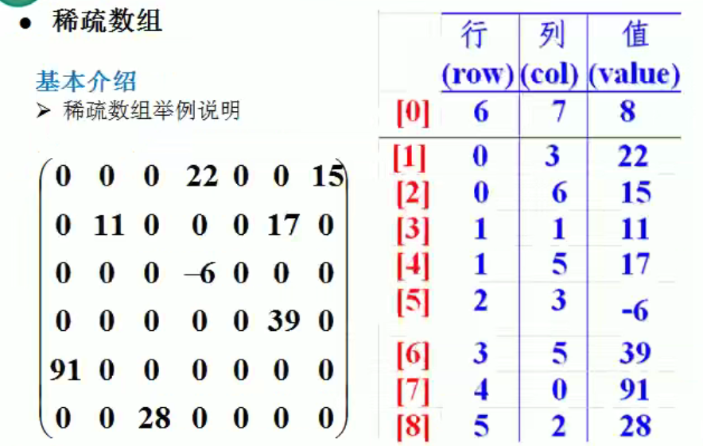
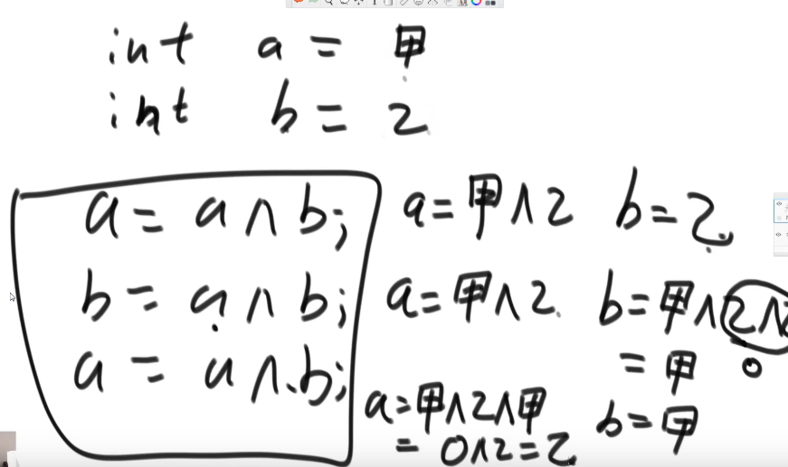
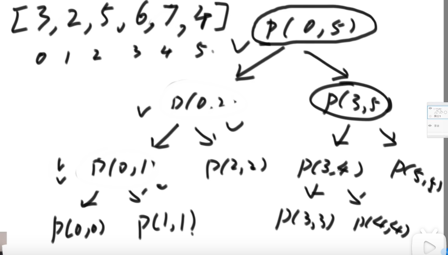

# 数据结构

## 一、绪论

### 1.基本概念和术语

- 数据
  - 是描述客观事物的符号，是计算机中可以操作的对象，是能被计算机识别，并输入给计算机处理的符号集合。
- 数据元素
  - 是组成数据的，有一定意义的基本单位，在计算机中通常作为整体处理，也被称作为记录。
- 数据项
  - 一个数据元素可以由若干个数据项组成。
  - 数据项是数据不可分割的最小单位。
- 数据对象
  - 是性质相同的数据元素的集合，是数据的子集。
- 数据结构
  - 不同数据元素之间不是独立的，而是存在特定的关系，我们将这些关系称为结构。
  - 数据结构：是相互之间存在的一种或多种特定关系的数据元素的集合。

### 二、逻辑结构和物理结构

#### 逻辑结构：

是指数据对象中数据元素之间的相互关系

- 集合结构
  - 集合元素中的数据元素除了同属于一个集合外，他们之间没有其他关系
- 线性结构
  - 线性结构中的数据元素之间是一对一的关系。
- 树形结构
  - 树形结构中的数据元素之间存在一种 一对多的层次关系
- 图形结构
  - 图形结构的数据元素是多对多的关系

#### 物理结构

是指数据的逻辑结构在计算机中的存储形式

- 顺序存储结构
  - 是把数据元素存放在地址连续的存储单元里，其数据间的逻辑关系和物理关系是一致的。
- 链式存储结构
  - 是把数据元素存放在任意的存储单元里，这组存储单元可以是连续的也可以是不连续的

### 三、抽象数据类型

#### 数据类型

- 原子类型：
  - 是不可以再分解的基本类型，包括整形，实型，字符型等。
- 结构类型
  - 由若干个类型组合而成，是可以再分解的。例如，整型数组是由若整型数据组成的

#### 抽象数据类型

- 是指一个数学模型及定义在该模型上的一组操作

- “抽象”的意义在于数学类型的数学抽象特性

- 抽象数据类型体现了设计程序中问题分解，抽象和信息隐藏的特性

## 二、算法

### 1、算法定义

- 算法是描述解决问题的方法
- 普遍的定义：
  - 算法是解决特定问题求解步骤的描述，在计算机中表现为指令的有限序列，并且每条指令表示一个或多个操作

### 2、算法的特性

- 输入
- 输出
- 有穷性
- 确定性
- 可行性

**输入输出**

算法具有零个或多个输入，算法至少具有一个或多个输出

**有穷性**

指算法在执行有限的步骤之后，自动结束而不会出现无限循环，并且每个步骤在可接受的时间内完成

**确定性**

算法的每一步骤都具有确定的含义，不会出现二义性。

**可行性**

算法的每一步必须是可行的，也就是说，每一步都能通过执行有限次数完成

### 3、算法设计的要求

**正确性**

算法的正确性是指算法至少应该具有输入，输出和加工处理无歧义性，

能正确反映问题的需求，能够得到问题的正确答案。

- 算法程序没有语法错误
- 算法程序对于合法的输入数据能够产生满足要求的输出结果
- 算法程序对于非法的输入数据能够得出满足规格说明的结果。
- 算法程序对于精心选择的，甚至刁难的测试数据都有满足要求的输出结果。

**可读性**

算法设计的另一目的是为了便于阅读，理解和交流

**健壮性**

当输入数据不合法时，算法也能做出相关处理，而不是产生异常或莫名其妙的结果。

**时间效率和存储量低**

算法应当尽量满足时间效率高和存储量低的要求

###  4、算法效率的度量方法

- 事后统计方法
  - 这种方法主要是通过设计好的测试程序和数据，利用计算机计时器对不同算法编制的程序的运行时间进行比较，从而确定算法效率的高低。
- 事前分析估算方法
  - 在计算机程序编制，依据统计方法对算法进行估算。
  - 一个程序的运行时间依赖于算法的好坏和问题输入规模，所谓问题输入规模是指输入量的多少。
  - 最终，在分析程序的运行时间时，最重要的是把程序看成是独立于程序设计语言的算法或一系列步骤。

### 5、算法时间复杂度

- 推导大O阶方法
  - 看书
- 常见的时间复杂度
  - 看书

### 6、最坏情况和平均情况

- 最坏情况运行时间是一种保证，那就是运行时间将不会再坏了。在应用中，这是一种最重要的需求，通常，除非特殊指定，我们提到的运行时间都是最坏情况的运行时间。

### 7、算法空间复杂度

我们在写代码时，完全可以用空间来换时间。

具体看书。

## 三、线性表

- 零个或多个数据元素的有限序列

- 在较复杂的线性表中，一个数据元素可以由若干个数据项组成。 

### 1、线性表的顺序存储结构

- 定义
  - 线性表的顺序存储结构，指的是用一段地址连续的存储单元依次存储线性表的数据元素。
- 顺序存储方式
  - 

# Java数据结构和算法----尚硅谷


- 暴力匹配
- KMP算法
  - 建立一个《部分匹配表》通过这个部分匹配表里面的搜索词进行匹配，效率会得到大幅度提升。


- 分治算法

 

- 回溯算法
- 九十二种

 

- 图的深度优先算法（DFS）+贪心算法优化


## 算法的重要性

- 算法是程序的灵魂，优秀的程序在海量数据计算时，依然保持高速计算。
- 一线公司的面试题
- 如果你不想永远都是代码工人，那就花时间来研究下数据结构和算法

- ==数据结构分为线性结构和非线性结构==
  - 线性结构
    -  常见的有数组、队列、链表和栈
    - 两种存储方式：链式存储方式，顺序存储方式
      - 分别就是在物理存储上是不是连续的
  - 非线性结构
    - 二维数组、多维数组、广义表、树结构、图结构

## 稀疏（sparse）数组(array)

- 当一个数组种大部分元素为0，或者为同一个值的数组时，可以使用稀疏数组来保存该数组。
- 稀疏数组的处理方法：
  - 记录数组一共有几行几列，有多少个不同的值
  - 把具有不同值的元素的行列及值记录在一个小规模的数组中，从而缩小程序的规模。
- 

**需求：**


五子棋要把原来的棋盘存起来，把二维数组转化为稀疏数组存起来，更加节省空间。

```java
public class SparseArray {
    public static void main(String[] args){
        //创建一个原始的二维数组
        //0: 表示没有棋子， 1：表示黑子， 2：表示蓝子
        int chessArr[][] = new int[11][11];
        chessArr[1][2] = 1;
        chessArr[2][3] = 2;
        chessArr[5][7] = 2;
        System.out.println("原始的二维数组:");
        printArr(chessArr);
        //二维数组转为稀疏数组
        int x = 0;
        for(int i = 0; i < 11; i++){
            for(int j = 0; j < 11; j++){
                if(chessArr[i][j] != 0){
                    x++;
                }
            }
        }
        int sparseArr[][] = new int[x+1][3];
        sparseArr[0][0] = 11;
        sparseArr[0][1] = 11;
        sparseArr[0][2] = x;
        int count = 1;  //用于记录是第几个非零数据
        for(int i = 0; i < 11; i++){
            for(int j = 0; j < 11; j++){
                if(chessArr[i][j] != 0){
                    sparseArr[count][0] = i;
                    sparseArr[count][1] = j;
                    sparseArr[count][2] = chessArr[i][j];
                    count++;
                }
            }
        }
        System.out.println("稀疏数组：");
        printArr(sparseArr);
        //将稀疏数组恢复为二维数组
        int chessArr2[][] = new int[sparseArr[0][0]][sparseArr[0][1]];
        for(int i = 1; i <= sparseArr[0][2];i++){
            chessArr2[sparseArr[i][0]][sparseArr[i][1]] = sparseArr[i][2];
        }
        System.out.println("恢复后的二维数组");
        printArr(chessArr2);
    }
    public static void printArr(int[][] chessArr){
        for(int[] row: chessArr){
            for(int data: row){
                System.out.printf("%d\t",data); //格式化输出
            }
            System.out.println();
        }
    }
}
```

## 队列（ArrayQueue）

- 队列是一个有序列表，可以用数组或者是链表来实现
- 遵循**先入先出**的原则
- 先存入队列的数据要先取出，后存入队列的数据后取出
- 添加数据到队列的时候要先判断队列是不是空的是不是满的

**数组模拟队列**

```java
public class ArrayQueue {
    private int maxSize;    //表示数组的最大容量
    private int front;  //队列头
    private int rear;  //队列尾
    private int[] arr; //该数组用于存放数据，模拟队列

    //创建队列的构造器
    public ArrayQueue(int maxSize){
        this.maxSize = maxSize;
        arr = new int[maxSize];
        front = -1;     //指向队列的头部，分析出front是指向队列头的前一个位置
        rear = -1;      //指向队列的尾部，指向队列尾的数据，（就是队列的最后一个数据）
    }
    //判断队列是否满
    public boolean isFull(){
        return rear == maxSize - 1;
    }
    //判断队列是否为空
    public boolean isEmpty(){
        return front == rear;
    }
    //添加数据到队列
    public void addQueue(int n){
        //判断队列是否满
        if(isFull()){
            System.out.println("队列满，不能加入数据！！");
            return;
        }
        rear++;
        arr[rear] = n;
    }
    //获取队列的数据，出队列
    public int getQueue(){
        //判断是否为空
        if(isEmpty()){	fo
            throw new RuntimeException("队列空，不能取数据");
        }
        front++;
        return arr[front];
    }
    //显示队列的所有数据
    public void showQueue(){
        //遍历
        if(isEmpty()){
            System.out.println("队列空的，没有数据！！！");
            return;
        }
       for(int i = 0; i < arr.length; i++){
           System.out.printf("arr[%d]=%d\n",i,arr[i]);
       }
    }
    //显示队列的头部数据
    public int headQueue(){
        if(isEmpty()){
            throw new RuntimeException("队列空，没有头部数据");
        }
        return arr[front + 1];
    }
}
```

上面的队列模拟出来了，但是又很大的问题，数组前面的空间一旦用完就不能再使用了，还有就是数组空间一旦使用完队列就不能用了，这是个消耗型的队列。

### 数组模拟环形队列：

思路：

- front变量的含义做一个调整：
  - front就指向队列的第一个元素，也就是说arr[front]就是队列的第一个元素
  - front的初始值为0
- rear变量的含义做一个调整：
  - rear指向队列的最后一个元素的后一个位置，因为希望空出一个位置作为约定。
  - rear的初始值是0
- 当队列满时，条件是(rear+1)%maxSize = front [满]
- 当队列为空的条件：rear=front [空]
- 当我们这样分析的时候，队列中有效数据的个数：
  - (rear - front + maxSize) % maxSize 
- 我们就可以在原来的队列上修改得到，一个环形队列

数组队列：环形

```java
package zrulin.queue;

public class CircleArrayQueue {
	private int maxSize;
	private int front;
	private int rear;
	private int[] arr;
	
	public CircleArrayQueue(int maxSize) {
		this.maxSize = maxSize;
		front = 0;
		rear = 0;
		arr = new int[maxSize];
	}
	
	//判断队列是否为满
	public boolean isFull() {
		return (rear+1) % maxSize == front;
	}
	//判断队列是否为空
	public boolean isEmpty() {
		return rear == front;
	}
	//添加数据到队列
	public void addQueue(int data) {
		if(isFull()) {
			System.out.println("队列满，不能添加数据");
			return;
		}
		arr[rear] = data;
		rear = (rear+1) % maxSize;
	}
	//获取队列的数据，出队列
	public int getQueue() {
		if(isEmpty()) {
			throw new RuntimeException("队列空，没有数据");
		}
		int data = arr[front];
		front = (front+1)%maxSize;
		return data;
	}
	//显示所有数据
	//思路：从front开始遍历，遍历多少个元素
	public void showAll() {
		for(int i = front ;i < front + size() ; i++ ) {
			System.out.printf("arr[%d]=%d\n",i % maxSize,arr[i % maxSize]);
		}
	}
	//显示队列头部的数据
	public int headQueue() {
		if(isEmpty()) {
			throw new RuntimeException("队列空，没有数据");
		}
		return arr[front];
	}
	//求出当前队列有效数据的个数
	public int size() {
		return (rear + maxSize - front) % maxSize;
	}
}

```


## **链表**

### 单链表


**节点的创建**

```java
//定义节点
class HeroNode{
	//数据域
	private Integer id;
	private String name;
	private String password;
	private String introduce;
	//指针域，指向下一个对象
	private HeroNode next;
	
	
	public HeroNode(Integer id,String name, String password, String introduce) {
		this.id = id;
		this.name = name;
		this.password = password;
		this.introduce = introduce;
	}
	
	public Integer getId() {
		return id;
	}

	public void setId(Integer id) {
		this.id = id;
	}

	public String getName() {
		return name;
	}

	public void setName(String name) {
		this.name = name;
	}

	public String getPassword() {
		return password;
	}

	public void setPassword(String password) {
		this.password = password;
	}

	public String getIntroduce() {
		return introduce;
	}

	public void setIntroduce(String introduce) {
		this.introduce = introduce;
	}

	public HeroNode getNext() {
		return next;
	}

	public void setNext(HeroNode next) {
		this.next = next;
	}

	@Override
	public String toString() {
		return "HeroNode [id=" + id + ", name=" + name + ", password=" + password + ", introduce=" + introduce + "]";
	}	
}
```


**链表的创建：**

下面的代码中只定义了增加和遍历的方法，和按照id顺序添加的方法

```java
//定义单链表
 class SingleLinkedList {
	//初始化一个头节点，头节点不要动	，不存放具体数据
	private HeroNode head = new HeroNode(0,"", "", "");
	
	//添加节点到单项链表
	//思路：当不考虑编号顺序时：	
	//1.找到当前链表的最后节点
	//2.找到最后这个节点的next，指向新的节点
	public void addNode(HeroNode heronade) {
		//头节点不能动，用其他的变量指向它
		HeroNode temp = head;
		//遍历链表，找到最后
		while(true) {
			//找到链表的最后
			if(temp.getNext() == null) {
				break;
			}else {
				//如果没有找到，就将temp往后移
				temp = temp.getNext();
			}			
		}
		//当推出while循环的时，temp就指向了链表的最后
		//将最后这个节点的next,指向新节点
		temp.setNext(heronade);
	}
	//显示链表【遍历】
	public void list() {
		if(head.getNext() == null) {
			System.out.println("链表中没有数据");
			return;
		}
		//通过一个辅助变量遍历链表，因为head是不能动的
		HeroNode temp = head.getNext();
		while(temp != null) {
			System.out.println(temp);
			temp = temp.getNext();
		}
	}
	
	//根据id的顺序（从小到大）将节点存入链表，如果id相同，就报错
	public void addByOrder(HeroNode heroNode) {
		// 因为头节点不能动，我们仍然通过一个辅助指针（变量）来帮助找到添加的位置
		HeroNode temp = head;
		boolean flag = false; // flag标志添加的元素是否存在，默认为false
		while(true) {
			if(temp.getNext() == null) {//说明temp已经在链表的最后
				break;
			}
			if(temp.getNext().getId() > heroNode.getId()) {//位置找到，就在temp的后面插入
				break;
			}else if (temp.getNext().getId() == heroNode.getId()) {//希望添加的节点id已经存在
				flag = true; // 说明编号存在
				break;
			}
			temp = temp.getNext(); // 遍历链表
		}
		if(flag) {
			System.out.printf("id “%d” 已经存在，，。。\n",heroNode.getId());
		}else {
			if (temp.getNext() != null) {
				heroNode.setNext(temp.getNext());
				temp.setNext(heroNode);
			}else {
				temp.setNext(heroNode);
			}
		}	
	}
	
	public void update(HeroNode heroNode) {
		if(head.getNext() == null) {
			System.out.println("链表为空，，，");
			return;
		}
		//找到需要修改的节点，根据id
		//定义一个辅助变量来遍历
		HeroNode temp = head.getNext();
		boolean flag = false; //表示是否找到该点
		while(true) {
			if(temp == null) {
				break; // 已经遍历完链表
			}
			if(temp.getId() == heroNode.getId()) {
				flag = true; //表示找到
				break;
			}
			temp = temp.getNext();
		}
		if(flag) {
			temp.setName(heroNode.getName());
			temp.setPassword(heroNode.getPassword());
			temp.setIntroduce(heroNode.getIntroduce());
			System.out.println("修改好了");
		}else {
			System.out.println("没有找到该对象 ，，，，，，，。。");
		}
	}
	public void delete(int id) {
		if(head.getNext() == null) {
			System.out.println("该链表为空");
			return;
		}
		HeroNode temp = head;
		boolean flag = false;
		while(true) {
			if(temp.getNext() == null) {
				break;
			}
			if(temp.getNext().getId() == id) {
				flag = true;
				break;
			}
			temp = temp.getNext();
		}
		if(flag) {
			temp.setNext(temp.getNext().getNext());
		}else {
			System.out.println("没有找到这个元素。");
		}
	}
}
```

**题目：**


```java
//获取链表长度
public int getLength(HeroNode head){
    if(head.getNext() == null){
        return 0;
    }
    HeroNode temp = head.getNext();
    int sum = 0;
    while(temp != null){
        sum++;
        temp = temp.getNext();
    }
    return sum;
}
```

```java
//获取倒数第k个节点
public HeroNode getNode(int index,HeroNode head){
    if(head.getNext() == null){
        throw new RuntimeException("链表没有数据");
    }
    int LinkLength = getLength(head);
    if(index < 1 || index > LinkLength){
        throw new RuntimeException("输入数据有误");
    }
    HeroNode temp = head.getNext();
    for(int i = 1; i< LinkLength + 1 -index; i++){
        temp = temp.getNext();
    }
    return temp;
}
```

```java
 //反转链表
    public void reverse(HeroNode head){
        if(head.getNext() == null || head.getNext().getNext() ==null){
            return ;
        }
        HeroNode reverseHead = new HeroNode(0,"1","","");
        HeroNode cur = head.getNext();
        HeroNode next = null;   //指向当前节点[cur]的下一个节点
        while (cur != null){
//            if(reverseHead.getNext() == null){
//                reverseHead.setNext(temp);
//                temp = temp.getNext();
//                reverseHead.getNext().setNext(null);
//            }else{
//                tem = temp;
//                temp = temp.getNext();
//                tem.setNext(reverseHead.getNext());
//                reverseHead.setNext(tem);
//            }
            next = cur.getNext();//先暂时保存当前节点,因为后面需要用
            cur.setNext(reverseHead.getNext()); //将cur的下一个节点指向新的链表的最前端
            reverseHead.setNext(cur);   //将cur连接到新的链表中
            cur = next;//让cur后移
        }
        head.setNext(reverseHead.getNext());
    }
```

```java
//用栈的方式逆序打印链表
//利用栈的数据结构，将各个节点压入栈中，然后利用栈的先进后出的特点，实现逆序打印
public void rePrintLink(HeroNode head){
    Stack<HeroNode> stack = new Stack<>();
    if(head.getNext() == null){
        System.out.println("链表中没有数据");
        return;
    }
    HeroNode temp = head.getNext();
    while(temp != null){
        stack.add(temp);
        temp = temp.getNext();
    }
    while(stack.size() > 0){
        System.out.println(stack.pop());
    }
    return;
}
```

### 双向链表


```java
/**节点
 * @author zrulin
 * @create 2021-09-25 19:50
 */
public class HeroNode2{
    private Integer id;
    private String name;
    private String password;
    private HeroNode2 next;
    private HeroNode2 pre;

    public HeroNode2(Integer id, String name, String password){
        this.id = id;
        this.name = name;
        this.password = password;
    }

    public Integer getId() {
        return id;
    }

    public void setId(Integer id) {
        this.id = id;
    }

    public String getName() {
        return name;
    }

    public void setName(String name) {
        this.name = name;
    }

    public String getPassword() {
        return password;
    }

    public void setPassword(String password) {
        this.password = password;
    }

    public HeroNode2 getNext() {
        return next;
    }

    public void setNext(HeroNode2 next) {
        this.next = next;
    }

    public HeroNode2 getPre() {
        return pre;
    }

    public void setPre(HeroNode2 pre) {
        this.pre = pre;
    }

    @Override
    public String toString() {
        return "HeroNode{" +
                "id=" + id +
                ", name='" + name + '\'' +
                ", password='" + password + '\'' +
                '}';
    }
}
```

```java
/**双向链表 
 * @author zrulin
 * @create 2021-09-25 19:45
 */
public class DoubleLinkedList {
    private HeroNode2 head = new HeroNode2(0,"","");

    public HeroNode2 getHead() {
        return head;
    }
    //显示链表【遍历】
    public void list() {
        if(head.getNext() == null) {
            System.out.println("链表中没有数据");
            return;
        }
        //通过一个辅助变量遍历链表，因为head是不能动的
        HeroNode2 temp = head.getNext();
        while(temp != null) {
            System.out.println(temp);
            temp = temp.getNext();
        }
    }

    //添加节点到双向链表的最后
    public void addNode(HeroNode2 heroNode2) {
        //头节点不能动，用其他的变量指向它
        HeroNode2 temp = head;
        //遍历链表，找到最后
        while(true) {
            //找到链表的最后
            if(temp.getNext() == null) {
                break;
            }else {
                //如果没有找到，就将temp往后移
                temp = temp.getNext();
            }
        }
        temp.setNext(heroNode2);
        heroNode2.setPre(temp);
    }

    public void update(HeroNode2 heroNode) {
        if(head.getNext() == null) {
            System.out.println("链表为空，，，");
            return;
        }
        //找到需要修改的节点，根据id
        //定义一个辅助变量来遍历
        HeroNode2 temp = head.getNext();
        boolean flag = false; //表示是否找到该点
        while(true) {
            if(temp == null) {
                break; // 已经遍历完链表
            }
            if(temp.getId() == heroNode.getId()) {
                flag = true; //表示找到
                break;
            }
            temp = temp.getNext();
        }
        if(flag) {
            temp.setName(heroNode.getName());
            temp.setPassword(heroNode.getPassword());
            System.out.println("修改好了");
        }else {
            System.out.println("没有找到该对象 ，，，，，，，。。");
        }
    }
    public void delete(int id) {
        if(head.getNext() == null) {
            System.out.println("该链表为空");
            return;
        }
        HeroNode2 temp = head.getNext();
        boolean flag = false;
        while(true) {
            if(temp == null) {
                break;
            }
            if(temp.getId() == id) {
                flag = true;
                break;
            }
            temp = temp.getNext();
        }
        if(flag) {
            temp.getPre().setNext(temp.getNext());
            if(temp.getNext()!=null){
                //如果是最后一个节点就不需要这句话，否则就会出现空指针异常
                temp.getNext().setPre(temp.getPre());
            }
        }else {
            System.out.println("没有找到这个元素。");
        }
    }

}
```


### 单向环形链表

可以解决约瑟夫问题


思路


小孩出圈思路分析


```java
/**
 * @author zrulin
 * @create 2021-10-09 10:00
 */
public class Josepfu {
    public static void main(String[] args) {
        CircleSingleLinkedList list  = new CircleSingleLinkedList();
        list.addBoy(25);
        list.list();
        //测试一把小孩出圈是否正确
        list.countBoy(1,2,25);
    }

}


class CircleSingleLinkedList{
//创建一个first节点，当前没有编号。
    private Boy first =  null;
    //添加一个小孩节点构成一个环形链表
    public void addBoy(int nums){
        //判断 做一个数据校验
        if(nums < 1){
            System.out.println("输入的值有问题");
            return;
        }
        Boy curboy = null; //辅助指针帮助创建环形链表
        //使用for循环创建环形链表
        for(int i = 1 ;i <= nums; i++){
            // 根据编号，创建小孩节点
            Boy boy = new Boy(i);
            if(i == 1){
                first = boy;
                first.setNext(first); //构成环
                curboy = first;
            }else{
                curboy.setNext(boy);
                boy.setNext(first);
                curboy = boy;
            }
        }
    }
    //遍历当前的环形链表
    public void list(){
        //判断链表是否为空
        if(first == null){
            System.out.println("没有任何小孩");
            return;
        }
        //first不能动，用一个辅助指针来遍历
        Boy curboy = first;
        while(true){
            System.out.println(curboy);
            if(curboy.getNext() == first){ //说明已经遍历完毕
                break;
            }
            curboy = curboy.getNext();
        }
    }
    // 根据用户的输入， 计算出小孩的出圈顺序

    /**
     *
     * @param startNo   表示从第几个小孩开始报数
     * @param countNum  表示数几下
     * @param nums  表示最初有多少个小孩在圈中
     */
    public void countBoy(int startNo, int countNum, int nums){
        //先对数据进行校验
        if(first == null || startNo < 1 || startNo > nums){
            System.out.println("输入的数据有错误");
            return;
        }
        for(int i = 0; i< startNo - 1 ; i++){
            first = first.getNext();
        }
        // 创建辅助指针，帮助小孩出圈
        Boy curboy = first;
        while(true) {
            if (curboy.getNext() == first) {
                break;
            }
            curboy = curboy.getNext();
        }
        //当小孩报数时，让first和curboy同时移动m-1 次，然后出圈
        //这里是一个循环从操作，直到圈中只有一个节点
        while(true){
            if(curboy == first){// 说明圈中只有一个节点
                break;
            }
            // 让first和curboy指针同时移动countNum - 1
            for(int i = 0 ; i < countNum -1 ;i ++){
                first = first.getNext();
                curboy = curboy.getNext();
            }
            //这时first指向的节点 ， 就是要出圈的小孩节点
            System.out.printf("小孩%d出圈\n",first.getId());
            //这时将first指向小孩节点出圈
            first = first.getNext();
            curboy.setNext(first);
        }
        System.out.printf("最后留在圈中小孩的编号是%d\n",curboy.getId());
    }
}

//创建于给boy类，表示一个小孩
class Boy{
    private int id;
    private Boy next;

    public Boy(int id){
        this.id = id;
    }

    public int getId() {
        return id;
    }

    public void setId(int id) {
        this.id = id;
    }


    public Boy getNext() {
        return next;
    }

    public void setNext(Boy next) {
        this.next = next;
    }

    @Override
    public String toString() {
        return "Boy{" +
                "id=" + id +
                '}';
    }
}
```

## 栈

```java
/**
 * 演示栈的基本使用
 * @author zrulin
 * @create 2021-09-25 19:21
 */
public class StackDemo {

    public static void main(String args[]){
        Stack<String> stack = new Stack();
        //入栈
        stack.add("jack");
        stack.add("tom");
        stack.add("smith");
        //出栈
        while(stack.size() > 0){
            System.out.println(stack.pop());//pop就是将栈顶的数据取出
        }
    }

}
```

- 栈的应用场景


- 栈的英文名为（stack）
- 栈是一个先入后出的有序列表
- 栈（stack）是限制线性表中元素的插入和删除只能在线性表的同一端进行的一种特殊线性表。允许插入和删除的一段，为变化的一端,称为栈顶，另一端为固定的一端，称为栈底。
- 根据栈的定义可知，最先放入栈中的元素在栈底 ，最后放入栈中的元素在栈顶，而删除元素刚好相反，最后放入的元素最先删除，最先放入的元素最后删除。

------

- 数

# 算法小知识

- 异或运算就是不进位相加，0加1是1，1加1是0，0加0是0，1加0是1

- 异或满足交换律和结合律

  前提是 a和b不能是指向同一块内存区，因为同一块内存里面的东西异或，会给洗成0

- 异或的题
  - 1.一个数组中只有一个数字出现奇数次，其他所有的数字都出现了偶数次，找出这个出现奇数次的数
  - 2.一个数组中只有两个数字出现奇数次，其他所有数字都出现偶数次，找出这个出现奇数次的两个数

第一问：定义一个变量eor  让eor和数组中的每一个数异或，最后eor就是要找的这个数

```java
    public int test (int[] arr){
        int eor = 0;
        for(int data : arr){
            eor = eor ^ data;
        }
        return eor;
    }
```

第二问

```java
public void test1(int[] arr){
    int eor = 0;
    for(int data : arr){
        eor = eor ^ data;
    }
    // eor等于 a^b
    // eor 不等于零
    //eor 必然有一个位置上是1（二进制数）
    int rightOne = eor & (~eor +1); //提取出最右的1

    int onlyOne = 0 ; //就是 ero'
    for(int data: arr){
        if((data & rightOne) == 0){
            onlyOne = onlyOne^data;
        }
    }
    System.out.println(onlyOne+"+"+onlyOne^ero);    
}
```

冒泡排序和选择排序，最短ye要O(n平方)

插入排序，情况特别好可以是O(n)

- 对数器



```java
public static int process(int[] arr, int L , int R){
    if(L == R) return arr[L];  //范围上只有一个数，直接返回
    /*
    这里是求中间位置，本来应该是(L+R)/2,但是为了防止小概率时间，L+R导致溢出，也就是超出整数的范围。
    所以改成  L + (R- L)/2  , 然后右移一位比除2要快。
     */
    int mid = L + (R - L)>>1;
    int leftMax = process(arr,L , mid);
    int rightMax = process(arr, mid+1 , R);
    return Math.max(leftMax,rightMax);

}
```

递归就是一个压栈的过程，预先不知道第一个的结果，它会生成一个树形结构的样子，然后由这个树形结构的底部，一点一点的往上返回值。

