# 计算机组成原理

## 导论

**课程主要内容：**介绍运算器，控制器，存储器的结构，工作原理，设计方法，及互连构成整机的有关技术

从构造观，系统观，工程观的维度进行学习。

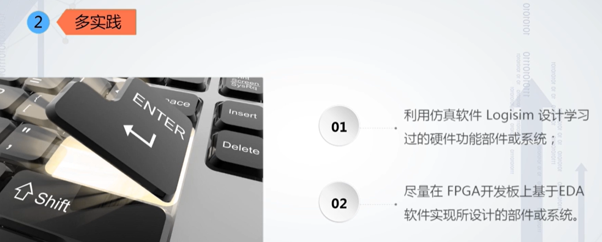

## 第一章、计算机系统概论

### 1、冯.诺伊曼结构原理及层次结构分析。

冯.诺伊曼计算机的工作原理:

其中的重点和难点：围绕冯.诺伊曼计算机的工作原理其中存储系统和控制器的设计。

​	

### 2、计算机系统性能评价

从两类指标入手：

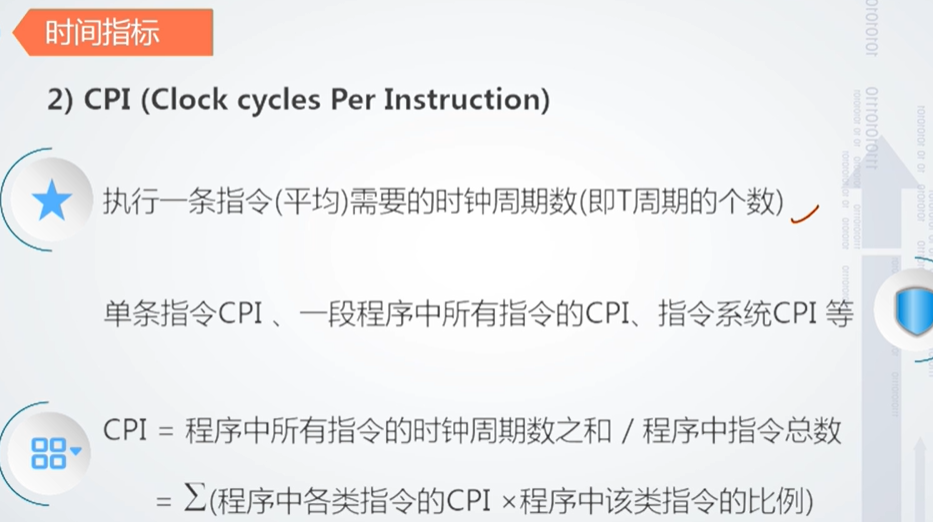

​	

计算机的性能除了和硬件本身固有的性能外，它和软件也密切相关。

### 3、计算机性能测试

## 第二章、数据表示

### 1、机器数及特点

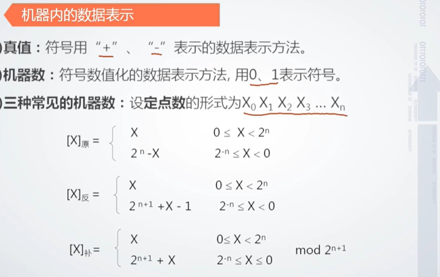

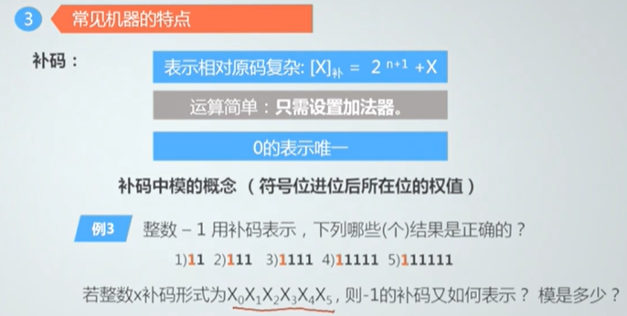

### 2、定点和浮点数据表示

**定点**

当小数位固定在符号位后面的时候，表示定点小数

当小数位固定在最后一位有效数字后面的时候，表示的就是定点整数

 

==阶码==：对任意一个二进制数N,可用N=S×2^P表示，其中S为尾数

，P为阶码，2为阶码的底，S表示N的全部有效数字，P指明小数点的位置，数的这种表示法称为定点表示，这样的数称为“[定点数](https://baike.baidu.com/item/定点数)”；当阶码为可变时，数的这种表示法称为[浮点](https://baike.baidu.com/item/浮点)表示，这样的数称为“[浮点数](https://baike.baidu.com/item/浮点数)。

E-127 是因为上面32位的偏移值为127，在阶码的基础上增加了127，为了把阶码值变成非负整数（为什么加了这个值就变成非负整数了？），所以这里还原的时候要减去。那个M尾数没有保留那个1所以算的时候要把那个1加上。

### 3、数据校验的基本原理

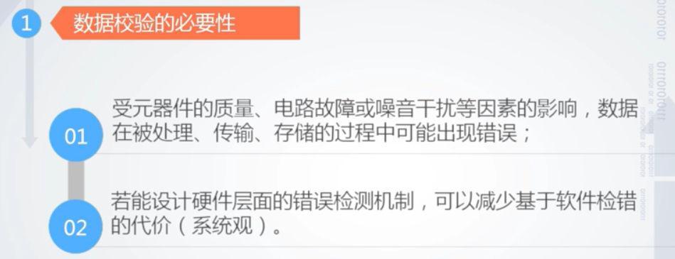

# 计算机组成原理（哈工大）

## 1、计算机概论

### 1、计算机系统简介

推荐的两本参考教材（用于这门课程的落地	，去做一些事情）：

 

### 2、计算机的基本组成

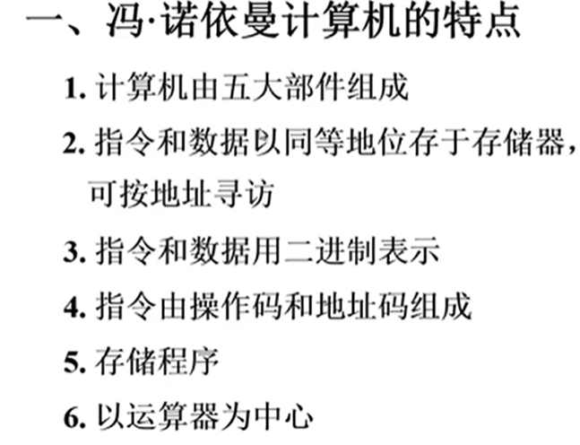

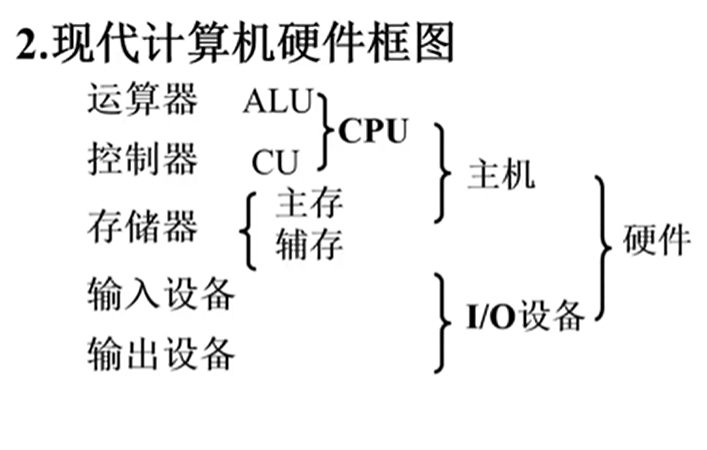

**存储器**

 

存储体由若干个存储单元组成

按地址寻访

MAR存储器地址寄存器，保存了存储单元的编号

MDR存储器数据寄存器，保存了要送入到cpu当中的数据，或者是要送入存储体中的数据，或者是刚刚从存储体中取出来的数据。

**运算器**

 

​	ACC累加器，X数据寄存器，	

乘除运算有点不懂

**控制器**

1.解释指令

2.保证指令的按序执行

pc计数功能为下一次取址做准备，具体是加一还是加几和机器的结构有关

### 3、计算机的主要性能指标

1.买这台机器做什么？

2.你有多少钱

3.机器的性能指标能否满足你的需求

​	如何在购买前对计算机的性能进行评价

​		处理速度快，内存容量大

主要指标：

在我们的模型机当中 cpu位数与寄存器位数相同，模型机的假设，并不是我们现在所有的计算机

最合适的测试运算速度的方法，把你最常用的软件安装，比如说cs，打打游戏，看看卡不卡，运行流不流畅。

## 系统总线

### 1.总线的基本概念

计算机总线（bus）结构便于增减外设，同时减少了信息传输线的条数。

在任何一个时刻只能由一对设备，或者一对部件来使用这个总线，其他设备，只能等待他们释放使用权。

第一种总线：

容易发生总线的争用,单总线结构存在很多问题。

指令，来自主存，数据来自主存，cpu与主存之间的交流是特别繁忙的。主存和外部设备没有直接的传输通道，必须经过cpu作为连接。一旦发生cpu和外部设备进行数据传输的话，cpu的计算任务，执行程序的任务还是会被打断的。

### 2.总线的分类

​	1.根据总线的位置进行分类

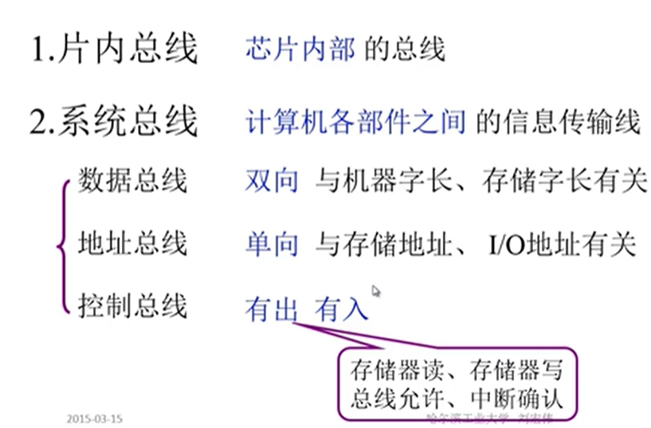

通常情况下数据总线的宽度小于等于机器字长或者是存储字长。

地址总线的条数一般来说和存储地址，IO地址是有关系的。通常情况下，地址总线的条数和地址单元的个数是相关的，我们这个 模型机中地址总线的宽度是和MAR寄存器的宽度是一样的。

扩展：

### 3.总线特性及性能指标

总线特性：

总线的性能指标：

​	总线标准：

### 4.总线结构

单总线结构：

多总线结构：

1. 双总线结构：
   - 
   - 一般来说，通道有自己的控制器，通道有自己的指令系统，通道能够执行一些简单的指令，执行通道程序。
2. 三总线结构
   -  
   - DMA总线，直接存储器访问，外部设备直接访问系统的内存
   - 高速外设访问主存，直接走DMA总线，而低速设备不行。
   - 
     - 多种设备都连接在扩展总线上，影响速度。 
3. 四总线结构
   - 
   - 把高速设备和低速设备进行分类。数据传输速率更高
4. 传统微型机总线结构
   - 
5. VL-BUS局部总线结构
   - 
   - 高速设备：VL-BUS总线
   - 低速设备：标准总线控制器那里衍生出来的总线
6. PCI总线结构
   - 
   - 高速总线：32位的那个
   - 低速总线：下面那个16位的。
7. 多层PCI总线结构：
   - 

### 5.总线控制（重点，难点）

解决两个问题：

- 多个设备可能同时发出占用总线的请求
- 设备占用总线之后要通讯，如何完成这个通讯过程，保证通讯过程的正确性。

**一、总线判优控制**

1.基本概念（根据是否能发出总线请求划分）

集中式：把总线的判优逻辑做在一个部件上，比如说放在cpu当中。

分布式：判优逻辑分布到各个设备，或者是各个设备的端口当中。	

**1.链式查询**

先所有设备都发请求BR，然后总线控制部件BG顺序同意发出，碰到第一个发请求的设备之后，设备发出BS总线忙。

优先级和BG这条线的查询顺序有直接关系，它的顺序 就是各个IO设备占用总线的优先全的先后顺序

对电路故障特别敏感如果BG出问题，就传不下去了，后面设备无法获得同意

优点：结构简单，增删设备容易

把BG或者BS换成两条线，避免线路出问题。

用在微型计算机，或者简单的嵌入式系统上面

**2.计数器定时查询：**

和上面的区别就是不是链式的查询，通过计数器慢慢加进行查询。

优点：优先级确定非常灵活，计数器的初值是可以改变的。还可以通过软件的方式对总线控制部件进行控制。使优先级的顺序得到更灵活的改变。

**4.独立请求方式**

内部有一个排队器

优先级的确定非常的灵活，看排队器如何进行设置。比如说可以有预定的优先级设置，还可以用自适应的方式，看哪些设备在工作中比较重要，就给比较高的优先级，里边也可以用计数器的设置。这种方式用线比较多

## 存储器

### 1.概述

1.存储器可分哪些类型？

2.现代存储器的层次结构，为什么要分层？

TTL:晶体管-晶体管逻辑的。集成度较低，功耗较高。但速度比较快

MOS：金属氧化物半导体。功耗低，集成度比较高。（主要）

RAM 随机存储器，可读可写

ROM 只读存储器  

Flash Memory  半导体存储器

### 2.主存储器（重点）

7大部分

#### 1.概述

四个基本问题：

高位字节存储到低地址地位字节存放在高地址

高位字节所在的地址作为存储字的地址

位（bit）

一个字节8位

一个字包含多个字节

24根地址线一共可以表示2的24次方个地址（按字节寻址）

按字寻址的话（16位的字中间有两个字节，所以24根地址线要分出一根线来标识，看是第一个字节还是第二个字节）所以一共可以标识2的23次方个w(字word)

16K×32位的存储器，32位需要32根数据线，16k需要 用14根地址线

存取时间：从存储器给出地址，一直到得到稳定的数据输出或者是数据输入，这个时间成为存取时间，根据是读出还是写入，分为读出时间和写入时间

 存取周期一般比存储时间要长。

#### 2.半导体存储芯片

译码驱动方式：指给出了存储单元的地址之后怎么去找到指定的存储单元。

片选线：芯片选择信号， 指出了芯片这次操作给出的地址是不是正对这个存储芯片的地址，被选择的存储单元，被选择的字节，是不是在这个芯片当中

半导体片选线，两种标识方式，cs（芯片选择）,ce（芯片使能信号）（上面有一横标识低电平有效）

用一根来表示(we)，或者用两根来表示(oe,we)

16K的那个每次一位数据，8个并在一起就是8位数据

弄4组八个的出来，第一组标识地址范围0-16k第二组标识16k到32k第三组标识32k到48k以此类推。

**译码驱动方式：**

线选法：

16×8矩阵，竖着是16，也就是16个地址，横着每八个标识一个数据

读写过程：

缺点：对容量稍大一点的是非常不合适的。

地址1M就需要20根地址线，需要100万行的矩阵（一个线性的数组）

重合法：二维的阵列。

读写 过程：

就是竖着的一列地址为零的时候，第一行全部打开

横着的一列为零的时候，第一个行的前八个数据打开开关被读取。

集成度比线选法高。

#### 3.随机存取存取器

静态RAM和动态RAM

使用的是双稳态触发器：是一种具有记忆功能的逻辑单元电路，它能储存一位二进制码。它有两个稳定的工作状态，在外加信号触发下电路可从一种稳定的工作状态转换到另一种稳定的工作状态。

也称为6管的静RAM 	

we低电平写，高电平读

cs低电平就选择这个芯片（低电平有效）

6个行地址信号造成64行，然后6个列地址信号造成16列，把16列分为4组，每组包含16列。所以1k×4位的过程64×64的矩阵。

当列地址为0000的时候

选中的就是低0，16，32，48列。

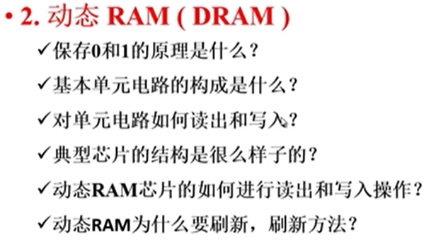

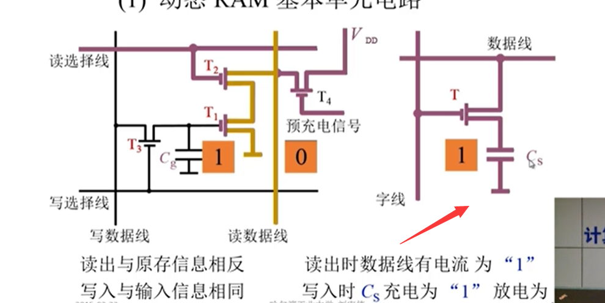

电容会放电，信号慢慢消失，那个三角形是刷新放大器，每一段时间就会对电容里面的信息重写

只有7根地址线，但是要有16k的寻址范围，所以7根地址线两次传入，第一次放到行地址缓存器当中，第二次放到列地址缓存器当中，行地址和列地址经过译码以后选中指定的存储单元进行读写操作。

读放大器两端的电平相反，

读出反向，写入反向，就一致了 0-64列的数据

动态ram是利用电容保存信息的，电容漏电，如果不刷新的话，数据就没了

**动态RAM刷新**

- 1.集中刷新

**静态RAM和动态RAM的比较**

#### 4.只读存储器

1.掩模ROM(MROM)

厂家把信息直接做在芯片上，用户不能修改。

数据只能读，不能擦除

​	

要擦除的话紫外线直接照射，擦除浮动栅

#### 5.cpu和存储器的连接（重点，难点）

两个芯片采用相同的片选，两个芯片同时被选中

字扩展：两个芯片不能同时进行工作，2k×8位有11根地址线，1k×8位有10根地址线，剩下的一条地址线，如果为0的话选择一片芯片，如果为一的话选择另一片芯片。直接把A10作为片选信号，为0的话选第一个，为1的话选第二个取反是因为低电平有效。并能保证选一的时候不选二。

如下图，用译码器，两根地址线弄出四个信号。

一般用地址的低位作为地址，高位作为片选信号。

系统程序，配置信息用ROM，用户程序部分，系统程序 运行部分用RAM

芯片数量尽可能少，片选逻辑尽可能简单。

cpu的时序要和存储器的时序相互配合

负载;cpu能够带多少个存储芯片。

4.1 4.2

cpu的信号要么输入到芯片当中，要么一定要出现在片选的输入端，不要忘了mreq

#### 6.存储器的校验

如果内存所处的电磁环境比较复杂，或者是在空间环境下收到带电粒子的打击，极可能会在成电容的充电放电或者是触发器的反转。存放在存储器中的信息就可能出错，因此需要对存储器中的信息进行校验。

#### 7.提高访存速度的措施 

- 采用高速器件
- 采用层次结构 Cache  --主存
- 调整主存结构

第一种方法：

第二种方法：

存在问题：存储的时候是按序存储，如果只保存在M0的话就会造成访问的 时候第一个存储体一直在工作，另外的空闲

这种方式就是之前的存储器容量的扩展，但是这种方法并不适合提高存储器的带宽	

低位交叉

分离式通讯，提高主存储器的带宽 

以流水的方式访问不同的存储体

### 3.高速缓冲存储器

程序的局部性原理在计算机结构系统中是非常重要的一个基本原理，是人们在研究的过程中，得到的程序执行的或者是数据使用的一个规律，程序的局部性原理分为两部分，第一个是时间的局部性，当前正在使用的指令和数据，在不久的将来还会被使用到。当前这些指令和数据我们应该放到cache当中去，将来在使用的时候直接从cache中拿值，另外的一个特征是空间的局部性，当前正在使用一个指令或者数据，那么在不久的将来，相邻的指令或者数据就可能会被用到。这样的话，我们把当前正在使用的数据或指令放在cache中，同时把相邻的指令和数据放在cache当中。

 标记 ，标记了主存块和cache块之间的对应关系

​	直你们那

结构简单，速度快 

缺点:cache的命中率可能会很低，cache调用的时候冲突的概率非常大

全相联映射：主存中任意一个块可以放到cache当中任意一个块

电路比较复杂，速度比较慢，参加比较的位数比较长，比较器的长度也会比较长

直接映射和全相联映射就是两个极端。

组相联映射就是直接映射和全相联映射的折中

先把cache分成块，cache这些块又被分为若干个组

和直接映射相比一个块有多个位置

### 4.辅助存储器

把辅助存储器中的数据调到主存中然后cpu再与主存交换信息。

电生磁和磁生电的过程

​	软盘推出了现在的计算机市场

## 输入输出系统

可移植性差

​	

cpu一头连着主存，一头连着外部设备。踏步等待。

启动I/O设备之后cpu干自己的事情，直到外部设备发出中断服务请求，cpu就和外部设备进行数据的传输，然后接着处理自己的程序或指令，没有踏步等待现象。

缺点：cpu暂停自己的事情去做别的事情,后面回来接着做，这中间的 程序或指令需要维护保护，需要更多的指令，也消耗cpu的性能。

还有就是和程序查询方式一样，cpu在中间，一端挂着主存，一端挂着I/O设备。

## 计算机的运算方法

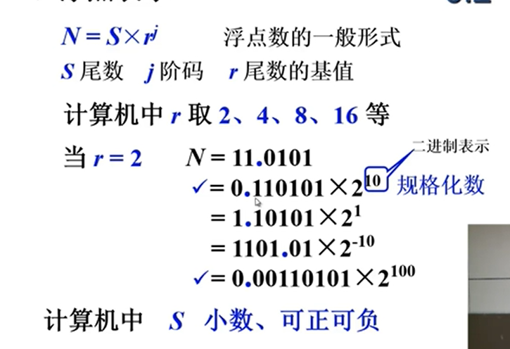

s尾数的绝对值是小于等于一的。阶码是整数。	

​       

符号位产生的进位自动丢掉。

 

## 指令系统

实际上操作码的作用早就超过了要做什么操作这样一个简单的说法，有很多机器的指令集中，操作码还要指出对什么样的数据进行操作。

### 机器指令

短操作码一定不能是长操作码的前缀

在程序执行过程中，经常执行的指令用短操作码来表示，低频指令用长操作码来表示。

pc代表A4就变为三地址了

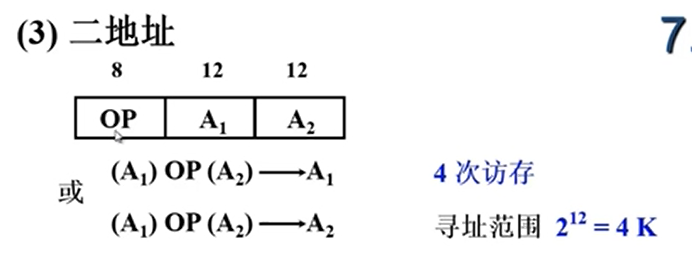

### 操作数类型和操作种类

操作数就是指令要进行处理的那些数据，他的类型有以下四种形式。

跳转指令过程中，操作数就是一个地址，绝对地址，就是无符号整数，相对寻址，地址是一个有符号数

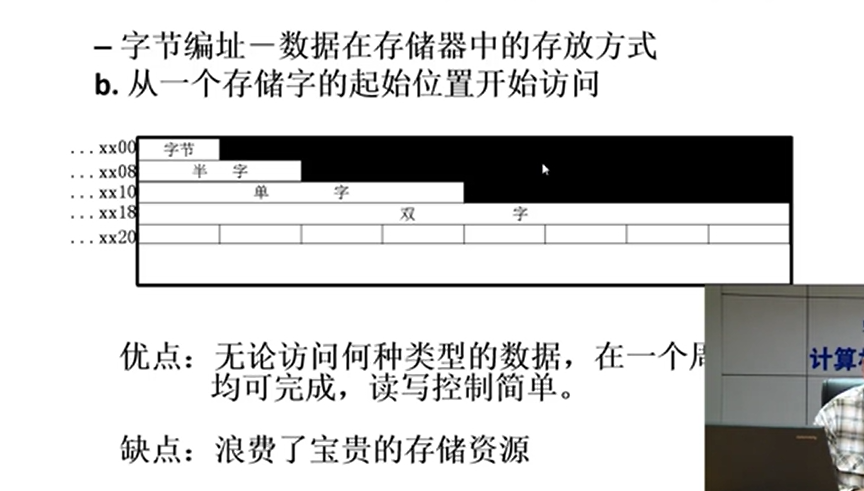

在一个周期可以完成存储访问。

操作类型：

寻址方式：

这个1比较复杂，如果内存的编址单位是字节，那么如果一条指令的长度是32位那么顺序寻址的时候每次加的值就是4

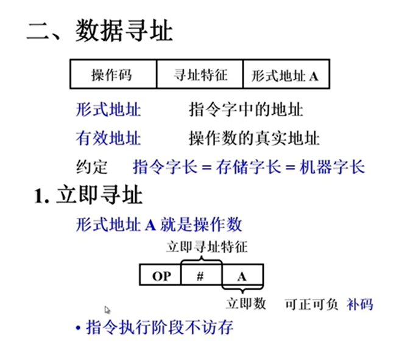

指令格式举例

## cpu的结构

## 控制单元的功能

