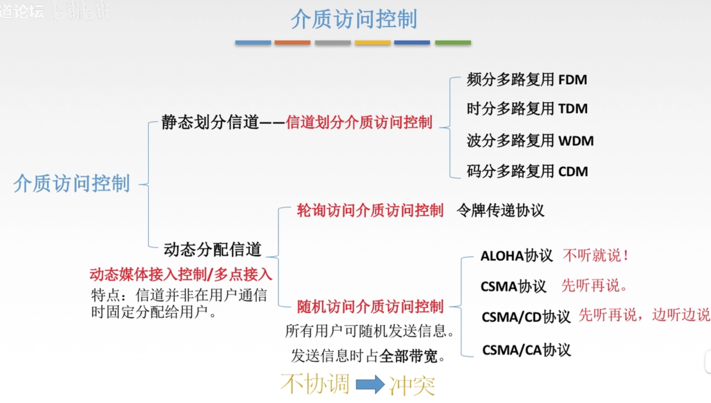
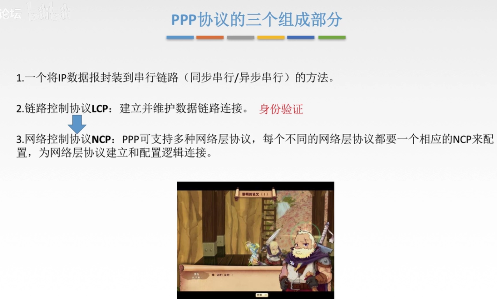

# 计算机网络

帧的数据部分长度上限-MTU

## 物理层

- 互联网的组成
  - 边缘部分
    - 由所有连接在互联网上的主机组成
    - 这部分是**用户直接使用**的
    - 用来进行通信（传送数据，音频或视频）和资源共享
  - 核心部分
    - 由大量网络和连接在这些网络上的路由器组成
    - **为边缘部分提供服务**（提供连通性和交换）
- 互联网的核心部分
  - 在网络核心部分起特殊作用的是**路由器**，他是一种专用计算机，，路由器是实现**分组交换**的关键构件。其任务是**转发收到的分组**。
  - 电路交换
    - 交换
      - 交换就是按照某种方式动态的分配传输线路的资源。
    - 这种必须经过**建立连接**（占用物理资源）-->**通话**（一直占用物理资源）-->**释放连接**（归还通信资源）三个步骤的 交换方式称为**电路交换**。
    - **线路传输效率很低**。
  - 分组交换
    - 采用**存储转发**技术													
    - 路由器暂时存储的是一个一个的短分组，而不是整个长报文，短分组是暂存在路由器的存储器（即内存）中而不是存储在磁盘中的，这样就保证了较高的交换速率。
    - 分组交换在传送数据之前不必先占用一条端到端的通信资源，分组在哪段链路上传送才占用那段链路上的通信资源，分组在传输时就这样逐段的断续占用通信资源，而且还省去了建立连接和释放连接的开销，传输效率更高。
    - 当网络中的某些节点或链路突然出现故障时，在各路由器运行的路由选择协议能够自动的找到转发分组最合适的路径。
    - 为了提高分组交换网 的可靠性，互联网的核心部分常采用了网状拓扑结构
- 计算机网络的性能
  - 速率
    - 数据的传送速率
    - 速率的单位是比特每秒
    - 
  - 带宽
  - 吞吐量
  - 时延
  - 时延带宽积
  - 往返时间RTT
  - 利用率																																																																																									

## 数据链路层 

封装成帧，透明传输

### 差错检测

 

 

奇偶校验码：

 

crc循环冗余码：

 

 

 

### 局域网

局域网虽然是网络，但是不把局域网放到网络层讨论，因为网络层要考虑的问题是多个网络互联的问题，从整个互联网来看，局域网仍然属于数据链路层的范围。

局域网的的基本概念和体系结构：

局域网是指在某一区域内，由多台计算机互联组成的计算机组，使用**广播信道**

决定局域网的主要要素为：**网络拓扑**，**传输介质**，与**介质访问控制方法**。

 

拓扑结构：

传输介质：

 

局域网的分类：

 

IEE802标准

 

### 以太网

 

 

 

集线器使得更方便扩网以及检查故障。

 

适配器和mac地址

 

通过mac地址查找自己的硬件设备是不是正品：网址

 

 

目的地址有三种情况：

1、单播地址，一个专有的mac地址

2、广播地址

3、多播地址

类型是指的上层协议；

mtu=1500字节

以太网最小帧长64个字节。

 

 

### 无线局域网

IEEE802.11标准是无线局域网通用的标准。

 

无线局域网的分类：

1、有固定基础设施无线局域网

2、无固定基础设施无线局域网的自组织网络

 

### CSMA-CD协议

先听再说，边听边说。

 

 

 

 

### 	PPP

通常用于广域网中。

 

 

 

 

## 网络层

几个概念

- 可靠交付
  - 发送方发送什么，接收方就就接收什么
- 交换
  - 是指通信资源的分配
- 网络资源
  - cpu周期，缓冲区，带宽
- 发送过程
  - 无差错，不重复，不缺失，不失序。就准确了
- **让网络负责可靠交付**
  - 就是用面向连接的通信方式
  - 当两台计算机建立连接时，在交换分组中是建立了一条虚电路，预留资源。
- **网络提供数据报服务**（主流）
  - 网络层设计的尽量简单，向其上层只提供简单灵活的，无连接的，尽最大努力交付的数据报服务。
  - 网络层不提供服务质量的承诺，由主机中的运输层负责
  - 网络造价大大降低，运行方式灵活
- 网络层的两个层面
  - **数据层面**
  - **控制层面**
  - 路由器之间传送的信息分为两大类
    - 第一类是转发源主机和目的主机之间所传送的数据
    - 第二类是传送路由信息
  - 路由协议执行路由算法来交换路由信息生成路由表（转发表）
- **软件定义网络**
  - 路由器之间不在相互交换信息，在网络的控制层面有一个逻辑上集中的远程控制器，专门计算路由信息生成转发表为每一个路由器（老师说这个是局部的）

### 网际协议IP

与协议配套使用的有：

地址解析协议APR

网际控制报文协议ICMP

网际组管理协议IGMP

他们的关系是：IP协议经常使用ARP协议，ICMP和IGMP要使用IP协议

- **虚拟互联网络**
  - 不同的网络之间：
    - 不同的寻址方案
    - 不同的最大分组长度
    - 不同的网络接入机制
    - 不同的超时控制
    - 不同的差错恢复方法
    - 不同的状态报告方法
    - 不同的路由选择技术
    - 不同的用户介入控制
    - 不同的服务（面向连接的服务和无连接服务）
    - 不同的管理与控制方式等等
  - 没有一种单一的网络能适应所有用户的需求
  - 网络相互连接起来需要一种**中间设备**
    - 物理层使用的叫做**转发器**
    - 数据链路层使用的叫做**网桥**或**桥接器**，以及**交换机**
    - 网络层使用的叫做**路由器**
    - 网络层以上使用的叫做**网关**
  - 许多计算机网络用路由器进行互联，参加互联的计算机都是用相同的网际IP，可以把互联后的计算机网络看成一个虚拟互联网络
  - 意思就是互连起来的各种物理网络的异构性是客观存在的，但是我们使用协议IP就可以使这些性能各异的网络在网络层看起来好像是一个统一的网络，
  - 使用的IP的好处是：
    - 当IP网上的主机进行通信时，就好像在一个单一的网络上进行通信一样，他们看不见互联的各网络的具体异构细节，如果在这种覆盖全球的IP网的上层使用TCP协议，就是现在的互联网
- 交付方式
  - **直接交付**
    - 不需要任何路由器能完成任务，交付到一个网络
  - **间接交付**
  - 分组在传送途中的每一次转发都称为一“跳”
  - 在转发分组是也常常使用下一跳的说发

#### IP地址

整个互联网就是一个**单一**的，**抽象**的网络。IP地址就是给连接到互联网的每一台主机的每一个接口

IP地址现在由互联网名字和数字分配机构ICANN进行分配

IP地址都是32位的二进制代码，为了提高可读性，采用**点分十进制记法**

IP地址由两个字段组成，第一个字段是网络号，第二个字段是主机号

”：：=“  表示 “定义为”

IP地址指明了链接到某个网络上的一个主机

- **分类的ip地址**
  - n的意思就是网络号占据前面多少位
  - A类地址（n = 8）网络号占据前面一个字节，也就是说主机号占据后面三个字节，可以分配2的24次方个主机，是个大范围的网络，网络号由0开头
  - B类地址（n = 16）网络号都由10开头
  - C类地址（n = 24）网络号都由110开头
  - D类地址是多播地址（一对一通信）网络号都由1110开头
  - E类地址是保留地址
  - 网络号全为零的地址表示**本网络**，网络号为127保留做为本地软件环回测试
  - 全为0的主机号表示本网络上的本主机，全为1表示所有的，广播。
- 分类ip的优缺点：
  - 优点：管理简单，使用方便，转发分组迅速
  - 缺点：互联网用户的猛增，使得IP地址的数量面临枯竭，即使后来采用划分子网的方法，也无法解决IP地址枯竭的问题
  - 现在解决这个问题的方法就是从IPV4向IPV6过渡
- **无分类编制CIDR**
  - 全名：无分类域间路由选择CIDR
  - 网络号改称为网络前缀，使用斜线记法。
  - 128.14.35.7/20表示前20位是网络前缀（网络号）
  - **地址掩码**
    - 另外一种记发，1就表示 网络号，0就表示主机号
    - IP地址与地址掩码进行按位 与运算，所得到的就是网络地址
- **IP地址的特点**
  - 每一个Ip地址都由网络前缀和主机号组成
    - 路由器根据目的主机的网络前缀来转发分组（而不考虑主机号）
  - 实际上IP地址是标志一台主机（或路由器）和一条链路的接口
    - 当一台主机同时接入到两个网络上时，该主机就同时具备两个相应的ip地址
  - 用转发器或交换机连接起来的若干个局域网仍为一个网络
  - 在IP地址中，所有分配到网络前缀的网络，都是平等的，所谓平等，就是指互联网同等对待每一个IP地址

#### IP地址和MAC地址

**MAC地址**是数据链路层使用的地址，mac地址已经固化在网卡上的ROM中了，常被称为**硬件地址或物理地址**。

**IP地址**是网络层和以上各层使用的地址，是一种**逻辑地址**。

大概我的理解传输过程：

- ip数据报中只存在有，本主机的ip地址（最初的）和目的主机的ip地址。通过路由算法根据目的ip地址算出下一跳ip地址，然后根据下一跳的ip地址得出下一跳的路由器的mac地址，然后将本主机的mac地址（当前的）和下一跳的mac地址，封装到帧中，让数据链路层根据mac地址传输。
- 从而体现出了，在**数据链路层是点对点的传输**（每一个节点之间），**在网络层是端对端的传输**（从源主机到目的主机）

ip抽象层只能看到ip数据报

- 尽管互联在一起的网络的MAC地址体系互不相同，但是IP抽象层的互联网却屏蔽了下层这些很复杂的细节。

#### 地址解析协议ARP

ARP来解决的问题：知道一个机器的ip地址，找出其相应的MAC地址

协议DHCP可以通过自己的MAC地址找出其IP地址

ARP协议解决这个问题的方法是：在主机的ARP高速缓存中存放一个从IP地址到MAC地址的映射表。并且这个映射表还经常动态更新。

**如果映射表中没有这个ip  "B"   所对应的mac地址：**

1. ARP进程在本局域网上广播发送一个ARP请求分组，
2. 在本局域网上的所有主机的ARP进程都收到此ARP请求分组
3. 主机B的IP地址与ARP请求分组中要查询的IP地址一致，就收下这个ARP请求分组，并向源主机发送ARP相应分组
4. 源主机收到主机B的ARP响应分组后，就在其ARP高速缓存区中，写入主机B的IP地址到MAC地址的映射。

注意：

- ARP请求分组是广播发送的，但ARP响应分组是普通的单播
- ARP用于解决**同一个局域网**上的主机或路由器的IP地址和MAC地址的映射问题。

如果要找**别的网络上的ip对应的MAC**，那么就要通过这个连接两个网络的路由器来发送请求分组，简介获取mac地址

#### ip数据报的格式

ip协议中，IP数据报分为首部和数据部分，<  描述首部格式的宽度有32位（4字节）>

一个ip数据报的前20个字节是固定的，是ip数据报必须具有的。在首部的固定部分的后面是一些可选字段，其长度是可变的。

固定部分各字段的意义：

- 版本
  - 占4位，指协议ip的版本。。
- 首部长度
  - 占4位，首部长度字段表示数的单位是32位字长（4字节）,ip分组的首部长度不是4的整数倍时，必须利用最后的填充字段填充。首部长度限制为60个字节
- 区分服务
  - 占8位，区分不同应用对网络的需求，用来获得更好的服务，在旧标准中叫做服务类型
- 总长度
  - 占16位，指首部和数据之和的长度，单位为字节，因此数据报的最大长度为2的16次方-1=65535个字节
  - 在数据链路层设置了每一个数据帧中的数据字段的最大长度，最大传送单元MTU，最常用的以太网就规定其MTU值是1500字节。
- 标识
  - 占16位，IP软件在存储器维持一个计数器，每产生一个数据报，计数器就加1，并将此值赋给标识字段
- 标志
  - 占3位，目前只有两位有意义
  - 最低位记为MF，MF=1表示后面**还有分片**，MF=0表示这是若干数据报片中的最后一个。
  - 标志字段的中间一位记为DF，意思是“不能分片”，只有当DF=0时才允许分片。
- 片偏移
  - 占13位，片偏移指出：较长的分组在切片后，某片在原分组中的相对位置。以8个字节为偏移单位
  - 2的13次方乘以8  正好等于2的16次方，也就是总长度的最大值。
- 生存时间
  - 占8位，TTL字段的功能为“跳数限制”，每转发一次就将TTL的值-1，若TTL减到了零，就丢弃这个数据报。
- 协议
  - 占8位，指出此数据报携带的数据使用何种协议（上一层哪种协议，tcp?icmp?igmp?等等）
- 首部检验和
  - 占16位，只检验数据报的首部，但不包括数据部分。因为数据报每经过一个路由器都要重新计算一下首部检验和（一些字段，如生存时间，标志，片偏移等都可能发生变化）
  - 采用反码求和的方法。
- 源地址
  - 占32位，发送IP数据报的主机的IP地址
- 目的地址
  - 占32位，接收IP数据报的主机的IP地址

### EGP内部网关协议

#### OSPF协议

 

 

### BGP外部网关协议

 

 

bgp协议交换的信息包含的是一个完整的路径。

## 运输层

## 应用层

